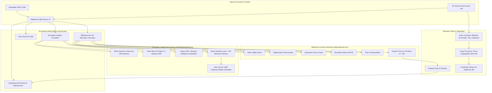
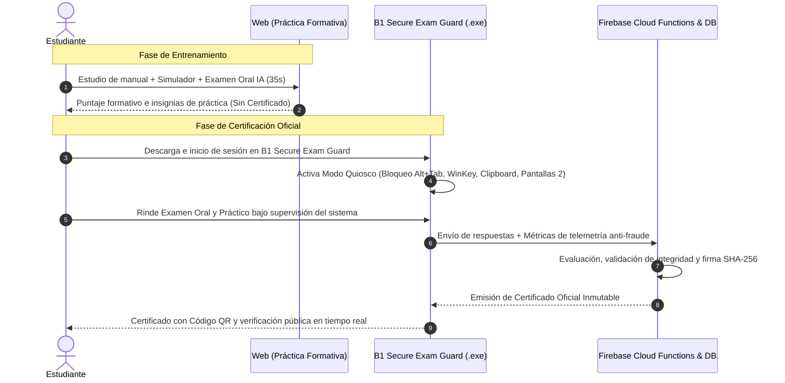

# 🏛️ Arquitectura Global del Sistema LMS & Ecosistema de Simulación (SAP Academy B1)

## 📌 1. Visión y Propósito del Sistema

**SAP Academy (Heinsohn B1)** es una plataforma de ingeniería de aprendizaje y certificación profesional de élite en **SAP Business One 10.0 (HANA)**. Su arquitectura está diseñada para superar la pasividad de los cursos tradicionales mediante un **entorno inmersivo, práctico y guiado por Inteligencia Artificial**.

El sistema integra:
1. **Biblioteca Universal de 120 Manuales Oficiales** organizados en 23 categorías operativas.
2. **Clases Magistrales con Video y Sincronización Dual:** Teleprompter del instructor + Guía de laboratorio paso a paso.
3. **Simulador Interactivo Píxel a Píxel:** Replicación fidedigna de la interfaz de escritorio de SAP Business One (Windows).
4. **Examen Oral con Profesor Evaluador IA:** Evaluación conversacional contrarreloj (35 segundos por pregunta) con detección anti-trampa.
5. **Simulador Integral de Escritorio (`/simulador`):** Entorno virtual multitarea con el menú canónico de los 12 módulos de SAP y más de 5,000 capturas reales indexadas.
6. **Modelo de Certificación Segura (Dual-Tier):** Entrenamiento web ilimitado + Certificación oficial mediante la aplicación de escritorio descargable **B1 Secure Exam Guard**.

---

## 🗺️ 2. Diagrama de Arquitectura de la Plataforma

---

## 💻 3. Pila Tecnológica y Flujo de Rendimiento (Hermes A+)

* **Framework Web:** Next.js 15 (App Router, Server Components para renderizado ultrarrápido Byte 0, React 19).
* **Estilos y Diseño:** Tailwind CSS modular (cero estilos inline, escala tipográfica armónica, soporte Dark/Light).
* **Base de Datos y Autenticación:** Google Cloud / Firebase (Authentication, Firestore Database, Cloud Storage).
* **Motor de Simulación MDI:** Arquitectura de ventanas desacopladas en canvas libre, con z-index dinámico, arrastre fluido y minimización a barra de tareas.
* **Atlas Audiovisual:**
  * 5,082 capturas de pantallas originales extraídas de manuales oficiales.
  * Archivos `clase_sync.json` con timestamps exactos para teleprompter y guía de laboratorio.
  * Audio pedagógico neutro integrado localmente en formato WebM/MP3/MP4 sin llamadas bloqueantes a APIs externas durante el consumo.

---

## 🎓 4. Las 6 Capas de Aprendizaje por Manual

Cada una de las lecciones dentro de [`ManualViewer.tsx`](file:///c:/Users/pablo/OneDrive/Desktop/proyectos%20web/sap%20academy/src/components/site/ManualViewer.tsx) ofrece una experiencia estructurada en 6 capas sinérgicas:

| Capa | Componente | Función Pedagógica |
| :--- | :--- | :--- |
| **1. Audiovisual** | Reproductor de Video 1080p | Explicación teórica y demostración visual de la transacción en SAP B1. |
| **2. Guion** | Teleprompter Dinámico | Transcripción sincronizada en tiempo real que resalta el párrafo activo. |
| **3. Laboratorio** | Guía Paso a Paso | Instrucciones técnicas precisas con rutas de menú (ej: *Ventas > Orden de Venta*). |
| **4. Práctica** | Simulador Píxel a Píxel | Entorno interactivo idéntico al cliente SAP (cajas amarillas, botones 3D, resultados). |
| **5. Tutoría** | Agente Tutor IA | Chat contextualizado que resuelve dudas técnicas citando el manual. |
| **6. Evaluación** | Examen Oral IA (35s) | Preguntas orales en tiempo real con temporizador estricto y anti-trampa. |

---

## 🗂️ 5. Árbol de Habilidades y Clasificación Curricular (Skill Tree)

Los 120 manuales se agrupan en un árbol estructurado de competencias que desbloquea niveles de dominio:

```mermaid
graph TD
    M0[Módulo 0: Fundamentos & Tronco Común] --> R_FIN[Rama 1: Finanzas & Contabilidad]
    M0 --> R_LOG[Rama 2: Logística & Inventario]
    M0 --> R_COM[Rama 3: Ventas & Clientes]
    M0 --> R_PROD[Rama 4: Producción & MRP]
    M0 --> R_ADM[Rama 5: Administración & Consultas SQL]

    subgraph "Rama 1: Finanzas"
        R_FIN --> F1[Contabilidad Básica & Asientos]
        R_FIN --> F2[Gestión de Pagos & Bancos]
        R_FIN --> F3[Informes Financieros & Activos Fijos]
    end

    subgraph "Rama 2: Logística"
        R_LOG --> L1[Datos Maestros de Artículos]
        R_LOG --> L2[Compras & Aprovisionamiento]
        R_LOG --> L3[Movimientos de Stock & Ubicaciones Bin]
    end

    subgraph "Rama 3: Comercial"
        R_COM --> C1[Circuito Order-to-Cash]
        R_COM --> C2[Listas de Precios & Descuentos]
        R_COM --> C3[Gestión de Servicios & Proyectos]
    end

    subgraph "Rama 4: Manufactura"
        R_PROD --> P1[Listas de Materiales BOM]
        R_PROD --> P2[Órdenes de Fabricación & Rutas]
        R_PROD --> P3[Asistente de Planificación MRP]
    end

    subgraph "Rama 5: Administración"
        R_ADM --> A1[Inicialización & Parametrizaciones]
        R_ADM --> A2[Permisos, Usuarios & Workflows]
        R_ADM --> A3[Consultas SQL Query Generator & HANA]
    end
```

---

## 🖥️ 6. Arquitectura del Simulador Integral (`/simulador`)

El nuevo entorno virtual ubicado en `/simulador` consolida toda la academia en un único sistema operativo virtual:

1. **Barra de Menús Superior:**
   * `Archivo`, `Edición`, `Ver`, `Datos`, `Ir a`, `Módulos`, `Herramientas`, `Ventana`, `Ayuda`.
2. **Barra de Herramientas Estándar:**
   * Botones con tooltip nativo: *Añadir (`Ctrl+A`), Buscar (`Ctrl+F`), Primero, Anterior, Siguiente, Último, Imprimir, Parametrizaciones de Formulario*.
3. **Menú Principal de 12 Módulos:**
   * Árbol de carpetas colapsable con buscador rápido por palabra clave (ej: *"asiento"*, *"factura"*, *"artículo"*).
4. **Gestor MDI (Multi-Document Interface):**
   * Soporta múltiples ventanas abiertas simultáneamente con solapamiento, foco al hacer clic y minimización limpia.
5. **Motor Dual:**
   * **Modo Sandbox:** Exploración libre del sistema sin restricciones.
   * **Modo 120 Misiones:** Retos guiados vinculados a los manuales con validación de datos en tiempo real y asignación de XP.

---

## 🔒 7. Modelo de Seguridad y Certificación Dual (Web vs App Kiosk)

Para resolver definitivamente el problema del uso desleal de asistentes de IA durante los exámenes, se implementa una frontera clara:

---

## 🔗 8. Documentos Relacionados del Ecosistema

* [[06_Manuales]] - Inventario clasificado y rutas de los 120 manuales.
* [[07_Reconstruccion_Manuales_CS]] - Metodología de ingeniería inversa y reconstrucción tipográfica in-place de manuales prácticos.
* [[08_B1_Secure_Exam_App]] - Arquitectura técnica detallada de la aplicación de escritorio descargable (Tauri/Rust) para exámenes oficiales.
* [[09_Simulador_Integral_Desktop]] - Especificación técnica del escritorio virtual y el catálogo de 5,082 pantallas.
