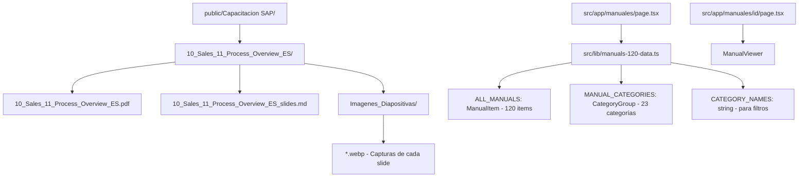

# 📚 Manuales SAP Academy - Documentación Técnica

## Visión General

La **Biblioteca de Manuales Técnicos** es el repositorio central de los 120 manuales oficiales de capacitación SAP Business One. Cada manual contiene:

- **PDF original** del manual SAP
- **Markdown de texto** (`_slides.md`) con la transcripción de cada diapositiva
- **Imágenes de diapositivas** (`.webp`) extraídas con alta resolución

## Arquitectura de Datos



## Interfaz TypeScript

```typescript
export interface ManualItem {
  id: string;           // ID = nombre de la carpeta
  number: number;       // Número secuencial (1-120)
  slug: string;         // Slug para URL
  title: string;        // Título en ESPAÑOL
  category: string;     // Categoría temática en español
  categoryIcon: string; // Emoji de la categoría
  categoryOrder: number;// Orden de agrupación
  summary: string;      // Resumen extraído del contenido real
  totalSlides: number;  // Cantidad de diapositivas disponibles
  pdfPath: string;      // Ruta al PDF
  mdPath: string;       // Ruta al Markdown de texto
  imagesPath: string;   // Ruta a la carpeta de imágenes
}
```

## Categorías (23 Módulos Temáticos)

| # | Icono | Categoría | Manuales |
|---|-------|-----------|----------|
| 1 | 🎓 | Introducción a SAP Business One | 2 |
| 2 | 🗺️ | Visión General del Sistema | 1 |
| 3 | 🛠️ | Implementación y Configuración | 22 |
| 4 | 📊 | Contabilidad Básica | 2 |
| 5 | 🏦 | Gestión Bancaria y Pagos | 3 |
| 6 | 📈 | Informes Financieros y Control | 4 |
| 7 | 💰 | Costos y Presupuestos | 4 |
| 8 | 🔄 | Procesos Financieros | 6 |
| 9 | ⚙️ | Configuración Financiera | 6 |
| 10 | 🏢 | Activos Fijos | 6 |
| 11 | 📦 | Gestión de Inventario y Artículos | 7 |
| 12 | 🏷️ | Datos Maestros de Artículo | 4 |
| 13 | 📋 | Inventarios y Movimientos | 4 |
| 14 | 📦 | Ubicaciones en Almacén (Bin Locations) | 6 |
| 15 | 📐 | Planificación de Materiales (MRP) | 3 |
| 16 | 🏷️ | Determinación de Precios | 6 |
| 17 | 🏭 | Producción | 9 |
| 18 | 📊 | Gestión de Proyectos | 2 |
| 19 | 🛒 | Compras y Aprovisionamiento | 8 |
| 20 | 💼 | Ventas | 7 |
| 21 | 🔧 | Gestión de Servicios | 1 |
| 22 | 🆘 | Herramientas de Soporte | 1 |
| 23 | ✏️ | Casos Prácticos y Ejercicios | 6 |

## Flujo de Navegación y E-Learning

```mermaid
graph TD
    A[/manuales - Biblioteca] -->|Clic Ficha Técnica| B[Modal Ficha Técnica]
    B -->|Abrir / Descargar| PDF[PDF Original Oficial]
    A -->|Abrir Clase| C[/manuales/id - Aula Interactiva]
    C --> D[ManualViewer UI - 1 solo pantallazo]
    D --> E[Video Player MP4 Sincronizado]
    D --> F[Teleprompter React Auto-Scroll]
    D --> G[Quiz Evaluativo - 3 preguntas]
    G -->|Aprobado 2/3| H[localStorage: sap_completed_manuals]
    H -.->|Reflejo de Estado| A
```

## Archivos Relacionados

- [[01_Auth]] - Sistema de autenticación para acceso a manuales
- [[06_LMS_Architecture]] - Arquitectura del LMS y árbol de progresión
- [[03_Inspection]] - Aplicación de campo (módulo independiente)

## Sistema de Sincronización Teleprompter & Video

1. **`clase_sync.json`**: Mapea cada slide con `script_text`, `start_time` y `end_time` medidos en milisegundos reales con `mutagen`.
2. **Auto-Scroll Activo**: En `ManualViewer.tsx`, el hook `useEffect` centrado en `activeSyncSlide` invoca `scrollIntoView({ behavior: 'smooth', block: 'center' })` garantizando que el texto activo suba automáticamente según el compás del narrador.
3. **Registro de Aprobación**: Los manuales aprobados mediante el quiz quedan marcados de forma persistente con un badge distintivo `✓ Aprobado` en la biblioteca principal y el modal.

