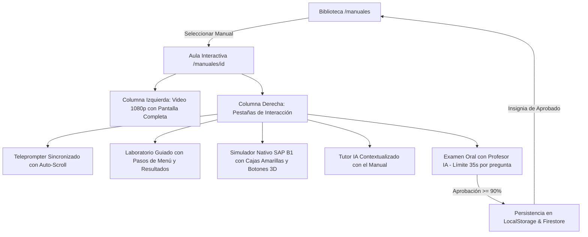

# 📚 Manuales SAP Academy - Documentación Técnica y Curricular

## 📌 Visión General

La **Biblioteca de Manuales Técnicos** (`/manuales`) es el repositorio central de los **120 manuales oficiales de capacitación de SAP Business One 10.0 (versión HANA)**. Cada manual es una unidad pedagógica autosuficiente compuesta por:

1. **PDF Oficial Original:** Documento canónico de SAP con capturas del sistema y casos de negocio.
2. **Transcripción y Diapositivas Markdown (`_slides.md`):** Extracción estructurada del contenido para indexación y búsqueda.
3. **Imágenes de Alta Resolución (`Imagenes_Diapositivas/*.webp`):** Capturas originales y esquemas vectoriales sin pérdida de calidad.
4. **Sincronización Multimodal (`clase_sync.json`):** Mapeo milimétrico de tiempo entre audio/video, teleprompter docente y laboratorio paso a paso.
5. **Video 1080p (`clase_video.mp4`):** Clase magistral con locución pedagógica humana.
6. **Simulador Nativo SAP B1:** Replicación de ventanas oficiales (Query Generator, Fiori Cockpit, Circuito de Compras).
7. **Examen Oral con Profesor Evaluador IA:** Preguntas dinámicas contrarreloj (35 segundos por pregunta) con detección anti-fraude.

---

## 🗺️ Arquitectura de Datos por Manual

```mermaid
graph TD
    subgraph "Almacenamiento Local (public/Capacitacion SAP/)"
        A[Carpeta del Manual: 10_Sales_11_Process_Overview_ES/] --> B[Manual.pdf Oficial]
        A --> C[Manual_slides.md Transcripción]
        A --> D[clase_video.mp4 Masterclass 1080p]
        A --> E[clase_sync.json Sincronización Teleprompter]
        A --> F[Imagenes_Diapositivas/*.webp Capturas HD]
    end

    subgraph "Capa de Datos de la Aplicación (TypeScript)"
        G[src/lib/manuals-120-data.ts] --> H[ALL_MANUALS: ManualItem[] - 120 manuales]
        G --> I[MANUAL_CATEGORIES: CategoryGroup[] - 23 módulos]
        G --> J[CATEGORY_NAMES: string[] - Filtros activos]
    end

    subgraph "Vistas y Experiencia de Usuario"
        K[/manuales - Biblioteca y Ficha Técnica] --> G
        L[/manuales/id - Aula Interactiva ManualViewer.tsx] --> A
        L --> G
    end
```

---

## 🧩 Modelo de Datos TypeScript

```typescript
export interface ManualItem {
  id: string;            // Identificador único (nombre exacto de carpeta)
  number: number;        // Número correlativo (1 a 120)
  slug: string;          // Slug semántico para URL limpia
  title: string;         // Título técnico oficial en español
  category: string;      // Categoría temática (23 módulos)
  categoryIcon: string;  // Ícono distintivo de la categoría
  categoryOrder: number; // Orden de progresión curricular
  summary: string;       // Síntesis técnica extraída del contenido oficial
  totalSlides: number;   // Total de diapositivas analizadas
  pdfPath: string;       // Ruta al archivo PDF original
  mdPath: string;        // Ruta al Markdown estructurado
  imagesPath: string;    // Ruta a la carpeta de imágenes WebP
}
```

---

## 🗂️ Las 23 Categorías Operativas (120 Manuales Oficiales)

| # | Ícono | Categoría Temática | Manuales | Enfoque Operativo |
|---|:---:|---|:---:|---|
| 1 | 🎓 | Introducción a SAP Business One | 2 | Navegación, conceptos y arquitectura general |
| 2 | 🗺️ | Visión General del Sistema | 1 | Procesos empresariales integrados end-to-end |
| 3 | 🛠️ | Implementación y Configuración | 22 | Inicialización, parametrizaciones, DTW y personalización |
| 4 | 📊 | Contabilidad Básica | 2 | Principios contables y asientos automáticos |
| 5 | 🏦 | Gestión Bancaria y Pagos | 3 | Pagos recibidos, efectuados y conciliaciones |
| 6 | 📈 | Informes Financieros y Control | 4 | Balances, cuentas de resultados y control de caja |
| 7 | 💰 | Costos y Presupuestos | 4 | Contabilidad analítica, centros de costo y presupuestos |
| 8 | 🔄 | Procesos Financieros | 6 | Períodos contables y cierre de ejercicio |
| 9 | ⚙️ | Configuración Financiera | 6 | Plan de cuentas y cuentas de mayor predeterminadas |
| 10 | 🏢 | Activos Fijos | 6 | Alta, amortización, revalorización y baja de activos |
| 11 | 📦 | Gestión de Inventario y Artículos | 7 | Gestión de almacenes, valoración y recuentos |
| 12 | 🏷️ | Datos Maestros de Artículo | 4 | Propiedades, grupos y listas de precios |
| 13 | 📋 | Inventarios y Movimientos | 4 | Entradas, salidas y transferencias de stock |
| 14 | 📦 | Ubicaciones en Almacén (Bin Locations) | 6 | Almacenes avanzados y gestión por ubicaciones |
| 15 | 📐 | Planificación de Materiales (MRP) | 3 | Pronósticos de demanda y asistente de compras/producción |
| 16 | 🏷️ | Determinación de Precios | 6 | Listas de precios, descuentos por volumen y periodos |
| 17 | 🏭 | Producción | 9 | Listas de materiales (BOM), órdenes y costes |
| 18 | 📊 | Gestión de Proyectos | 2 | Fases de proyecto, presupuestos y facturación |
| 19 | 🛒 | Compras y Aprovisionamiento | 8 | Circuito Procure-to-Pay: OPOR, OPDN, OPCH |
| 20 | 💼 | Ventas | 7 | Circuito Order-to-Cash: OQUT, ORDR, ODLN, OINV |
| 21 | 🔧 | Gestión de Servicios | 1 | Contratos de servicio, tarjetas de equipo y tickets |
| 22 | 🆘 | Herramientas de Soporte | 1 | Remote Support Platform (RSP) y soporte técnico |
| 23 | ✏️ | Casos Prácticos y Ejercicios (CS) | 6 | Laboratorios prácticos de consultas y configuración |

---

## 🔄 Flujo de Aprendizaje Multimodal en el Aula (`ManualViewer.tsx`)



## 🎮 Registro de Arquetipos de Simulación (`manual-simulator-registry.ts`)

Para evitar forzar simulaciones transaccionales en temas puramente teóricos o mostrar interfaces genéricas incorrectas, los 120 manuales se clasifican mediante un registro TypeScript declarativo:

1. **Manuales Prácticos / Transaccionales (103 manuales):**
   * **`sales`:** Documentos de ventas (`OQUT`, `ORDR`, `ODLN`, `OINV`) con cliente `C20000 (Maxi-Teq)`, grilla de líneas de artículos, IVA y cálculo automático de totales.
   * **`procurement`:** Documentos de compras (`OPOR`, `OPDN`, `OPCH`) con proveedor `S10000 (Far East Imports)`, recepción en almacén y mapa de relaciones.
   * **`item_master`:** Datos Maestros de Artículo (`OITM`) con pestañas *General*, *Compras*, *Ventas*, *Inventario* (método FIFO/Promedio y stock por almacén) y *Planificación*.
   * **`journal_entry`:** Asiento contable manual (`OJDT`) con cuentas de mayor, validación de partida doble en tiempo real (*Debe == Haber*) y bloqueo si existe descuadre.
   * **`banking`:** Cobros y pagos (`ORCT`/`OVPM`) con selección de facturas y asignación de medios de pago (Transferencia, Cheque, Efectivo).
   * **`query`:** Generador de Consultas SQL (`Query Generator`) con selector de campos `Name`/`Description`, cláusulas `Select`, `From`, `Where`, `Sort By` y tabla de resultados con sumatoria `Ctrl + Clic`.
   * **`cockpit`:** Parametrizaciones generales, Fiori Cockpit, roles y widgets.
   * **Otros arquetipos:** `bin_locations`, `inventory_move`, `production`, `mrp`, `pricing`.

2. **Manuales Teóricos y Conceptuales (17 manuales):**
   * Configurados con `requiresSimulator: false` y `archetype: 'none'`.
   * La pestaña del simulador en el aula muestra una **tarjeta pedagógica ilustrada de fundamentos** que explica los conceptos clave de la lección y redirige al alumno a profundizar en el video 1080p, teleprompter, tutor IA y prepararse para el Examen Oral (35s), con acceso directo opcional a explorar el sistema libre en `/simulador`.

---

## 🔗 Documentos Relacionados (Obsidian Vault)

* [[06_LMS_Architecture]] - Arquitectura general del LMS, flujo de datos y modelo pedagógico.
* [[07_Reconstruccion_Manuales_CS]] - Metodología de reconstrucción tipográfica in-place de manuales prácticos.
* [[08_B1_Secure_Exam_App]] - Arquitectura de la aplicación de escritorio quiosco (Tauri/Rust) para exámenes oficiales.
* [[09_Simulador_Integral_Desktop]] - Especificaciones del escritorio virtual `/simulador` con las 5,082 capturas indexadas.
* [[PLAN_MAESTRO_LECCIONES_PEDAGOGICAS]] - Estándar del instructor docente y registro de progreso de lecciones.
