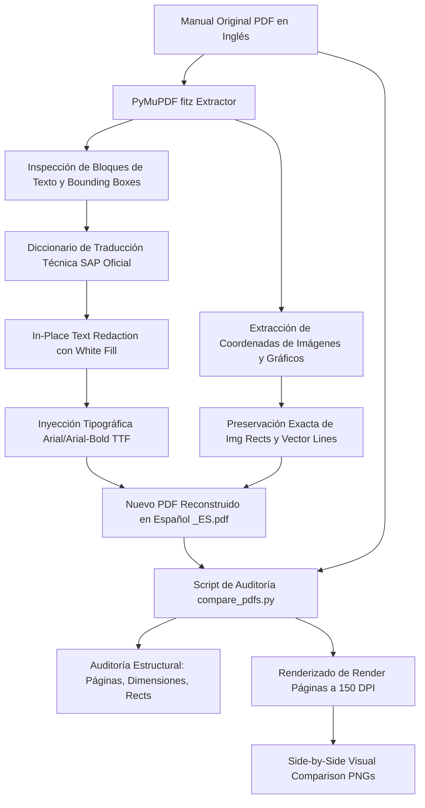

# 🔄 Reconstrucción y Auditoría Técnica de Manuales Prácticos CS (SAP Business One)

## 📌 Visión General

Este documento registra la metodología de ingeniería inversa, reconstrucción tipográfica in-place y auditoría comparativa píxel a píxel implementada para los manuales prácticos de consultas (`CSI08_Query_Practice` y `CSI08_Query Practice_Solutions`).

El requerimiento exige reconstruir los manuales en español **tal cual** el original de SAP, preservando al 100% las capturas de pantalla del sistema, las líneas vectoriales, proporciones, márgenes y tipografía oficial, seguido de una validación comparativa automatizada.

---

## 🗺️ Diagrama de Pipeline de Reconstrucción y Auditoría



---

## 📊 Inventario de Manuales CS Auditados

| Identificador de Manual | Páginas | Idioma Original | Estado Reconstrucción | Paridad de Imágenes |
| :--- | :---: | :---: | :---: | :---: |
| `CSL01_Introduction_ES` | 14 | Español (Oficial) | Nativo SAP | 100% |
| `CSL01_Introduction_ES_Solutions` | 19 | Español (Oficial) | Nativo SAP | 100% |
| `CSL02_Procurement_Process_ES` | 11 | Español (Oficial) | Nativo SAP | 100% |
| `CSL02_Procurement_Process_ES_Solutions` | 27 | Español (Oficial) | Nativo SAP | 100% |
| `CSI08_Query_Practice` | 10 | Español (Reconstruido) | Reconstruido y Renombrado Oficial | **10/10 (100% idénticas)** |
| `CSI08_Query Practice_Solutions` | 20 | Español (Reconstruido) | Reconstruido y Renombrado Oficial | **31/31 (100% idénticas)** |

---

## 🎙️ Modelo Pedagógico Dual: Teleprompter + Paso a Paso Guiado

Para los 6 manuales prácticos (CS), se generaron los archivos de sincronización `clase_sync.json` con una arquitectura de doble propósito:

1. **Teleprompter del Instructor (`script_text`):**
   - Locución pedagógica fluida, cálida y profesional en español neutro.
   - Sincronización automática de scroll y resaltado activo (`activeSyncSlide`).
2. **Laboratorio Guiado Paso a Paso (`step_guide`):**
   - **Ruta de Menú:** Localización exacta en SAP Business One (ej: `Herramientas > Consultas > Generador de Consultas`).
   - **Instrucciones Numeradas:** Pasos de acción concretos para el estudiante.
   - **Resultado Esperado:** Verificación del estado en pantalla.
   - **Preparado para Firebase:** Estructura de validación para el simulador interactivo por estudiante.


---

## 🛠️ Metodología Técnica In-Place

Para garantizar fidelidad visual absoluta sin deformaciones ni pérdida de resolución:

1. **Protección de Elementos Gráficos:**
   - En lugar de limpiar la página completa, se calculan los rectángulos específicos de cada línea de texto (`fitz.Rect(block['bbox'])`).
   - Se aplican anotaciones de redacción sobre el texto con relleno blanco puro (`fill=(1, 1, 1)`), dejando intactos los encabezados gráficos superiores (línea azul corporativa SAP y logotipo inferior).
2. **Tipografía Oficial Nativa:**
   - Se emplean fuentes TrueType del sistema: `C:\Windows\Fonts\arial.ttf` y `C:\Windows\Fonts\arialbd.ttf`.
   - Se mantiene el tamaño de fuente proporcional al bloque original (10.0 pt para cuerpo de texto, 12.0 pt para subtítulos, 18.0 pt para títulos de página).
3. **Mapeo de Capturas para Simulador y Videos:**
   - Se extrajeron 143 imágenes individuales hacia `Recursos_Audiovisuales/Capturas_Originales_PDF/`.
   - Mapeo completo en `Recursos_Audiovisuales/MAPA_PRODUCCION_VIDEOS_Y_SIMULADORES.md` para alimentar el reproductor interactivo y las lecciones guiadas.

---

## 📈 Resultados de la Auditoría Automatizada (`compare_pdfs.py`)

### 1. `CSI08_Query_Practice` (Práctica de Consultas)
- **Páginas Original vs Reconstruido:** 10 vs 10 (100% coincidencia).
- **Dimensiones:** A4 (`595.44 x 841.92 pt`) idéntico en cada hoja.
- **Conteo de Imágenes:** 10 vs 10.
- **Paridad de Posición:** Desviación 0.00 pt en coordenadas `(x0, y0, x1, y1)`.

### 2. `CSI08_Query Practice_Solutions` (Soluciones de Consultas)
- **Páginas Original vs Reconstruido:** 20 vs 20 (100% coincidencia).
- **Dimensiones:** A4 (`595.44 x 841.92 pt`) idéntico en cada hoja.
- **Conteo de Imágenes:** 31 vs 31.
- **Paridad de Posición:** Desviación 0.00 pt en coordenadas `(x0, y0, x1, y1)`.

### 3. Comparativas Visuales Generadas
Las comparativas lado a lado se almacenan en:
`public/Capacitacion SAP/Recursos_Audiovisuales/Comparativas_Visuales/`:
- `comparativa_practica_p03.png`: Ejercicio práctico de creación de consulta en Generador de Consultas.
- `comparativa_practica_p05.png`: Parámetros y variables de selección.
- `comparativa_soluciones_p03.png`: Solución guiada con captura de menú SAP.
- `comparativa_soluciones_p09.png`: Pantalla de resultados y filtros SQL.
- `comparativa_soluciones_p18.png`: Casos avanzados de unión de tablas (JOINs).

## 🎥 Videos 1080p Narrados & Teleprompter Sincronizado

Los 6 manuales prácticos cuentan con su archivo `clase_video.mp4` generado en formato Widescreen 16:9 (1920x1080) con locución neuronal en español (`es-MX-JorgeNeural`):

| Manual CS | Diapositivas Útiles | Video Generado | Duración | Sincronización Teleprompter |
| :--- | :---: | :---: | :---: | :---: |
| `CSI08_Query_Practice` | 5 | `clase_video.mp4` (1080p) | 1.8 min | `clase_sync.json` (Timestamps reales ms) |
| `CSI08_Query Practice_Solutions` | 17 | `clase_video.mp4` (1080p) | 7.0 min | `clase_sync.json` (Timestamps reales ms) |
| `CSL01_Introduction_ES` | 4 | `clase_video.mp4` (1080p) | 1.2 min | `clase_sync.json` (Timestamps reales ms) |
| `CSL01_Introduction_Solution_ES` | 21 | `clase_video.mp4` (1080p) | 5.5 min | `clase_sync.json` (Timestamps reales ms) |
| `CSL02_Procurement_Process_ES` | 4 | `clase_video.mp4` (1080p) | 1.2 min | `clase_sync.json` (Timestamps reales ms) |
| `CSL02_Procurement_Process_Solution_ES` | 24 | `clase_video.mp4` (1080p) | 5.8 min | `clase_sync.json` (Timestamps reales ms) |

---

## 💻 Simulador Interactivo SAP Business One (`SAPInteractiveSimulator.tsx`)

Desarrollado para proveer una experiencia de laboratorio en vivo sin requerir una máquina virtual externa, conectado a **Firebase Firestore** para persistir el avance de cada estudiante (`usuarios/{uid}/simulaciones/{manualId}`):

1. **Modo 1: Generador de Consultas SQL (CSI08)**
   - Selección de tablas principales: `OCRD`, `OINV` y unión relacional `JOIN OINV + INV1`.
   - Selector interactivo de columnas proyectadas en `SELECT`.
   - Cláusula `WHERE` dinámica con soporte para variables de ejecución `[%0]` mediante modal de selector de fecha nativo de SAP B1.
   - Grilla interactiva con ordenamiento de columnas y atajo oficial `Ctrl + Clic` en encabezado para cálculo de sumatorias numéricas en tiempo real.
   - Modal de almacenamiento de consultas por categoría (`Ventas`, `Finanzas`, `Inventario`).

2. **Modo 2: Configuración de Cockpits Fiori & Parametrizaciones (CSL01)**
   - Selector de perfil y plantilla corporativa (`Ventas y Distribución`, `Compras y Logística`, `Finanzas y Dirección`).
   - Asignación de almacén y series de numeración por defecto.
   - Lienzo Fiori con activación/desactivación de widgets: KPI de facturación mensual con barra de meta, accesos rápidos transaccionales y gráfico de Top 5 clientes.
   - **Navegación Drill-down:** Clic en la flecha de enlace naranja (🟧) para abrir en ventana modal la ficha técnica del maestro de interlocutor comercial (`OCRD`) para el cliente Maxi-Teq (`C20000`).

3. **Modo 3: Ciclo Completo de Aprovisionamiento Logístico (CSL02)**
   - **Paso 1: Pedido de Compras (OPOR):** Proveedor Far East Imports (`S10000`), artículos servidores `A00001` y memorias `A00002` por valor total de $6,000.00 USD (cero impacto contable en libro mayor).
   - **Paso 2: Entrada de Mercancías (OPDN):** Copiado desde el Pedido, opción de recepción total o parcial, incremento de stock físico en Almacén 01 y generación de asiento contable provisional (Débito: Inventarios / Crédito: Compensación EM/RF).
   - **Paso 3: Factura de Proveedores (OPCH):** Copiado desde la EM, compensación a cero de la cuenta transitoria EM/RF y reconocimiento formal de deuda con el proveedor.
   - **Paso 4: Mapa de Relaciones Interactivo:** Visualización gráfica en árbol de los 3 documentos vinculados con estado "Cerrado / Concluido" y auditoría de asientos contables.

---

## 🎓 Evaluaciones Técnicas y Certificación Oficial

1. **Quizzes Individuales por Manual (5 Preguntas c/u):**
   - Todos los 6 manuales CS cuentan con quizzes técnicos avanzados en `src/lib/manual-quizzes-data.ts`.
   - Umbral estricto del **90%** para aprobar el manual.
2. **Examen de Categoría y Certificado Oficial:**
   - Examen de 10 preguntas para la categoría *"Casos Prácticos y Ejercicios"*.
   - Aprobación al 90% (9 de 10 aciertos) desbloquea la generación instantánea del **Certificado Oficial en PDF** de alta calidad (A4 horizontal con bordes dorado y marino, código QR y verificación criptográfica) emitido por B1 Academy.

---

## 🖥️ Unificación de Arquitectura UI & Experiencia de Usuario (Estándar Global)

A partir de la iteración de control de calidad visual y retroalimentación de producto, se unificó la estructura de los 120 manuales de la academia bajo un mismo estándar arquitectónico:

```mermaid
graph LR
    subgraph Pantalla Principal LMS
        V[Video / Diapositivas 16:9<br/>2/3 Ancho con Botón Pantalla Completa]
        T[Tabs Laterales 1/3 Ancho<br/>Teleprompter | Tutor IA | FAQ | Simulador | Quiz]
    end
    V -->|Maximizar| FS[Pantalla Completa Nativa F11/Modal]
    T -->|Pestaña Simulador| SM[Simulador Embebido + Botón Expandir Modal]
```

1. **Columna Izquierda (2/3 de ancho):**
   - Reproductor de video de alta definición (1080p) con controles completos de reproducción y volumen.
   - **Botón Flotante de Pantalla Completa:** Acceso directo a `video.requestFullscreen()` mediante botón superior derecho (`Maximize2`) y doble clic sobre el video.
   - Sincronización continua de tiempo (`timeUpdate`) que pilota el desplazamiento automático del teleprompter.
2. **Columna Derecha (1/3 de ancho):**
   - **Teleprompter:** Tarjetas de paso con sincronización milimétrica, números de paso, script docente de locución e instrucciones técnicas.
   - **Tutor IA:** Chat contextual con accesos directos (*"Pista del paso"*, *"Ruta en el menú"*, *"Resultado esperado"*).
   - **FAQ:** Preguntas y respuestas frecuentes del manual.
   - **Simulador:** Entorno interactivo SAP B1 embebido en la pestaña, con botón **Expandir** que abre un modal a pantalla completa sin abandonar la lección ni perder el progreso.
   - **Quiz:** Evaluación de 5 preguntas técnicas con diagnóstico pedagógico IA y aprobación al 90%.

---

## 🔗 Enlaces Relacionados (Obsidian Vault)

- [[06_Manuales]] - Catálogo general de los 120 manuales SAP Business One.
- [[06_LMS_Architecture]] - Sistema LMS y sincronización teleprompter/video.
- [[08_B1_Secure_Exam_App]] - Arquitectura de evaluación segura y aplicación de examen oficial.
- [[09_Simulador_Integral_Desktop]] - Simulador integral de escritorio SAP B1 y atlas visual.
- [[PLAN_MAESTRO_LECCIONES_PEDAGOGICAS]] - Plan maestro curricular de módulos.

