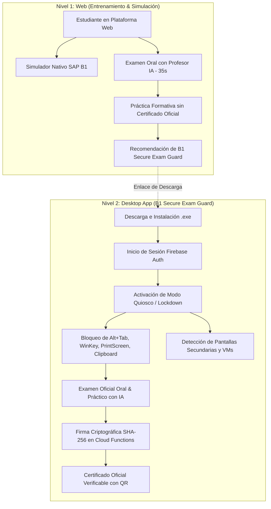
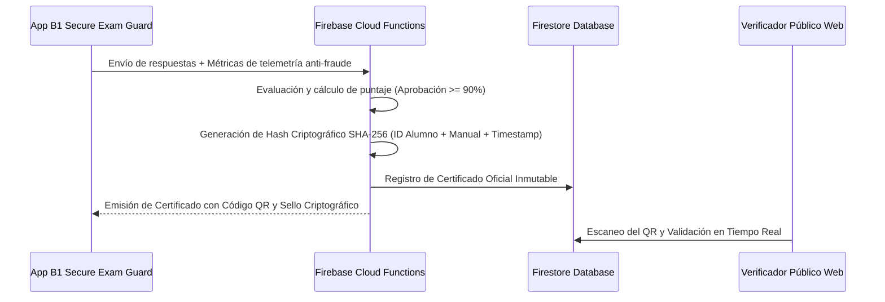

# 🛡️ B1 Secure Exam Guard: Arquitectura de Evaluación Segura y Certificación Oficial

## 📌 Visión General

Este documento define la arquitectura técnica del ecosistema de evaluación y certificación para **SAP Academy (Heinsohn B1)**, resolviendo la necesidad de impedir el uso no autorizado de asistentes de Inteligencia Artificial (ChatGPT, Copilot, etc.) o trampas durante los exámenes oficiales.

Se adopta un **modelo de dos niveles (Dual-Tier)**:
1. **Nivel 1 (Web):** Entorno de entrenamiento y práctica interactiva con el **Simulador SAP B1** y el **Examen Oral con Profesor Evaluador IA** (límite de 35 segundos por pregunta).
2. **Nivel 2 (Desktop Kiosk App - B1 Secure Exam Guard):** Aplicación de escritorio descargable (`.exe` / `.msi`) con modo quiosco blindado para la rendición de exámenes con validez oficial y emisión criptográfica de certificados.

---

## 🗺️ Diagrama de Arquitectura de Evaluación Dual

---

## 🖥️ 1. Nivel Web: Simulador Nativo & Examen Oral IA

Implementado en [`ManualViewer.tsx`](file:///c:/Users/pablo/OneDrive/Desktop/proyectos%20web/sap%20academy/src/components/site/ManualViewer.tsx) y [`SAPInteractiveSimulator.tsx`](file:///c:/Users/pablo/OneDrive/Desktop/proyectos%20web/sap%20academy/src/components/simulator/SAPInteractiveSimulator.tsx):

### A. Simulador Interactivo Píxel-Perfect SAP B1
- **Barra de Título Auténtica:** Gradiente azul acero clásico (`from-[#004e92] to-[#000428]`), ícono nativo SAP, tipografía Tahoma/Segoe UI y controles de ventana (`_ [] X`).
- **Panel Izquierdo:** Tabla de dos columnas (`Name` / `Description`) de campos de tabla (ej. `CardCode`, `CardName`, `CardType`, `Balance`), doble clic para inserción y botón de avance `>>`.
- **Panel Derecho:** Cajas de texto estructuradas `Select`, `From`, `Where`, `Sort By`, `Group By` con fondo amarillo pálido característico (`#fffde0`).
- **Botones con Relieve Clásico (Beveled):** Botones `[ Execute ]` y `[ Close ]` con sombreado de borde 3D idéntico al cliente SAP Business One para Windows.
- **Grilla de Resultados:** Tabla de datos con selección de fila, ordenamiento de columnas y cálculo de sumatoria con `Ctrl + Clic` en cabeceras numéricas.

### B. Examen Oral con Profesor Evaluador IA
- **Contrarreloj Estricto (35 segundos):** Cada pregunta se expone como una intervención oral del profesor evaluador. Si el tiempo expira, la pregunta se califica automáticamente con 0/100 y avanza a la siguiente.
- **Protección Anti-Pegado (`Ctrl+V`):** El portapapeles web está bloqueado (`e.preventDefault()`) para impedir copiar y pegar desde ChatGPT.
- **Detección de Cambio de Foco (`visibilitychange`):** Registra eventos de salida de ventana y emite alertas de seguridad.

---

## 🔒 2. Nivel Desktop: B1 Secure Exam Guard (Modo Quiosco)

Para garantizar integridad académica absoluta, la emisión del certificado oficial se delega a la aplicación de escritorio **B1 Secure Exam Guard**.

### Stack Tecnológico Recomendado
- **Framework:** **Tauri v2 (Rust + Next.js / Webview)** o **Electron Lockdown**.
  - *Ventaja de Tauri:* Binario ultraligero (< 15 MB), bajo consumo de RAM (< 40 MB), acceso nativo a APIs del sistema operativo Windows (`user32.dll`) sin sobrecargar el equipo del estudiante.

### Capacidades de Blindaje (Lockdown Features)
1. **Bloqueo de Teclado del Sistema (Global Low-Level Keyboard Hook):**
   - Deshabilita combinaciones del sistema operativo: `Alt + Tab`, `Win Key`, `Ctrl + Shift + Esc`, `Alt + F4`, `PrintScreen`.
2. **Restricción de Pantalla y Ventana:**
   - Modo pantalla completa exclusiva (Exclusive Fullscreen Kiosk Mode).
   - Bloqueo de cambio de foco (`WM_KILLFOCUS`).
   - Detección de monitores múltiples: exige desconectar pantallas adicionales antes de iniciar el examen.
3. **Aislamiento de Portapapeles:**
   - Limpieza y deshabilitación total del portapapeles del sistema durante la sesión de examen.
4. **Detección de Máquinas Virtuales y Procesos No Autorizados:**
   - Monitoreo en segundo plano para alertar si el examen se ejecuta dentro de VirtualBox, VMware, o si aplicaciones de captura/asistencia remota (AnyDesk, TeamViewer, OBS) están activas.

---

## 📜 3. Emisión y Validación Criptográfica del Certificado

1. **Hash Criptográfico Único:** `SHA256(student_id + manual_id + timestamp + secret_key)`.
2. **Código QR Inalterable:** Redirige a `/validar-certificado/[cert_id]` donde cualquier empleador o consultora puede verificar la autenticidad en tiempo real.
3. **Auditoría de Intentos:** Registro de telemetría de intentos fallidos, tiempos de respuesta y eventos de sospecha.

---

## 🔗 Documentos Relacionados

- [[06_LMS_Architecture]] - Arquitectura general de la plataforma de aprendizaje.
- [[06_Manuales]] - Catálogo e índice de los 120 manuales SAP Business One.
- [[07_Reconstruccion_Manuales_CS]] - Reconstrucción y auditoría técnica de manuales prácticos CS.
- [[09_Simulador_Integral_Desktop]] - Simulador integral de escritorio SAP B1 y atlas visual.
- [[PLAN_MAESTRO_LECCIONES_PEDAGOGICAS]] - Estándar pedagógico docente y registro de lecciones.
