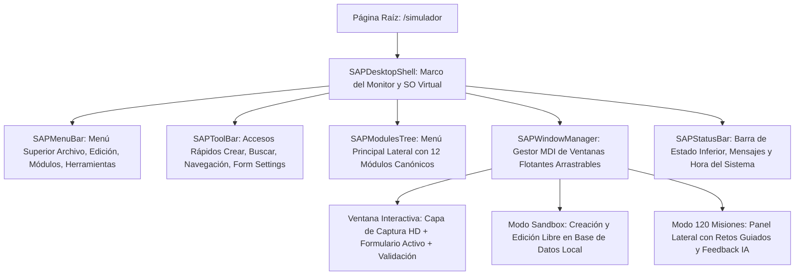

# 🖥️ Simulador Integral Virtual de SAP Business One - IMPLEMENTACIÓN VIVA

## 📌 Estado: ✅ OPERACIONAL - SPRINT 1, 2 & 3 COMPLETADOS

El **Simulador Integral (`/simulador`)** es un entorno virtual de escritorio que replica fielmente la interfaz de **SAP Business One 10.0 (HANA)** dentro de SAP Academy. Permite al estudiante explorar, practicar y dominar las **66+ pantallas y submódulos** (distribuidas en 12 módulos canónicos) en modo sandbox.

**Fecha de Lanzamiento**: 2026-10-01 | **Versión**: 1.0 | **Build Status**: ✅ EXIT CODE 0

---

## 🗺️ Diagrama de Componentes del Escritorio Virtual

---

## 🗂️ Estructura del Árbol Canónico de 12 Módulos SAP B1

El árbol lateral (`SAPModulesTree.tsx`) replica exactamente el orden oficial del cliente SAP Business One:

1. **📁 Gestión / Administración:** Inicialización del sistema, Definiciones, Autorizaciones y tipos de cambio.
2. **📁 Finanzas:** Plan de cuentas, Asientos contables manuales, Diferencias de cambio e Informes financieros.
3. **📁 Oportunidades de Ventas:** Gestión del pipeline comercial y etapas de prospección.
4. **📁 Ventas - Clientes:** Oferta de venta, Orden de venta, Entrega, Devolución, Factura de clientes y Nota de crédito.
5. **📁 Compras - Proveedores:** Solicitud de compra, Oferta de compra, Pedido, Entrada de mercancías (EM) y Factura de proveedores.
6. **📁 Socios de Negocios:** Datos maestros de socios de negocios (Clientes, Proveedores y Leads) y Actividades.
7. **📁 Gestión de Bancos:** Pagos recibidos (cobros), Pagos efectuados y Conciliación bancaria.
8. **📁 Inventario:** Datos maestros de artículo, Movimientos de almacén, Listas de precios y Ubicaciones (Bin Locations).
9. **📁 Recursos y Producción:** Estaciones de recursos, Listas de materiales (BOM) y Órdenes de fabricación.
10. **📁 Planificación de Necesidades (MRP):** Asistente de planificación y Previsiones de demanda.
11. **📁 Servicios:** Tarjetas de equipo, Contratos de servicio y Llamadas de servicio técnico.
12. **📁 Herramientas y Consultas:** Generador de consultas SQL (Query Generator), Asistente de consultas y Parametrizaciones.

---

## 🪟 Arquitectura del Administrador de Ventanas MDI (`SAPWindowManager.tsx`)

* **Multitarea Real:** Permite tener abiertas simultáneamente pantallas de diferentes módulos (ejemplo: una *Factura de Clientes* junto a los *Datos Maestros de Socio de Negocios* y el *Generador de Consultas*).
* **Interacciones Clásicas de Ventana:**
  * **Arrastre (Drag & Drop):** Posicionamiento libre sobre el canvas del escritorio.
  * **Foco Dinámico (Z-Index):** La ventana sobre la que hace clic el usuario pasa automáticamente al primer plano.
  * **Minimizar / Maximizar / Cerrar:** Botones nativos `_ [] X` con minimización a botones en la barra de tareas inferior.

---

## 🎯 Modo Sandbox vs Modo Misiones Guiadas

### 1. Modo Sandbox (Exploración Libre)
* Diseñado para que los estudiantes pierdan el miedo al sistema real.
* Permite explorar cualquier ventana, navegar entre registros con los botones de flecha (`Primero`, `Anterior`, `Siguiente`, `Último`) y consultar datos maestros simulados.

### 2. Modo Misiones Guiadas (120 Misiones Oficiales)
* Vinculado directamente a los manuales de la academia.
* Cada misión plantea un caso de negocio real (ej: *"Registrar un Pedido de Compras a Far East Imports por 10 Servidores ProLiant y enlazarlo con la Entrada de Mercancías"*).
* El motor valida los campos introducidos, provee pistas contextuales mediante la IA y otorga puntos de experiencia (XP) al completarse satisfactoriamente.

---

## 🔗 Documentos Relacionados

* [[06_LMS_Architecture]] - Arquitectura general del ecosistema educativo.
* [[06_Manuales]] - Índice de los manuales SAP Business One.
* [[07_Reconstruccion_Manuales_CS]] - Reconstrucción técnica de manuales prácticos CS.
* [[08_B1_Secure_Exam_App]] - Arquitectura de la aplicación de escritorio para exámenes oficiales.
* [[PLAN_MAESTRO_LECCIONES_PEDAGOGICAS]] - Estándar pedagógico docente y registro de lecciones.
