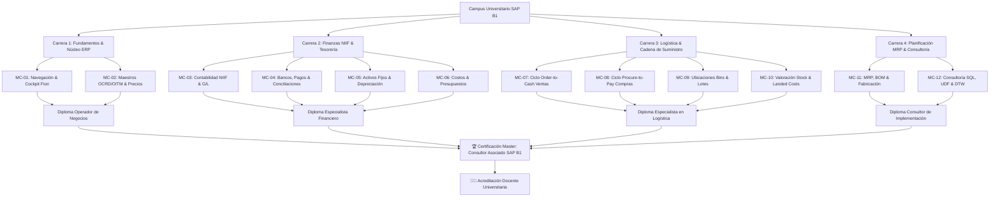

# 🏛️ Campus Universitario & Escuela SAP Business One 10.0 (HANA)

El Campus Universitario (`/campus`) es el nuevo núcleo formativo de élite de la academia, superando la anterior estructura de 5 tracks genéricos para consolidar una **Escuela Profesional y Universitaria** con 4 Carreras de Especialización, 12 Micro-certificaciones por hitos operativos y un modelo de habilitación docente.

---

## 🗺️ Mapa de Arquitectura Curricular

---

## 🎖️ Sistema de Acreditación & Monetización de Títulos Oficiales

Cada título emitido en el campus se procesa mediante el motor de alta resolución jsPDF (`[[11_Master_B1_Tutor_IA]]`) e incluye:
1. **Firmas de Responsabilidad:**
   - Director Académico y de Certificaciones (*Ing. Pablo García*).
   - Comité Técnico Evaluador y Red de Consultoría SAP (*Master B1 & Lead Consultants*).
2. **Código de Validación Oficial:** Código alfanumérico único (ej. `B1-MIC-9AB21C-2026`).
3. **Hash Criptográfico SHA-256:** Evidencia anti-adulteración.
4. **Enlace de Validación Pública:** Accesible por reclutadores y universidades en `https://b1academy.org/verificar/[CODE]`.
5. **Sello Oficial en Oro B1 Verified.**

---

## 👨‍🏫 Programa "Train the Trainer" (Docencia Universitaria)

El Campus cuenta con un selector de perfil para alternar entre:
- **Estudiante / Profesional:** Foco en la asimilación técnica, resolución de retos en el simulador y obtención de micro-credenciales.
- **Docente Universitario:** Vista para catedráticos con:
  - Requisitos de habilitación como *Docente Catedrático Especialista* (1 carrera aprobada al 90%+).
  - Requisitos de habilitación como *Docente Titular Master B1* (121 manuales + simulador integral).
  - Guías didácticas oficiales generadas por Master B1.
  - Banco de casos de estudio empresariales.

---

## 🔗 Enlaces Relacionados (Obsidian Vault)

- [[11_Master_B1_Tutor_IA]] - Especificación de la IA residente Master B1 y checkpoints interactivos.
- [[06_LMS_Architecture]] - Arquitectura general del LMS.
- [[06_Manuales]] - Catálogo e índice de los 121 manuales técnicos.
- [[09_Simulador_Integral_Desktop]] - Simulador integral de escritorio SAP B1 y atlas visual.
