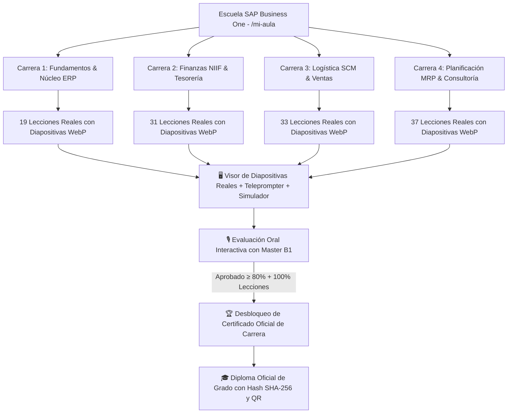

# 🏛️ Campus Universitario & Escuela SAP Business One 10.0 (HANA)

El Campus Universitario (`/mi-aula` y `/mi-aula/[careerId]`) es la plataforma de formación de nivel mundial de la academia, superando a plataformas como edX o Coursera al integrar:
1. **Sidebar Colapsable** con perfil del alumno, progreso en tiempo real, árbol de módulos y estado de acreditaciones.
2. **Visor de Diapositivas Reales** en alta definición (`.webp`) extraídas directamente de los manuales oficiales.
3. **Teleprompter y Cátedra de Master B1** con locución por síntesis de voz sincronizada.
4. **Laboratorio de Práctica en el Simulador SAP B1 10.0 (HANA)**.
5. **Evaluación Oral Interactiva con Master B1 (Defensa Técnica)**: Conversación en vivo donde la IA evalúa respuestas técnicas sobre casos reales de consultoría antes de otorgar cualquier acreditación.

---

## 🗺️ Mapa de Arquitectura de la Escuela (Manuales en 4 Carreras)

---

## 🔒 Política de Integridad y Acreditación de Grado

> **Regla de Rigor Universitario:** Ningún certificado se regala ni se emite con simples preguntas de selección múltiple.
> Para desbloquear el Certificado Oficial de Carrera o el Diploma de Grado:
> 1. El estudiante debe **completar el 100% de las lecciones** de la carrera en el visor de diapositivas.
> 2. Debe defender sus conocimientos en la **Evaluación Oral con Master B1**, respondiendo preguntas de análisis de casos de consultoría empresarial en tiempo real con una calificación mínima del **80%** (a diferencia del **90%** requerido para aprobar cada manual / lección individual).

---

## 🎙️ Evaluación Oral con Master B1 (`/api/oral-exam`)

- **Rol de la IA:** Examinador Titular de la Escuela SAP Business One.
- **Dinámica:** Diálogo técnico abierto donde Master B1 plantea situaciones de contingencia y audita la comprensión de la lógica contable, trazabilidad y parametrizaciones del sistema.
- **Rúbrica:** 0 a 25 puntos por respuesta argumentada (total 100 puntos en 4 preguntas).
- **Desbloqueo:** Al aprobar con 80 puntos o más, el estado del certificado en el sidebar pasa de 🔒 Bloqueado a 🎉 Desbloqueado, habilitando la generación del PDF oficial firmado.

---

## 🔗 Enlaces Relacionados (Obsidian Vault)

- [[11_Master_B1_Tutor_IA]] - Especificación de la IA residente Master B1 y motor de evaluación oral.
- [[06_LMS_Architecture]] - Arquitectura general del LMS con sidebar colapsable.
- [[06_Manuales]] - Catálogo e índice de los manuales técnicos oficiales.
- [[09_Simulador_Integral_Desktop]] - Simulador integral de escritorio SAP B1 y atlas visual.
