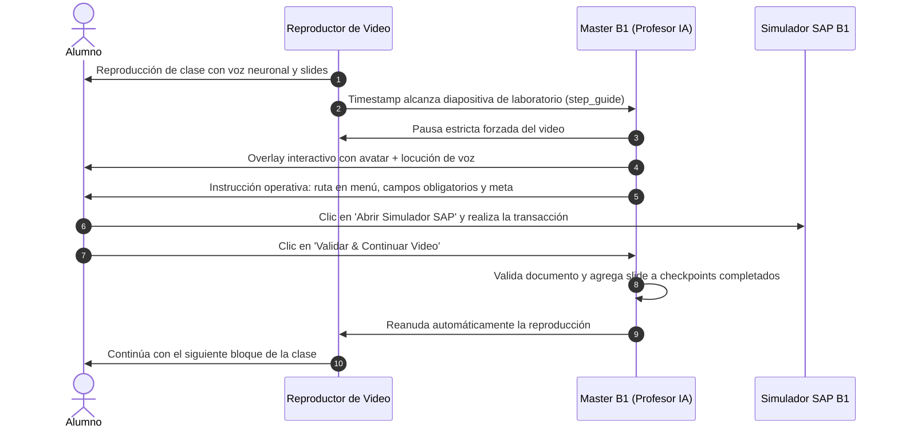

# 🤖 Master B1: Profesor IA Residente & Tutor de Laboratorio

**Master B1** es la inteligencia artificial pedagógica que vive dentro del entorno de aprendizaje de la academia SAP Business One. Su misión es garantizar que los estudiantes, profesionales y docentes no consuman contenido de forma pasiva, sino que desarrollen memoria muscular y rigor transaccional en el ERP.

---

## ⚡ Flujo de Intervención: Pausa Estricta en Video (Opción A)

---

## 👨‍🏫 Modo Docente (Herramientas para Profesores)

Master B1 habilita la pestaña **Modo Docente** en cada lección técnica (`[[06_Manuales]]`), proporcionando al catedrático:
1. **Objetivo de Aprendizaje:** Resumen ejecutivo de la meta transaccional.
2. **Preguntas Socráticas para el Aula:** Reactivos de indagación profunda para formular a los estudiantes durante la clase (impacto en Libro Mayor, tablas vinculadas, etc.).
3. **Errores Frecuentes de Alumnos:** Alertas sobre descuidos habituales de los novatos (olvido de campos mandatorios `#fffde0`, fechas fiscales erróneas).
4. **Rúbrica Práctica en el Simulador:** Criterio explícito para calificar la ejecución del ejercicio en el simulador.

---

## 🔗 Enlaces Relacionados (Obsidian Vault)

- [[10_Campus_Escuela_SAP_B1]] - Arquitectura del Campus y las 4 Carreras.
- [[06_Manuales]] - Biblioteca de los 121 manuales técnicos.
- [[09_Simulador_Integral_Desktop]] - Simulador integral de escritorio y catálogo de pantallas.
