# 🎓 Malla Curricular Oficial de SAP Academy (Estructura Biyectiva 1:1)

> **Actualización:** Octubre 2026  
> **Arquitectura:** Biyectiva 1:1 estricta — Cada Módulo $N$ posee exactamente el ID `mod-N`, clases `modN-c1..cK` y carpeta `public/aula/modN-cK`.  
> **Documentos Relacionados:** [[20_Auditoria_Agente_Estudiante_Simulador_y_Certificacion]] · [[19_Track_Consultoria_y_Business_Analyst]] · [[06_LMS_Architecture]]

---

## 🏛️ 1. Diagrama de la Red Neuronal Académica (Mermaid)

```mermaid
graph TD
    subgraph Bloque1["1. Administración y Talento Humano"]
        M1["M01: Fundamentos (mod-1)"] --> M2["M02: Maestros Socios & Artículos (mod-2)"]
        M2 --> M3["M03: Activos Fijos (mod-3)"]
        M2 --> M4["M04: Administración y Seguridad (mod-4)"]
        M2 --> M5["M05: Gestión de Personal (mod-5)"]
        M5 --> M6["M06: Nómina & IESS 2026 (mod-6)"]
    end

    subgraph Bloque2["2. Logística y Cadena de Suministro"]
        M2 --> M7["M07: Procure-to-Pay (mod-7)"]
        M7 --> M8["M08: Compras Avanzadas (mod-8)"]
        M7 --> M9["M09: Valoración & UdM (mod-9)"]
        M7 --> M10["M10: Bodega & Ubicaciones (mod-10)"]
        M10 --> M11["M11: Despacho & Packing (mod-11)"]
    end

    subgraph Bloque3["3. Gestión Comercial y CRM"]
        M2 --> M12["M12: Order-to-Cash (mod-12)"]
        M12 --> M13["M13: Precios & Descuentos (mod-13)"]
        M12 --> M14["M14: CRM & Post-Venta (mod-14)"]
    end

    subgraph Bloque4["4. Producción y Planificación"]
        M9 --> M15["M15: Planificación MRP (mod-15)"]
        M15 --> M16["M16: Producción BOM (mod-16)"]
        M16 --> M17["M17: Capacidad y Rutas (mod-17)"]
    end

    subgraph Bloque5["5. Finanzas y Fiscalidad"]
        M1 --> M18["M18: Contabilidad NIIF (mod-18)"]
        M18 --> M19["M19: Tesorería & Bancos (mod-19)"]
        M18 --> M20["M20: Monedas & Cierre (mod-20)"]
        M18 --> M21["M21: Costos & Presupuestos (mod-21)"]
        M18 --> M22["M22: Facturación & SRI 2026 (mod-22)"]
    end

    subgraph Bloque6["6. Tecnología y Analítica"]
        M1 --> M23["M23: SQL, Alertas & DTW (mod-23)"]
        M23 --> M24["M24: Extensibilidad & Analytics (mod-24)"]
    end

    subgraph Bloque7["7. Consultoría & Business Analyst"]
        M1 --> M25["M25: SAP Activate (mod-25)"]
        M25 --> M26["M26: BPMN 2.0 (mod-26)"]
        M26 --> M27["M27: Blueprint BRD (mod-27)"]
        M27 --> M28["M28: UAT & Cambio (mod-28)"]
        M28 --> M29["M29: Puesta en Marcha (mod-29)"]
    end

    subgraph Bloque8["8. Proyecto Cumbre de Grado"]
        Bloque1 & Bloque2 & Bloque3 & Bloque4 & Bloque5 & Bloque6 & Bloque7 --> M30["M30: Proyecto Integrador Capstone (mod-30)"]
    end

    M30 --> Master["⭐ Súper Analista & Consultor Máster SAP B1"]
```

---

## 📋 2. Tabla Maestra de Módulos (30 Módulos · Secuencia 1:1)

| Módulo | ID Sistema | Bloque Académico | Clases | Título Oficial de Competencia |
| :---: | :---: | :--- | :---: | :--- |
| **01** | `mod-1` | Administración y Talento Humano | 4 | Fundamentos Operativos, Navegación y Empresa |
| **02** | `mod-2` | Administración y Talento Humano | 4 | Núcleo Maestro ERP: Socios y Artículos |
| **03** | `mod-3` | Administración y Talento Humano | 4 | Control y Gestión Administrativa de Activos Fijos |
| **04** | `mod-4` | Administración y Talento Humano | 6 | Administración del Sistema, Usuarios y Seguridad |
| **05** | `mod-5` | Administración y Talento Humano | 3 | Estructura Organizacional y Gestión de Personal |
| **06** | `mod-6` | Administración y Talento Humano | 3 | Nómina, Beneficios Sociales e IESS Ecuador 2026 |
| **07** | `mod-7` | Logística y Cadena de Suministro | 5 | Aprovisionamiento y Control de Inventarios (Procure-to-Pay) |
| **08** | `mod-8` | Logística y Cadena de Suministro | 3 | Compras Avanzadas y Gestión de Proveedores |
| **09** | `mod-9` | Logística y Cadena de Suministro | 4 | Unidades de Medida y Valoración de Inventario |
| **10** | `mod-10` | Logística y Cadena de Suministro | 4 | Operación de Bodega e Inventario Físico |
| **11** | `mod-11` | Logística y Cadena de Suministro | 2 | Picking, Packing y Despacho |
| **12** | `mod-12` | Gestión Comercial y CRM | 4 | Gestión de Ventas y Order-to-Cash |
| **13** | `mod-13` | Gestión Comercial y CRM | 4 | Estrategias Avanzadas de Precios y Descuentos |
| **14** | `mod-14` | Gestión Comercial y CRM | 4 | Gestión CRM, Oportunidades y Servicio Post-Venta |
| **15** | `mod-15` | Producción y Planificación | 4 | Planificación de Materiales (MRP) |
| **16** | `mod-16` | Producción y Planificación | 4 | Fabricación y Listas de Materiales (BOM) |
| **17** | `mod-17` | Producción y Planificación | 3 | Recursos de Planta, Capacidad y Rutas de Fabricación |
| **18** | `mod-18` | Finanzas y Fiscalidad | 4 | Contabilidad Central y Normativa NIIF |
| **19** | `mod-19` | Finanzas y Fiscalidad | 5 | Tesorería, Cobros, Pagos y Bancos |
| **20** | `mod-20` | Finanzas y Fiscalidad | 4 | Monedas, Cierre Contable e Informes Financieros |
| **21** | `mod-21` | Finanzas y Fiscalidad | 3 | Contabilidad de Costos, Dimensiones y Presupuestos |
| **22** | `mod-22` | Finanzas y Fiscalidad | 10 | Facturación Electrónica y Retenciones SRI 2026 |
| **23** | `mod-23` | Tecnología y Analítica | 4 | Consultoría de Datos, Query Manager SQL y DTW |
| **24** | `mod-24` | Tecnología y Analítica | 2 | Extensibilidad, Tablas de Usuario y Analytics |
| **25** | `mod-25` | Consultoría y Business Analyst | 4 | Metodología de Implementación y Ciclo de Vida SAP Activate |
| **26** | `mod-26` | Consultoría y Business Analyst | 4 | Modelado y Optimización de Procesos de Negocio (BPMN 2.0) |
| **27** | `mod-27` | Consultoría y Business Analyst | 4 | Levantamiento de Requerimientos y Business Blueprint (BRD) |
| **28** | `mod-28` | Consultoría y Business Analyst | 4 | Gestión de Clientes, Pruebas UAT y Adopción del Cambio |
| **29** | `mod-29` | Consultoría y Business Analyst | 4 | Implementación Técnica, Saldos Iniciales y Go-Live |
| **30** | `mod-30` | Proyecto Final | 3 | Proyecto Integrador: Certificación Máxima de Súper Analista |

---

## 🏆 3. Catálogo Oficial de 14 Diplomas de Especialidad

Cada diploma agrupa los módulos en estricto orden correlativo ascendente:

1. **Diploma de Asistente de Compras e Inventarios (`dip-compras`):** `mod-1`, `mod-2`, `mod-7`, `mod-8`, `mod-9`
2. **Diploma de Jefe de Bodega y Logística (`dip-bodega`):** `mod-1`, `mod-2`, `mod-7`, `mod-10`, `mod-11`
3. **Diploma de Ejecutivo Comercial y Ventas (`dip-comercial`):** `mod-1`, `mod-2`, `mod-12`, `mod-13`
4. **Diploma de Especialista en CRM y Post-Venta (`dip-postventa`):** `mod-1`, `mod-2`, `mod-12`, `mod-14`
5. **Diploma de Planificador de Producción (`dip-produccion`):** `mod-2`, `mod-15`, `mod-16`, `mod-17`
6. **Diploma de Asistente Contable NIIF (`dip-contable`):** `mod-1`, `mod-2`, `mod-18`, `mod-20`, `mod-22`
7. **Diploma de Especialista en Tesorería y Cobranzas (`dip-tesoreria`):** `mod-1`, `mod-18`, `mod-19`, `mod-22`
8. **Diploma de Analista de Costos y Presupuestos (`dip-costos`):** `mod-3`, `mod-9`, `mod-18`, `mod-21`
9. **Diploma de Gestión Administrativa y Control de Activos Fijos (`dip-admin-activos`):** `mod-1`, `mod-2`, `mod-3`, `mod-4`
10. **Diploma de Especialista en Talento Humano y Nómina (`dip-nomina`):** `mod-1`, `mod-2`, `mod-5`, `mod-6`
11. **Diploma de Consultor Comercial y Preventa SAP B1 (`dip-ventas-master`):** `mod-1`, `mod-2`, `mod-12`, `mod-13`, `mod-14`, `mod-23`
12. **Diploma de Administrador SAP Business One (`dip-admin`):** `mod-1`, `mod-4`, `mod-23`, `mod-24`
13. **Diploma de Consultor de Implementación (`dip-consultor`):** `mod-4`, `mod-23`, `mod-29`, `mod-30` (requiere al menos 1 diploma funcional previo)
14. **Diploma de Consultor Funcional & Business Analyst (`dip-business-analyst`):** `mod-1`, `mod-2`, `mod-25`, `mod-26`, `mod-27`, `mod-28`

---

## 🎖️ 4. Titulación Máxima de Grado: Súper Analista & Consultor Máster

- **ID del Programa:** `master-consultor-integral`
- **Requisito:** Aprobación de las 30 certificaciones de competencia técnica, validación de las 366 prácticas evaluadas en Supabase (PostgreSQL Cloud) y defensa aprobada del Proyecto Integrador Capstone.
- **Acreditación Registrada:** Ver reporte detallado en [[20_Auditoria_Agente_Estudiante_Simulador_y_Certificacion]].
