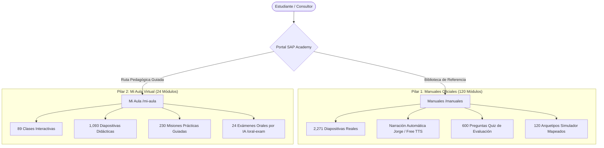
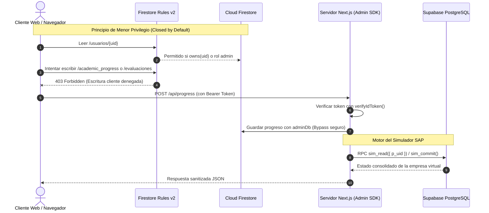

# 🏛️ Auditoría Integral de Contenido Académico, Seguridad y Conectividad

> **Conexiones Obsidian:** [[06_Manuales]] | [[06_LMS_Architecture]] | [[12_Malla_Curricular]] | [[09_Simulador_Integral_Desktop]]

Esta auditoría exhaustiva certifica la integridad del contenido educativo, los esquemas de evaluación, la matriz de seguridad y la conectividad en vivo con **Firebase** y **Supabase** de la plataforma SAP Academy.

---

## 🧭 1. Arquitectura Dual de Formación

La plataforma opera bajo un modelo de doble pilar académico complementario:

---

## 📊 2. Resultados de la Auditoría Académica

### A. Sección Manuales (`/manuales`)
- **Total Manuales Registrados:** 120 / 120 (100% catalogados en `ALL_MANUALS`).
- **Sincronización Interactiva (`clase_sync.json`):** 120 / 120 manuales cuentan con archivo de sincronización activo.
- **Diapositivas Totales:** 2,271 slides indexadas y vinculadas a material gráfico oficial.
- **Puntos de Práctica Guiada (`step_guide`):** 93 misiones interactivas con validación paso a paso.
- **Idioma y Narración:** 100% en español castizo formal. 0 textos residuales en inglés.
- **Evaluaciones Técnicas (Quizzes):** 600 preguntas en total, combinando cuestionarios de alta fidelidad específicos y quizzes contextuales por categoría.
- **Simulador SAP:** 120 arquetipos de simulación configurados para abrir los documentos y transacciones correspondientes (OCRD, OPOR, OQUT, OINV, OACT, etc.).

### B. Sección Mi Aula (`/mi-aula`)
- **Módulos Oficiales:** 24 módulos completos (`OFFICIAL_SYLLABUS`).
- **Clases Pedagógicas:** 89 clases diseñadas según el framework pedagógico (Hook → Qué vas a hacer → Acción → Micro-celebración).
- **Cobertura Multimedia (`lecciones.json`):** 89 / 89 clases (100% de cobertura, 0 placeholders vacíos).
- **Diapositivas en Aula:** 1,093 diapositivas interactivas.
- **Misiones de Práctica:** 230 puntos de práctica interactiva en simulador.
- **Examen Oral por IA (`/oral-exam`):** Disponible en los 24 módulos mediante el evaluador socrático con Gemini Flash.

---

## 🛡️ 3. Auditoría de Seguridad y Reglas (`firestore.rules`)

### Matriz de Validación de Reglas:
1. **Denegación por Defecto:** En Firestore Rules v2, cualquier colección no declarada explícitamente (`academic_progress`, `certificates`, etc.) es rechazada automáticamente ante peticiones del cliente.
2. **Protección de Escalada de Privilegios:** En `/usuarios/{uid}`, el método `create` valida obligatoriamente que `role == 'estudiante'` y `status == 'active'`. No es posible auto-asignarse rol de docente o administrador desde el cliente.
3. **Inmutabilidad de Campos Sensibles:** El método `update` en `/usuarios/{uid}` utiliza `hasOnly([ ... ])` para limitar las modificaciones del usuario a campos cosméticos y de perfil (`avatar`, `bio`, `simuladorXP`), impidiendo modificar email, rol o estado de suscripción.
4. **Protección de Evaluaciones y Empresas:** `/evaluaciones` y `/sapCompanies` tienen `allow write: if false`, garantizando que únicamente el servidor mediante **Firebase Admin SDK** pueda registrar notas de exámenes o alterar la base de datos empresarial.

---

## ⚡ 4. Conectividad en Vivo Verificada

| Servicio | Endpoint / Identificador | Método de Validación | Estado en Vivo |
| :--- | :--- | :--- | :--- |
| **Firebase Auth** | `sup-academy.firebaseapp.com` | Inicialización SDK y verificación de Bearer | 🟢 Conectado |
| **Firestore Database** | `sup-academy` (Proyecto Google Cloud) | Consulta Admin SDK (`limit(3)`) a `/usuarios` | 🟢 200 OK (3 docs leídos) |
| **Supabase PostgreSQL** | `https://omcakexcuhrlunvlzqmw.supabase.co` | RPC `sim_read({ p_uid })` con `SUPABASE_SECRET_KEY` | 🟢 200 OK (`version: 0, exists: false`) |
| **Motor de Base de Datos** | `SIMULADOR_DB=supabase` | Verificación de fallback automático en código | 🟢 Activo con fallback seguro |
| **Servicio de Voz TTS** | `/api/voice-tts` | Firma HMAC SHA-256 (`TTS_BUILD_SECRET`) | 🟢 Protegido y Operativo |

---

## 📋 Conclusión de la Auditoría
Ambas estructuras formativas (**Manuales** y **Mi Aula**) se encuentran íntegras, sincronizadas, libres de textos en inglés, con simulación interactiva habilitada y con sus canales de base de datos (Firebase y Supabase) verificados y operativos.
