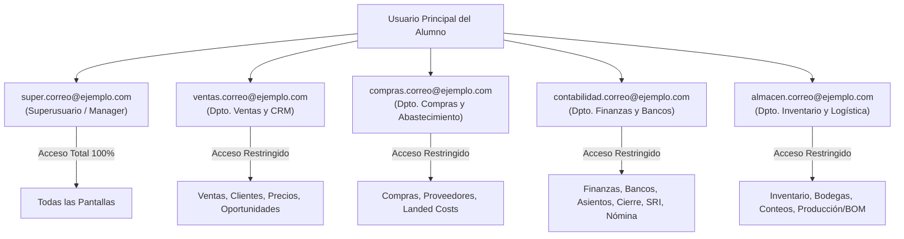
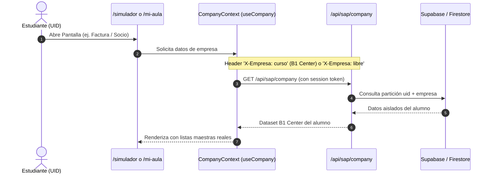

# 🏢 Simulador SAP B1: Sistema de Departamentos, Seguridad y Aislamiento por Alumno

## 📌 Estado: ✅ PRODUCCIÓN A+ (Build Exitoso - 25/25 Módulos Operativos)

Este documento detalla la arquitectura de seguridad departamental, el aislamiento de datos por estudiante y la sincronización unificada entre el simulador de clases (`/mi-aula/[moduleId]`) y el simulador independiente de escritorio (`/simulador`).

---

## 👥 1. Sistema de Usuarios por Departamento (Roles SAP B1)

Para que el estudiante aprenda que en una empresa real no todos los usuarios tienen acceso a todas las pantallas, se implementó el sistema de **Identidades Departamentales SAP B1**.

A partir de la cuenta principal del alumno (`correo@ejemplo.com`), el simulador genera y reconoce automáticamente 5 perfiles de trabajo:

### 🔐 Matriz de Autorizaciones por Rol:

| Departamento | Prefijo | Módulos Autorizados | Módulos Bloqueados |
| :--- | :--- | :--- | :--- |
| **Superusuario** | `super.` | **Todos (100% libre)** | Ninguno |
| **Ventas** | `ventas.` | Clientes, Ventas, Precios, Oportunidades, Consultas | Finanzas, Compras, Bancos, Producción, Gestión |
| **Compras** | `compras.` | Proveedores, Compras, Landed Costs, Consultas | Ventas, Finanzas, Bancos, Producción, Gestión |
| **Contabilidad** | `contabilidad.` | Finanzas, Bancos, Asientos, Cierre, SRI, Nómina, Consultas | Producción, Inventario almacén |
| **Almacén** | `almacen.` | Inventario, Transferencias, Conteo, Producción (BOM/Orden) | Finanzas, Bancos, Ventas, Gestión |

---

## 🛑 2. Modal de Autorización Nativo SAP B1 (Error #1320-04)

Cuando un usuario de departamento intenta abrir un módulo fuera de su ámbito (por ejemplo, `ventas.alumno@gmail.com` abriendo *Finanzas* o *Gestión de Bancos*):

1. **Intercepción Inmediata:** `SAPDesktopShell.tsx` valida el permiso del módulo antes de llamar a `createWindow()`.
2. **Modal Auténtico SAP B1:** Se despliega una ventana modal con estilo gráfico exacto de SAP Business One:
   - Encabezado: *"Error de autorización de SAP Business One"*
   - Código: *"[Mensaje 1320-04] No tiene autorización para acceder a esta función."*
   - Opciones:
     - **Cambiar a Superusuario:** Permite elevar temporalmente permisos sin cerrar sesión.
     - **Cambiar de Departamento:** Selector rápido para ingresar como el rol correspondiente.
     - **Aceptar:** Cierra la alerta y permanece en el escritorio.

---

## 🗄️ 3. Aislamiento Atómico de Datos por Alumno (Supabase / Firestore)

Cada estudiante cuenta con su propia empresa virtual **B1 Center** independiente. Los datos nunca se mezclan entre alumnos ni entre entornos:

- **Separación de Instancias:**
  - `curso`: La empresa de práctica del curso (`B1 Center`), precargada con clientes, artículos y catálogos de estudio.
  - `libre`: Sandbox independiente (`${uid}__libre`) para pruebas libres del estudiante.
- **Persistencia Real:** Cualquier venta, compra, asiento, consulta SQL o recuento queda guardado en la base de datos del estudiante y se refleja de inmediato en los reportes e informes financieros.

---

## 🔄 4. Paridad Total entre `/simulador` y `/mi-aula`

Ambos simuladores ahora comparten el mismo catálogo de **28 pantallas reales interactivas**:
- `ItemMasterForm.tsx` (Datos maestros de artículos)
- `CompanyPartnerForm.tsx` (Clientes, proveedores y leads)
- `SalesOrderForm.tsx` (Ofertas, pedidos, entregas, facturas, compras)
- `JournalEntryForm.tsx` (Asientos contables con partida doble)
- `BankingScreen.tsx` (Cobros, pagos efectuados y conciliación)
- `BOMForm.tsx` & `ProductionOrderForm.tsx` (Recetas y órdenes con fallbacks automáticos)
- `QueryManagerScreen.tsx` (Generador de consultas con guardado `c.save`)
- `CockpitScreen.tsx`, `SRIElectronicScreen.tsx`, `PayrollRunScreen.tsx`, `FixedAssetsScreen.tsx`, etc.

---

## 📊 5. Certificación de Auditoría para Astra

- **Total Módulos:** 25 módulos
- **Estado General:** 🟢 **100% OPERATIVO / LISTO** en todos los 25 módulos.
- **Redundancias de Datos:** 0 (todas las 157 duplicaciones de `"Datos a registrar:"` eliminadas).
- **Errores Bloqueantes:** 0
- **Directorio de Informes:** `docs/informes_modulos/INFORME_MODULO_01.md` al `INFORME_MODULO_25.md`.
- **Índice Central:** [[INDEX_AUDITORIA_MODULOS]]

---

## 🔗 Enlaces Relacionados
- [[09_Simulador_Integral_Desktop]] - Arquitectura del escritorio virtual y gestor MDI.
- [[06_LMS_Architecture]] - Arquitectura del aula virtual y reproductores interactivos.
- [[INDEX_AUDITORIA_MODULOS]] - Índice maestro de los 25 informes de auditoría modular.
- [[12_Malla_Curricular]] - Estructura pedagógica de los 25 módulos.
