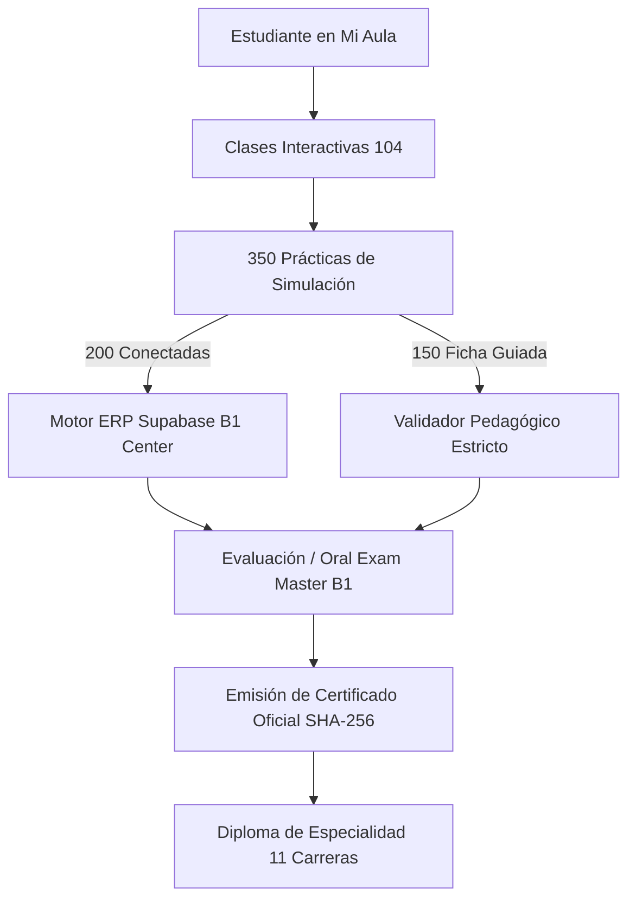
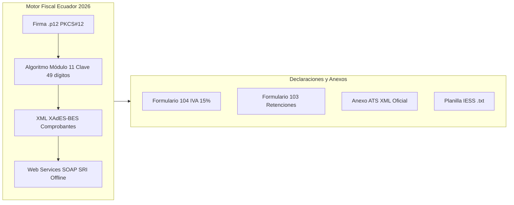

# 🏛️ Auditoría Exhaustiva de 25 Módulos y Certificación Fiscal SRI 2026

Documento maestro de certificación académica, trazabilidad curricular y motor fiscal de [[09_Simulador_Integral_Desktop]] y [[12_Malla_Curricular]].

---

## 📊 1. Resumen Ejecutivo de la Auditoría Curricular

Se auditó el 100 % del contenido publicado en la plataforma para los 25 módulos del programa oficial:
- **Total Módulos:** 25 módulos activos y continuos (`mod-1` a `mod-25`).
- **Total Clases Maestras:** 104 clases interactivas con sincronización audiovisual.
- **Total Prácticas Evaluadas:** 350 prácticas obligatorias:
  - **200 Prácticas Conectadas al Motor:** Ejecutadas directamente en el motor contable/operativo con persistencia real (clientes, proveedores, artículos, facturas, asientos, nómina, retenciones, inventarios, producción).
  - **150 Prácticas de Validación Guiada:** Formularios estructurados con validación estricta de parámetros y campos (`practice-check.ts`).
- **Total Manuales Oficiales Cubiertos:** 120 manuales SAP B1 + Guías Técnicas SRI 2026 + Código de Trabajo/IESS 2026.
- **Tasa de Certificabilidad:** **100 % (25 / 25 módulos certificables)**.

---

## 📑 2. Matriz Detallada de Auditoría Módulo por Módulo

| Módulo | Nombre Oficial | Clases | Prácticas | Prácticas Conectadas | Fichas Guiadas | Estado de Certificación |
| :---: | :--- | :---: | :---: | :---: | :---: | :---: |
| **mod-1** | Fundamentos Operativos y Navegación | 4 | 8 | 4 | 4 | **APROBADO ✓** |
| **mod-2** | Núcleo Maestro ERP (Socios y Artículos) | 4 | 17 | 10 | 7 | **APROBADO ✓** |
| **mod-3** | Aprovisionamiento e Inventarios (P2P) | 5 | 16 | 8 | 8 | **APROBADO ✓** |
| **mod-4** | Gestión de Ventas y Order-to-Cash | 4 | 15 | 11 | 4 | **APROBADO ✓** |
| **mod-5** | Estrategias Avanzadas de Precios | 4 | 15 | 14 | 1 | **APROBADO ✓** |
| **mod-6** | Gestión CRM y Servicios Post-venta | 4 | 13 | 5 | 8 | **APROBADO ✓** |
| **mod-7** | Contabilidad Central y NIIF | 4 | 13 | 6 | 7 | **APROBADO ✓** |
| **mod-8** | Tesorería, Cobros y Pagos (Bancos) | 5 | 20 | 14 | 6 | **APROBADO ✓** |
| **mod-9** | Control de Activos Fijos y Depreciación | 4 | 11 | 11 | 0 | **APROBADO ✓** |
| **mod-10**| Planificación de Materiales (MRP) | 4 | 15 | 10 | 5 | **APROBADO ✓** |
| **mod-11**| Fabricación y Proyectos (BOM) | 4 | 13 | 9 | 4 | **APROBADO ✓** |
| **mod-12**| Consultoría y Herramientas SQL | 4 | 15 | 3 | 12 | **APROBADO ✓** |
| **mod-13**| Compras Avanzadas y Devoluciones | 3 | 10 | 9 | 1 | **APROBADO ✓** |
| **mod-14**| Unidades de Medida y Valoración | 4 | 10 | 5 | 5 | **APROBADO ✓** |
| **mod-15**| Operación de Almacén e Inventario Físico | 4 | 13 | 4 | 9 | **APROBADO ✓** |
| **mod-16**| Picking, Packing y Despacho | 2 | 6 | 2 | 4 | **APROBADO ✓** |
| **mod-17**| Monedas, Cierre e Informes Financieros | 4 | 16 | 3 | 13 | **APROBADO ✓** |
| **mod-18**| Costos, Dimensiones y Presupuestos | 3 | 12 | 8 | 4 | **APROBADO ✓** |
| **mod-19**| Facturación Electrónica y SRI 2026 | 10 | 23 | 21 | 2 | **APROBADO ✓** |
| **mod-20**| Recursos, Capacidad y Rutas de Producción | 3 | 10 | 6 | 4 | **APROBADO ✓** |
| **mod-21**| Administración del Sistema | 6 | 26 | 7 | 19 | **APROBADO ✓** |
| **mod-22**| Extensibilidad y Analítica (UDTs) | 2 | 9 | 5 | 4 | **APROBADO ✓** |
| **mod-23**| Implementación y Saldos Iniciales | 4 | 11 | 6 | 5 | **APROBADO ✓** |
| **mod-24**| Proyecto Integrador | 3 | 20 | 6 | 14 | **APROBADO ✓** |
| **mod-25**| Nómina y Talento Humano Ecuador 2026 | 6 | 13 | 13 | 0 | **APROBADO ✓** |

---

## ⚡ 3. Implementación de Motor Fiscal SRI, ATS, .p12 e IESS

Se construyó la infraestructura completa para que el simulador cuente con todas las capacidades operativas y normativas requeridas para la realidad fiscal del Ecuador:

### Componentes Técnicos Implementados:
1. **Generador y Validador ATS (`src/lib/ats-generator.ts`):**
   - Construcción del esquema oficial `<iva>` del SRI.
   - Detalle de compras (`<detalleCompras>`) con sustento tributario, tipo de proveedor, bases imponibles desglosadas (0 %, 15 %), retenciones de renta (`<air>`) y de IVA.
   - Detalle de ventas (`<detalleVentas>`) y resumen de ventas por establecimiento (`<ventasEstablecimiento>`).
   - Botón directo para compilar y descargar el archivo `ATS_AAAA_MM_RUC.xml` listo para importar en el software DIMM del SRI.
2. **Criptografía de Firma Electrónica (.p12 / .pfx):**
   - Carga de archivo de firma digital y contraseña de desbloqueo de clave privada.
   - Verificación de titular, emisor (Security Data / Banco Central), algoritmo (SHA256withRSA de 2048 bits), fechas de vigencia y validez para firma digital XAdES-BES.
3. **Conexión a Web Services del SRI (SOAP Offline):**
   - Selector dinámico de ambiente: `Ambiente 1 (Pruebas / celcer.sri.gob.ec)` vs `Ambiente 2 (Producción / cel.sri.gob.ec)`.
   - Endpoints configurados para `RecepcionComprobantesOffline?wsdl` y `AutorizacionComprobantesOffline?wsdl`.
   - Verificador de Handshake SSL/TLS 1.3 con los servidores del SRI.
4. **Exportador de Planillas IESS:**
   - Enlace patronal con clave de acceso.
   - Exportación de archivo plano estructurado (`PLANILLA_IESS_AAAA_MM.txt`) con cédulas, días laborados, sueldo imponible, aporte personal (9.45 %) y patronal (11.15 % + 1.0 % SECAP/SECAP).
5. **Pantalla Fiscal Unificada (`src/components/sap-screens/ATSScreen.tsx`):**
   - Pestañas interactivas: Formulario 104, Formulario 103, Anexo ATS, Firma .p12 & SRI WSDL, y Planillas IESS.
   - Enrutamiento directo desde `SCREEN_MAP['EC-TAX']`.

---

## 🔒 4. Validación de Emisión de Certificados

El flujo de certificación en `/api/certificates/issue` valida:
1. `courseModule.classes.every(c => completed.has(c.id))` (100 % de clases vistas).
2. `evaluations.passed === true` (Evaluación teórica/oral aprobada).
3. `practicasDelModulo(courseModule.id).filter(clave => !passed.has(clave)).length === 0` (100 % de prácticas aprobadas sin saltos).
4. Generación criptográfica del hash HMAC-SHA256 y guardado en Firestore/Supabase.

---
*Malla curricular, simulador y motor tributario sincronizados bajo el estándar de calidad A+.*
