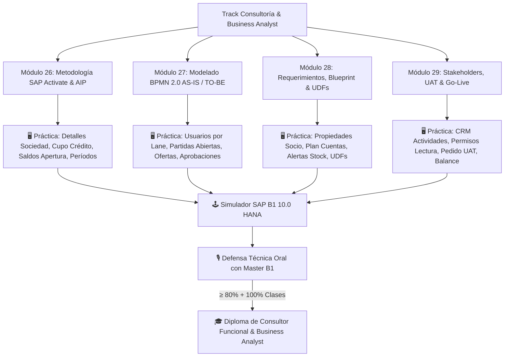

# 🏛️ Track de Consultoría y Business Analysis SAP Business One

> **Estado:** Implementado, validado y publicado (8-oct-2026).
> **Referencia:** Benchmark comparativo frente a *SAP Technology Consultant* y *SAP Business Analyst* de Coursera.
> **Total:** 4 módulos nuevos (`mod-26` a `mod-29`), 16 clases magistrales, 137 láminas WebP 1920x1080, 16 prácticas integradas en el simulador.

---

## 🎯 1. Propósito y Diferencial Competitivo Mundial

Este track incorpora a la academia la capa metodológica, estratégica y de relación con clientes propia de las grandes firmas de consultoría global (Big Four y partners SAP Gold):
1. **SAP Activate & AIP Oficial:** Supera el empirismo mediante un ciclo estructurado de 6 fases (*Discover, Prepare, Explore, Realize, Deploy, Run*).
2. **Modelado BPMN 2.0:** Traduce flujos informales en procesos estandarizados con Pools, Lanes y compuertas lógicas que se parametrizan en el ERP.
3. **Documentación de Negocio (BRD & BBD):** Especificación rigurosa mediante Business Blueprint, historias de usuario en formato ágil y criterios de aceptación Gherkin (*Dado/Cuando/Entonces*).
4. **La Ventaja Inalcanzable para Coursera:** Mientras que Coursera ofrece cursos puramente teóricos con casos ficticios en diapositivas, B1 Academy combina la metodología formal con **práctica transaccional real en el simulador de SAP Business One** conectado a base de datos viva y validación contable.

---

## 🗺️ 2. Mapa Arquitectónico del Track

---

## 📚 3. Desglose Curricular de los 4 Módulos

### Módulo 26 · Metodología de Implementación y Ciclo de Vida SAP
- **`mod26-c1`**: El Marco Metodológico: De Waterfall a SAP Activate y AIP.
  - *Práctica:* Configurar parámetros maestros de la sociedad en *Gestión > Inicialización del sistema > Detalles de la empresa*.
- **`mod26-c2`**: Talleres de Exploración (Explore) y Análisis Fit / Gap.
  - *Práctica:* Parametrizar bloqueo por límite de crédito en *Gestión > Inicialización > Parametrizaciones de documento*.
- **`mod26-c3`**: Fase de Realización: Parametrización y Migración Golden DB.
  - *Práctica:* Carga de saldos iniciales de stock en *Inventario > Transacciones > Saldos iniciales de inventario*.
- **`mod26-c4`**: Estrategia de Salida en Vivo (Cutover), Go-Live e Hypercare.
  - *Práctica:* Bloqueo de períodos en *Gestión > Inicialización > Períodos contables*.

### Módulo 27 · Modelado y Optimización de Procesos de Negocio (BPMN 2.0)
- **`mod27-c1`**: Fundamentos de BPMN 2.0 para Consultores ERP.
  - *Práctica:* Crear usuario operativo asignado a carril en *Gestión > Definición > General > Usuarios*.
- **`mod27-c2`**: Mapeo del Estado Actual (AS-IS) y Detección de Ineficiencias.
  - *Práctica:* Auditoría de cuellos de botella en *Ventas - Clientes > Informes > Lista de partidas abiertas*.
- **`mod27-c3`**: Diseño del Estado Futuro (TO-BE) alineado a Mejores Prácticas SAP.
  - *Práctica:* Creación de oferta comercial en *Ventas - Clientes > Oferta de ventas*.
- **`mod27-c4`**: Traducción de BPMN a Reglas de Negocio y Aprobaciones en SAP B1.
  - *Práctica:* Modelo de autorización por monto en *Gestión > Procedimientos de aprobación > Modelos de autorización*.

### Módulo 28 · Levantamiento de Requerimientos y Documentación de Negocio
- **`mod28-c1`**: Técnicas de Elicitación de Requisitos y Entrevistas Clave.
  - *Práctica:* Segmentación en *Gestión > Definición > Interlocutores comerciales > Propiedades*.
- **`mod28-c2`**: El Business Blueprint (BBD) y Business Requirements Document (BRD).
  - *Práctica:* Creación de cuenta contable en *Finanzas > Plan de cuentas*.
- **`mod28-c3`**: Historias de Usuario, Criterios Gherkin y Matriz RTM.
  - *Práctica:* Alerta automática en *Gestión > Alertas*.
- **`mod28-c4`**: De Requerimiento a Configuración: Campos UDF y Valores Válidos.
  - *Práctica:* Creación de UDF `U_CanalVenta` en *Herramientas > Customizing > Campos definidos por el usuario*.

### Módulo 29 · Gestión de Clientes, Pruebas UAT y Adopción del Cambio
- **`mod29-c1`**: Gestión de Stakeholders y Control de Cambios (Change Requests).
  - *Práctica:* Minuta de acuerdo en *CRM > Actividades*.
- **`mod29-c2`**: Gestión del Cambio Organizacional y Estrategia Train the Trainer.
  - *Práctica:* Permisos de entrenamiento en *Gestión > Inicialización > Autorizaciones generales*.
- **`mod29-c3`**: Estrategia y Elaboración de Guiones de Prueba UAT (Test Scripts).
  - *Práctica:* Ejecución de caso de prueba en *Ventas - Clientes > Pedido de cliente*.
- **`mod29-c4`**: Ejecución de Ciclo UAT, Validación Contable y Acta de Go-Live.
  - *Práctica:* Verificación de balance cuadrado en *Finanzas > Informes financieros > Balance*.

---

## 🏆 4. Nueva Acreditación: Diploma de Especialidad

- **Código:** `dip-business-analyst`
- **Título:** Diploma de Consultor Funcional & Business Analyst SAP Business One.
- **Rol Profesional:** *Consultor Funcional y Analista de Procesos SAP B1*.
- **Módulos Requeridos:** `mod-1`, `mod-2`, `mod-26`, `mod-27`, `mod-28`, `mod-29`.
- **Elegibilidad Master:** Integra el grupo de diplomas válidos para optar al título de *Consultor Integral SAP Business One* (`dip-consultor` y `master-consultor-integral`).

---

## 🔗 Enlaces Relacionados (Obsidian Vault)

- [[10_Campus_Escuela_SAP_B1]] - Arquitectura del aula virtual y visor de diapositivas.
- [[12_Malla_Curricular]] - Malla general de carreras y módulos de la academia.
- [[11_Master_B1_Tutor_IA]] - Sistema de examen oral y rúbricas de evaluación.
- [[18_Simulador_Departamentos_y_Aislamiento_Supabase]] - Conexión de prácticas con Supabase.
