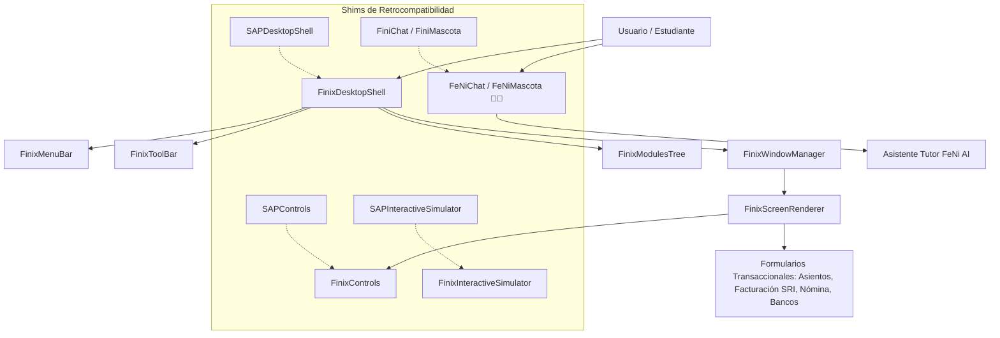

# 🐦‍🔥 Finix ERP & FeNi AI Architecture

Este documento detalla la arquitectura de desacople, seguridad de marca e identidad propia de **Finix ERP** (Cloud Edition 2026) y el asistente inteligente **@FeNi AI (el Fénix)** dentro del ecosistema de simulación empresarial.

Conectado con:
- [[21_Simulador_ERP_MultiEmpresa_FiniAI]]
- [[09_Simulador_Integral_Desktop]]
- [[18_Simulador_Departamentos_y_Aislamiento_Supabase]]
- [[19_Auditoria_25_Modulos_y_Cumplimiento_Fiscal_SRI]]

---

## 🏛️ 1. Filosofía de Propiedad Intelectual y Aislamiento

Para proteger la propiedad intelectual del simulador interactivo y del motor contable ecuatoriano de grado corporativo, se estableció una separación estricta:
1. **Contenido Pedagógico (`mi-aula`):** Enseña conceptos y metodologías ERP de clase mundial (SAP Business One) para capacitar a los estudiantes.
2. **Plataforma Transaccional y Simulador:** Opera exclusivamente bajo la marca e identidad técnica **Finix ERP** con su asistente guía **@FeNi AI (🐦‍🔥)**.
3. **Cero marcas registradas externas en el UI Chrome:** Todos los encabezados, barras de títulos, docks, consolas de login, marcas de agua en impresiones, menús contextuales y widgets de ayuda se identifican como **Finix ERP**.

---

## 🧩 2. Mapa Arquitectónico de Componentes

---

## 🔒 3. Capa de Retrocompatibilidad Cero-Rupturas (Shims)

Para garantizar estabilidad total en producción y evitar dependencias rotas en rutas dinámicas:
- Los componentes canónicos se renombraron a `Finix*` y `FeNi*` (`FinixDesktopShell.tsx`, `FinixControls.tsx`, `FinixInteractiveSimulator.tsx`, `FeNiChat.tsx`, `FeNiMascota.tsx`).
- Los antiguos módulos exportan punteros limpios a las nuevas definiciones de Finix con tipos completos, garantizando compilación `0 errores` en Next.js App Router.

---

## 🧪 4. Certificación Técnica (Protocolo Hermes)

- **TypeScript:** `npx tsc --noEmit` superado con 0 errores de tipado.
- **Linter:** `npm run lint` validado sin warnings.
- **Motor Contable:** 116 pruebas automatizadas (`motor_sri.ts`, `motor_impuestos.ts`, `motor_listas_oportunidades.ts`, `motor_banca.ts`) con 100% de éxito.
- **Build de Producción:** `next build` genera 155 rutas estáticas y dinámicas con código de salida `0`.
