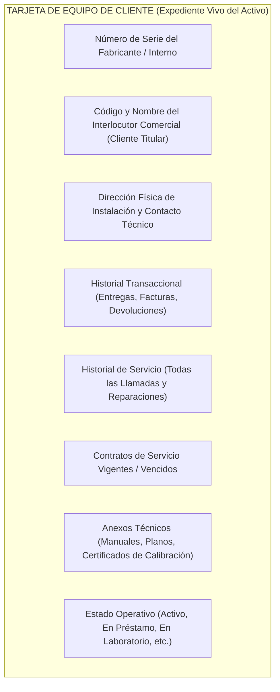
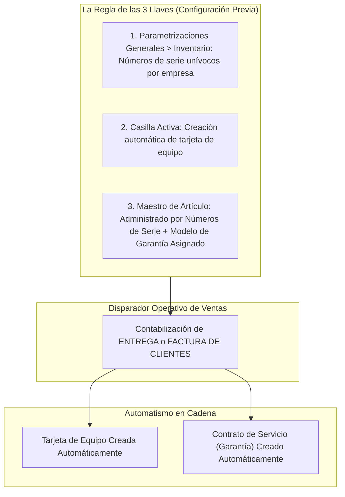
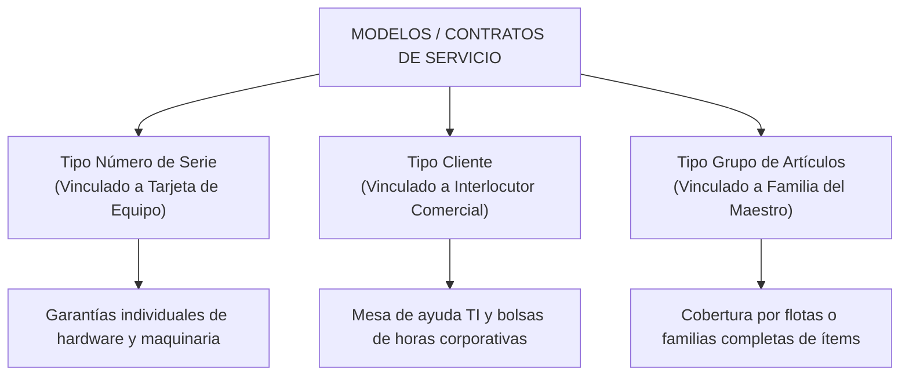
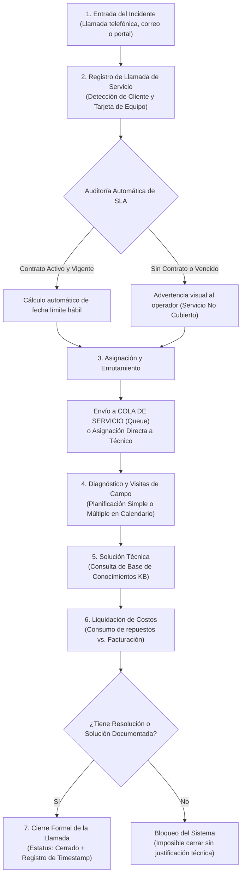
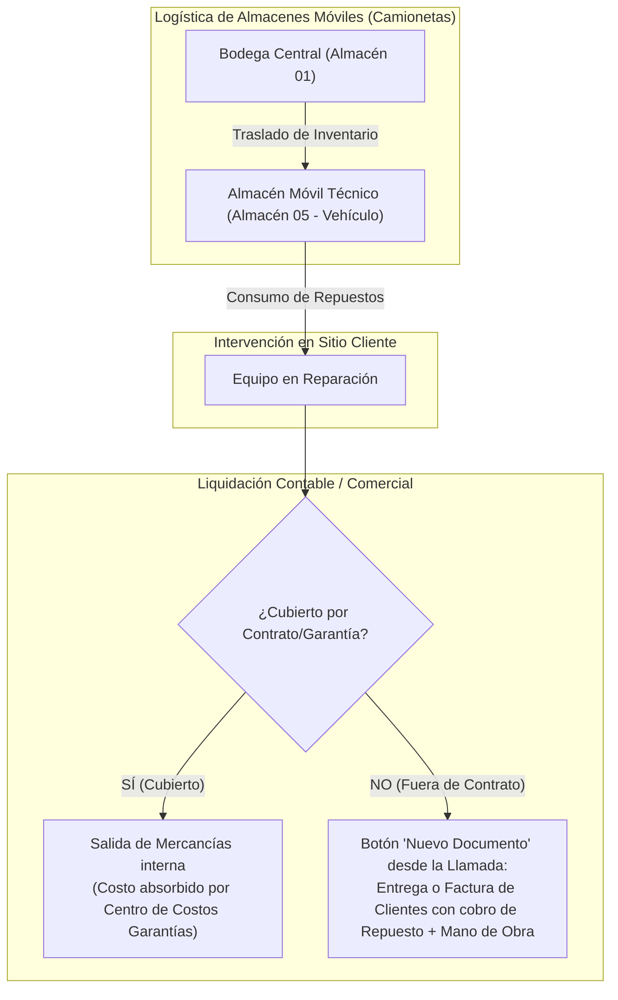

# MÓDULO 06: GESTIÓN DE SERVICIO AL CLIENTE (TARJETAS DE EQUIPO, CONTRATOS SLA Y LLAMADAS DE SERVICIO) (SAP BUSINESS ONE 10.0)

**Tipo de Contenido:** Base de Conocimiento Operativa y Guía de Entrenamiento para Copiloto IA  
**Fuentes Oficiales Analizadas:** 10_Service_11_CSProcess_Process_ES.pdf (SAP Official Curriculum)  
**Nivel:** Intermedio - Avanzado / Postventa, Garantías, Mesa de Ayuda y Servicios de Campo  
**Tiempo Estimado de Estudio:** 65 minutos (dividido en 4 lecciones integradas)

---

## Resumen Ejecutivo

En la gestión empresarial moderna, la venta de un producto no representa el final de la transacción comercial, sino el punto de partida de la relación más estratégica con el cliente: el servicio postventa. El módulo de Gestión de Servicio en SAP Business One 10.0 proporciona un ecosistema cerrado, altamente integrable y auditable que articula la logística de inventario, el despacho técnico y la contabilidad financiera.

A través de este módulo, el consultor o usuario clave comprenderá no solo el procedimiento mecánico, sino el *porqué* estructural detrás de cada herramienta:
* **La Tarjeta de Equipo de Cliente:** Convierte cada número de serie vendido en un expediente clínico vivo con trazabilidad de visitas, repuestos y traslados de titularidad.
* **Los Contratos de Servicio y SLAs:** Blindan la rentabilidad del negocio delimitando con exactitud quirúrgica qué costos asume la empresa y qué compromisos de tiempo (horas hábiles de respuesta y resolución) son exigibles contractualmente.
* **El Ciclo de la Llamada de Servicio y Colas:** Optimiza la asignación técnica mediante colas de trabajo especializadas y despacho de campo (simple o múltiple).
* **La Base de Conocimientos y Liquidación de Gastos:** Evita la reinvención de la rueda mediante la documentación de soluciones aprobadas, conciliando de forma transparente los consumos de repuestos en vehículos técnicos con la facturación al cliente final.

---

## ÍNDICE DEL MÓDULO

1. [Lección 6.1: Tarjetas de Equipo y Trazabilidad de Activos Serializados](#lección-61-tarjetas-de-equipo-y-trazabilidad-de-activos-serializados)
2. [Lección 6.2: Modelos y Contratos de Servicio: Gestión de Acuerdos de Nivel de Servicio (SLA)](#lección-62-modelos-y-contratos-de-servicio-gestión-de-acuerdos-de-nivel-de-servicio-sla)
3. [Lección 6.3: El Ciclo de Vida de la Llamada de Servicio: Colas, Despacho Técnico y Resolución](#lección-63-el-ciclo-de-vida-de-la-llamada-de-servicio-colas-despacho-técnico-y-resolución)
4. [Lección 6.4: Base de Conocimientos de Soluciones, Costeo de Gastos y Facturación Postventa](#lección-64-base-de-conocimientos-de-soluciones-costeo-de-gastos-y-facturación-postventa)
5. [Matriz de Troubleshooting y Reglas Críticas para el Copiloto IA](#matriz-de-troubleshooting-y-reglas-críticas-para-el-copiloto-ia)
6. [Banco de Evaluación Situacional](#banco-de-evaluación-situacional)
7. [Guiones Humanizados para Locución IA (ElevenLabs)](#guiones-humanizados-para-locución-ia-elevenlabs)

---

## LECCIÓN 6.1: TARJETAS DE EQUIPO Y TRAZABILIDAD DE ACTIVOS SERIALIZADOS

### 1. ¿Qué es una Tarjeta de Equipo de Cliente (Customer Equipment Card)?

La **Tarjeta de Equipo de Cliente** es el registro maestro que almacena el expediente histórico, técnico y legal de un artículo individual con **Número de Serie único**, ya sea instalado físicamente en las instalaciones de un cliente o gestionado internamente bajo arriendo o préstamo.

> [!NOTE]
> **El "Porqué" Arquitectónico:**  
> ¿Por qué SAP separa los Datos Maestros de Artículo de las Tarjetas de Equipo? El Maestro de Artículos define las propiedades genéricas del ítem (modelo, grupo de artículos, lista de precios, método de valoración). En contraste, la Tarjeta de Equipo individualiza la unidad física real que opera en el mundo exterior, acumulando su propio desgaste, intervenciones y cambios de piezas a lo largo de los años.

---

### 2. Creación Automática vs. Manual de Tarjetas de Equipo

Para asegurar una integridad de datos sin fisuras humanas, SAP Business One permite automatizar la creación de la Tarjeta de Equipo en el momento exacto de la salida de mercancía por venta.

#### Comparativa Funcional: Creación Automática vs. Manual

| Dimensión | Creación Automática | Creación Manual |
| :--- | :--- | :--- |
| **Disparador Operativo** | Al añadir una *Entrega* o *Factura de Clientes* que contenga artículos serializados. | Menú: `Servicio > Tarjeta de equipo de cliente` (creación directa por el usuario). |
| **Requisitos del Sistema** | Las 3 llaves activas: serialización unívoca por empresa, casilla de creación automática activa y modelo de garantía asignado en el artículo. | Ninguno. El operador ingresa manualmente el número de serie, cliente y artículo. |
| **Generación de Contrato** | Crea automáticamente un **Contrato de Servicio tipo Garantía** con fechas calculadas según el modelo. | No crea contrato de forma automática; debe vincularse o crearse manualmente si procede. |
| **Caso de Uso Empresarial** | Venta habitual de maquinaria industrial, servidores, equipos médicos o vehículos nuevos. | Mantenimiento a equipos que el cliente compró a un tercero (competidor) o activos previos a la implementación del ERP. |

> [!IMPORTANT]
> **La Importancia de los Números de Serie Unívocos por Empresa:**  
> Si la empresa permitiera duplicar un mismo número de serie entre diferentes artículos o almacenes, la relación biunívoca (1 a 1) entre el número de serie y la Tarjeta de Equipo colapsaría. Por ello, SAP Business One bloquea la creación automática a menos que la unicidad absoluta por empresa esté activa.

---

### 3. Estados de la Tarjeta de Equipo y Reglas de Validación Operativa

El campo **Estado** de la Tarjeta de Equipo gobierna las acciones que el personal de mesa de ayuda puede ejecutar en el sistema:

| Estado del Equipo | Definición Operativa | ¿Permite Abrir Llamadas de Servicio? | Comportamiento en el ERP |
| :--- | :--- | :---: | :--- |
| **Activo (*Active*)** | El equipo está operativo en las instalaciones del cliente. | **SÍ** | Estado estándar. Permite despacho de técnicos, consumo de repuestos y aplicación de garantías. |
| **Concedido en préstamo (*Loaned*)** | Equipo temporal (de sustitución o backup) entregado al cliente mientras el suyo es reparado. | **SÍ** | Permite registrar incidencias sobre la unidad provisional para monitorear su estado. |
| **En laboratorio (*In Lab*)** | El equipo ha sido retirado del cliente y se encuentra en los talleres internos de la empresa. | **NO (Bloqueado)** | Previene que un operador despache por error un técnico a sitio cliente para un equipo que está físicamente en taller. |
| **Devuelto (*Returned*)** | El cliente devolvió el equipo definitivamente (por nota de crédito o fin de arriendo). | **NO (Bloqueado)** | Bloquea gastos adicionales e inhabilita contratos de garantía vigentes. |
| **Cancelado / Terminado (*Terminated*)** | El activo fue dado de baja técnica, destruido o desguazado por obsolescencia. | **NO (Bloqueado)** | Se mantiene únicamente como registro de auditoría histórica. |

---

### 4. Soporte Multicliente y Trazabilidad Comercial

En las empresas de distribución o servicios industriales, los activos cambian de dueño o involucran múltiples actores comerciales. En la ruta `Gestión > Inicialización del sistema > Parametrizaciones de documento > Pestaña Por documento > Tarjeta de equipo`, se habilitan dos opciones críticas:

1. **Vincular varios interlocutores a una tarjeta de equipo:**  
   * *El Porqué:* Permite relacionar en un único expediente al **Fabricante / Proveedor** (a quien le compramos la máquina y a quien le exigimos garantías de fábrica), al **Distribuidor / Partner** intermediario y al **Cliente Final** que opera la máquina.
2. **Añadir automáticamente nuevos Interlocutores Comerciales a tarjetas existentes:**  
   * *El Porqué:* Si el Cliente A devuelve una máquina por renovación tecnológica, la empresa la reacondiciona (*refurbished*) y se la revende al Cliente B con el mismo número de serie, el sistema actualiza la titularidad comercial al Cliente B pero **preserva intacto todo el historial de fallas, visitas y horas operadas con el Cliente A**. Esto proporciona una trazabilidad total del ciclo de vida del activo.

---

## LECCIÓN 6.2: MODELOS Y CONTRATOS DE SERVICIO: GESTIÓN DE ACUERDOS DE NIVEL DE SERVICIO (SLA)

### 1. Las 3 Tipologías de Contratos de Servicio

Un **Contrato de Servicio** formaliza el compromiso legal entre la empresa y el cliente, delimitando qué intervenciones están cubiertas y bajo qué condiciones temporales y financieras. Se clasifican según su objeto de vinculación:

| Tipo de Contrato | Objeto de Vinculación | Características Principales | Caso de Uso Empresarial Típico |
| :--- | :--- | :--- | :--- |
| **1. Número de Serie** | **Tarjeta de Equipo** específica. | Cobertura estrictamente asociada a un activo individual serializado. Si el cliente tiene 5 máquinas iguales, cada una debe tener su contrato o línea de serie. | **Garantías de fábrica**, pólizas de mantenimiento para elevadores, tomógrafos médicos o servidores centrales. |
| **2. Cliente** | **Código de Interlocutor Comercial**. | Cobertura global que no exige vincular un activo físico. Funciona como una bolsa de servicios o póliza paraguas. | **Consultoría ERP**, soporte remoto de software corporativo, mesa de ayuda telefónica ilimitada. |
| **3. Grupo de Artículos** | **Familia de Artículos** del Maestro. | Aplica cobertura a todos los artículos que pertenezcan a una categoría específica adquiridos por el cliente. | Mantenimiento correctivo para "Todas las impresoras térmicas" o "Todos los lectores de código de barras" de una cadena de retail. |

---

### 2. Estructuración del Acuerdo de Nivel de Servicio (SLA)

El **SLA (*Service Level Agreement*)** es el motor paramétrico que permite medir objetivamente la calidad del servicio. En el Contrato de Servicio se configuran dos pestañas fundamentales:

#### A. Ficha General (Compromisos Temporales)
* **Tiempo de Respuesta (*Response Time*):** Plazo máximo comprometido (en horas o días) para que un operador acepte el ticket, clasifique la criticidad y asigne un técnico al incidente.
* **Tiempo de Resolución (*Resolution Time*):** Plazo límite legal comprometido para entregar el equipo completamente operativo y funcionando en sitio.

#### B. Ficha Cobertura (Ventana Operativa y Rubros de Costo)
* **Horario de Disponibilidad:** Ventanas de cobertura válidas (ejemplo: Lunes a Viernes de 08:00 a 17:00, o servicio ininterrumpido 24/7).
* **Inclusión de Feriados / Festivos:**
  * *Casilla Desmarcada (Recomendada para soporte estándar):* Los fines de semana y días festivos registrados en el calendario del sistema **pausan automáticamente el cronómetro del SLA**.
  * *Casilla Marcada (Pólizas críticas / Mission Critical):* Los festivos consumen horas del compromiso como cualquier día hábil.
* **Rubros de Cobertura (La Regla de los 3 Componentes de Costo):**
  1. **Piezas / Repuestos (*Parts*):** Si está marcado, los repuestos utilizados en reparaciones se entregan con costo cubierto (sin cobro al cliente).
  2. **Mano de Obra (*Labor*):** Si está marcado, las horas hombre de los ingenieros de campo están exoneradas de facturación adicional.
  3. **Desplazamiento (*Travel*):** Si está marcado, los viáticos, kilometraje y logística de transporte hacia las instalaciones del cliente corren por cuenta de la empresa de servicio.

> [!TIP]
> **El "Porqué" Financiero:**  
> Desmarcar una casilla (por ejemplo, desmarcar *Piezas*) le indica a SAP Business One que cualquier refacción que el técnico consuma durante la reparación deberá ser facturada al cliente final, impidiendo fugas de inventario y pérdidas económicas en el área de postventa.

---

## LECCIÓN 6.3: EL CICLO DE VIDA DE LA LLAMADA DE SERVICIO: COLAS, DESPACHO TÉCNICO Y RESOLUCIÓN

El ciclo de atención de incidentes en SAP Business One está diseñado para garantizar trazabilidad desde el primer timbrazo telefónico hasta la firma de conformidad del cliente:

---

### 1. Apertura de la Llamada y Algoritmo de Cálculo del SLA

Al recibir el reporte de una anomalía:
1. El operador ingresa el **Interlocutor Comercial** y selecciona la **Tarjeta de Equipo** o el artículo involucrado.
2. **Validación Automática de Cobertura:** El sistema audita instantáneamente si existe un contrato asociado en estado *Activo* y si la hora actual cae dentro de la franja horaria pactada. Si no existe contrato, el campo de contrato queda en blanco y el operador recibe una alerta visual para evitar prestar servicios no pagados.
3. **Cálculo del Vencimiento Hábil:** El sistema calcula de inmediato el valor del campo **"La resolución tiene que ser antes de"**, aplicando la fórmula:

$$\text{Fecha Límite} = \text{Fecha/Hora Apertura} + \text{Tiempo de Resolución (SLA)} \quad [\text{Solo dentro de Horas Hábiles y Festivos válidos}]$$

---

### 2. Gestión por Colas de Servicio (Service Queues)

En organizaciones con alto volumen de incidentes, asignar tickets técnico por técnico genera cuellos de botella y sobrecarga desbalanceada. SAP Business One resuelve esto mediante **Colas de Servicio**:

* **¿Qué es una Cola de Servicio?:** Es un buzón compartido que agrupa a especialistas según su disciplina técnica (ejemplo: *Cola Servidores Blade*, *Cola Impresoras Industriales*, *Cola Base de Datos*).
* **El Flujo "Pull" de Autoasignación:**
  1. El operador de Nivel 1 clasifica el ticket y lo enruta a la Cola respectiva.
  2. Los técnicos miembros de la cola abren el informe oficial: `Servicio > Informes de servicio > Llamadas de servicio por cola`.
  3. Cada especialista analiza los tickets pendientes, evalúa prioridades por SLA y **toma (*pull*)** el incidente, cambiando el técnico asignado a su propio nombre.
* **Configuración del Personal:** Para que un empleado aparezca disponible como ejecutor técnico, debe tener marcado el rol de **Técnico** en los *Datos Maestros del Empleado* (`Recursos Humanos > Datos maestros de empleado`).

---

### 3. Planificación de Visitas de Campo (Field Service Dispatching)

Cuando el incidente requiere presencia física, se utiliza la pestaña **Planificación** dentro de la Llamada de Servicio:

#### Modo Simple vs. Programación Múltiple (*Multiple Scheduling*)

| Modalidad | Funcionamiento Operativo | Limitaciones / Consideraciones |
| :--- | :--- | :--- |
| **Modo Simple (Predeterminado)** | Permite agendar **una única visita técnica** por llamada de servicio (una sola fecha, hora y técnico asignado). | Adecuado para servicios de soporte ágiles donde una visita resuelve el 100% de los casos. Inviable para proyectos complejos. |
| **Programación Múltiple (*Multiple Scheduling*)** | Habilita una **grilla multidimensional** que permite registrar *N* visitas con diferentes técnicos, distintos días, duraciones estimadas y direcciones de sitio. | Permite coordinar, por ejemplo: Visita 1 (Diagnóstico por Especialista A), Visita 2 (Entrega de repuesto por Logística) y Visita 3 (Instalación final por Especialista B). |

> [!WARNING]
> **Advertencia Crítica de Implementación:**  
> La activación de la casilla *Programación múltiple* en `Parametrizaciones de documento > Pestaña Por documento > Llamada de servicio` es **estrictamente irreversible** a nivel de base de datos. Una vez confirmada, el sistema no permite regresar al modo de visita simple.

---

## LECCIÓN 6.4: BASE DE CONOCIMIENTOS DE SOLUCIONES, COSTEO DE GASTOS Y FACTURACIÓN POSTVENTA

### 1. La Base de Conocimientos de Soluciones (Solutions Knowledge Base)

La Base de Conocimientos es el repositorio institucional donde la empresa documenta síntomas, causas raíz y procedimientos de resolución aprobados.

* **El "Porqué" Pedagógico:** Evita el síndrome del "técnico imprescindible". Si un especialista senior resuelve una falla de firmware compleja en una máquina industrial y la documenta en la KB, la próxima vez que el incidente ocurra, un técnico junior podrá consultar la solución y ejecutar el procedimiento en minutos, reduciendo drásticamente el Tiempo Medio de Reparación (*MTTR - Mean Time to Repair*).
* **Vinculación con la Llamada:** Desde la pestaña *Soluciones*, el operador puede buscar por palabras clave, síntomas o número de artículo y enlazar la solución oficial con un solo clic.

---

### 2. Documentos Relacionados y Logística de Repuestos en Campo

En la pestaña **Gastos / Documentos Relacionados** de la llamada de servicio converge todo el impacto financiero y logístico del incidente:

1. **Gestión de Camionetas como Almacenes Móviles:** Se recomienda crear un código de almacén en SAP para cada vehículo técnico (ejemplo: *ALM-TEC01*). Los repuestos se envían mediante **Traslados de Inventario** (*Inventory Transfer*).
2. **Liquidación Fuera de Garantía:** Si la pieza o el servicio no están cubiertos, el coordinador presiona el botón **Nuevo Documento** en la pestaña de documentos relacionados y genera directamente una *Oferta de Ventas*, *Entrega* o *Factura de Clientes*.
3. **Trazabilidad Total:** Al tildar **"Visualizar todos los documentos"**, la llamada exhibe el mapa de compras a proveedores de piezas raras, traslados internos y facturación al cliente final.

---

### 3. Requisitos de Integridad para el Cierre Formal de la Llamada

SAP Business One implementa una regla de gobernanza dura para garantizar que ningún caso se cierre sin dejar evidencia técnica:

> [!CAUTION]
> **Regla de Cierre Obligatoria:**  
> El sistema **bloqueará** cualquier intento de cambiar el campo *Estado* a **"Cerrado"** si la llamada no cuenta con al menos una de las siguientes dos condiciones:  
> 1. Al menos una solución vinculada desde la **Base de Conocimientos** (pestaña *Soluciones*), **O**  
> 2. Un texto descriptivo explícito ingresado en la pestaña **Resolución**.

Al grabarse el estado *Cerrado*, el ERP sella automáticamente el campo del sistema **"Cerrado el"** con la fecha y hora exactas del servidor, alimentando de forma inmutable los indicadores clave de rendimiento (KPIs) de cumplimiento de SLAs.

---

## MATRIZ DE TROUBLESHOOTING Y REGLAS CRÍTICAS PARA EL COPILOTO IA

| # | Problema Reportado | Causa Raíz Técnica | Protocolo de Resolución Guiada (Copiloto IA) |
| :-: | :--- | :--- | :--- |
| **1** | *"Se facturó un artículo serializado pero el sistema no generó la Tarjeta de Equipo ni el Contrato de Garantía."* | Se rompió la cadena de las 3 llaves: falta la serialización unívoca global, la casilla de creación automática está desmarcada, o el artículo carece de modelo de garantía en su maestro. | 1. Ir a `Gestión > Inicialización del sistema > Parametrizaciones generales > Inventario > Artículos` y verificar que *Números de serie unívocos por* esté en "Números de serie" y marcar *Creación automática de tarjeta de equipo*. 2. Abrir el *Maestro de Artículos*, pestaña *General*, y asignar un modelo de contrato en el campo *Modelo de garantía* (tipo Número de Serie). 3. Para el artículo ya facturado, crear la Tarjeta de Equipo de forma manual por única vez en `Servicio > Tarjeta de equipo`. |
| **2** | *"El operador intenta cerrar una llamada de servicio pero el sistema arroja error en rojo y bloquea la actualización."* | El usuario intentó seleccionar el estado "Cerrado" dejando totalmente vacías las pestañas de *Solución* y *Resolución*. | 1. Explicar al usuario que SAP exige documentación técnica obligatoria antes del cierre por motivos de auditoría de calidad. 2. Solicitar al operador que ingrese a la pestaña *Resolución* y redacte el trabajo efectuado, o ingrese a la pestaña *Soluciones* y vincule un artículo de la base de conocimientos. 3. Presionar *Actualizar* con la documentación cargada y proceder luego al cambio de estado a *Cerrado*. |
| **3** | *"La llamada de servicio calcula una fecha límite de SLA incoherente (vence un sábado a medianoche)."* | El Contrato de Servicio asociado tiene mal configurada la matriz horaria en la pestaña *Cobertura* o no tiene marcada la exclusión de feriados. | 1. Abrir el Contrato de Servicio vinculado y navegar a la pestaña *Cobertura*. 2. Verificar que los días de la semana y los rangos horarios coincidan con el horario laboral (ejemplo: Lunes a Viernes de 08:00 a 17:00) y que los fines de semana no estén marcados. 3. Asegurarse de desmarcar *Incluir festivos* para que el sistema consulte el calendario laboral de la empresa y pause el cálculo durante días no laborables. |
| **4** | *"La empresa requiere asignar varios técnicos y diferentes fechas de visita a una misma llamada, pero la pantalla solo permite una cita."* | La base de datos tiene activa la interfaz de visita simple predeterminada. | 1. Informar al administrador que se requiere activar la *Programación Múltiple*. 2. Advertir explícitamente que la activación en `Parametrizaciones de documento > Llamada de servicio > Casilla Programación múltiple` es **irreversible**. 3. Una vez activada, la pestaña *Planificación* se transformará en una grilla tabular para coordinar cuadrillas completas y múltiples fechas. |
| **5** | *"Un técnico consumió repuestos de su camioneta para un servicio fuera de garantía, pero el stock del vehículo sigue lleno y no se facturó al cliente."* | El técnico no ejecutó la salida de inventario ni vinculó el cobro desde la ficha de documentos relacionados de la llamada. | 1. Ir a la llamada de servicio, pestaña *Gastos / Documentos Relacionados*. 2. Presionar el botón *Nuevo Documento* y seleccionar *Factura de Clientes* (o *Entrega*). 3. Seleccionar las piezas consumidas especificando como almacén de salida el almacén móvil del vehículo técnico (ej. *ALM-TEC01*). Esto descontará el stock del vehículo y generará la cuenta por cobrar al cliente. |

---

## BANCO DE EVALUACIÓN SITUACIONAL

### Pregunta 1 (Automatización de Activos Serializados y Garantías)
Una empresa de tecnología médica implementa SAP Business One 10.0 para comercializar equipos de rayos X. La gerencia exige que cada vez que se emita una Entrega de venta a un hospital, el sistema cree de forma automática el expediente técnico del equipo y su respectivo contrato de mantenimiento preventivo por 12 meses. ¿Qué conjunto de condiciones técnicas es estrictamente indispensable para que este automatismo opere?

* A) Solo es necesario que el artículo esté marcado como "Artículo de Inventario" y "Artículo de Venta".
* B) Activar la opción "Números de serie unívocos por empresa", marcar la casilla "Creación automática de tarjeta de equipo" en Parametrizaciones Generales, gestionar el artículo por números de serie y asignarle un modelo de garantía tipo "Número de Serie" en su maestro. **[CORRECTA]**
* C) Crear previamente una Orden de Fabricación para el equipo y facturarlo obligatoriamente mediante una Factura de Reserva de Clientes.
* D) El sistema SAP Business One no soporta la creación automática de expedientes técnicos; todas las tarjetas de equipo deben cargarse manualmente o por Data Transfer Workbench (DTW).

> **Respuesta Correcta: B**  
> *Explicación Didáctica:* Para que SAP Business One dispare la creación simultánea de la Tarjeta de Equipo y el Contrato de Servicio tipo Garantía se requiere la alineación de las tres llaves: 1) Configuración global de series unívocas por empresa (evita colisiones de identificadores), 2) Casilla activa de creación automática en inventario, y 3) Configuración en el maestro del artículo (ser serializado y tener asignada la plantilla del modelo de garantía). Si cualquiera de estos tres elementos falta, el documento de venta se registra normalmente pero sin detonar los registros de postventa.

---

### Pregunta 2 (Gobernanza y Cierre de Casos en Mesa de Ayuda)
El coordinador de soporte de una empresa de maquinaria industrial intenta cerrar 15 llamadas de servicio pendientes cuyos trabajos mecánicos ya concluyeron en campo. Sin embargo, al cambiar el estado a "Cerrado" y pulsar el botón *Actualizar*, el sistema se detiene arrojando un mensaje de error en la barra de estado inferior. ¿Cuál es el motivo funcional de este bloqueo y cómo debe solucionarse?

* A) La llamada tiene actividades agendadas en el calendario que deben ser eliminadas previamente.
* B) El cliente tiene facturas de venta vencidas en el módulo de finanzas, lo que bloquea el cierre del ticket técnico.
* C) SAP Business One prohíbe el cierre de una llamada si no cuenta con al menos una solución enlazada desde la Base de Conocimientos o un texto explícito registrado en la pestaña Resolución. **[CORRECTA]**
* D) Es obligatorio emitir una factura de clientes ligada a la llamada antes de poder cerrarla, incluso si el servicio fue gratuito.

> **Respuesta Correcta: C**  
> *Explicación Didáctica:* SAP Business One incorpora un control de calidad y gobernanza de datos estricto: un ticket cerrado sin documentación técnica destruye la utilidad de la base de conocimientos y la auditoría postventa. Para proceder al cierre, el operador debe registrar qué procedimiento solucionó la falla en la pestaña *Resolución* o vincular una solución aprobada en la pestaña *Soluciones*.

---

### Pregunta 3 (Modelado de Acuerdos SLA y Franjas Horarias)
Un cliente con un contrato de soporte para servidores críticos tiene estipulado un SLA con un Tiempo de Resolución de **6 horas**. El cliente abre una llamada de servicio un **viernes a las 15:00 horas**. La ficha *Cobertura* del contrato establece disponibilidad de **Lunes a Viernes de 08:00 a 17:00 horas**, con la casilla "Incluir festivos" **desmarcada**. ¿Qué fecha y hora límite calculará SAP Business One en el campo "La resolución tiene que ser antes de"?

* A) El mismo viernes a las 21:00 horas.
* B) El sábado a las 11:00 horas.
* C) El lunes siguiente a las 12:00 horas. **[CORRECTA]**
* D) El martes siguiente a las 08:00 horas.

> **Respuesta Correcta: C**  
> *Explicación Didáctica:* El sistema evalúa únicamente las horas hábiles comprendidas en el contrato. El viernes entre las 15:00 y las 17:00 transcurren 2 horas hábiles (restando 4 horas de compromiso). Dado que los fines de semana no forman parte de la ventana de cobertura, el cronómetro del SLA se congela el viernes a las 17:00 y se reanuda el lunes a las 08:00. Al sumar las 4 horas hábiles restantes a partir de las 08:00 del lunes, la fecha límite exacta es el lunes a las 12:00 horas.

---

### Pregunta 4 (Despacho de Campo y Planificación Avanzada)
Una empresa de telecomunicaciones instala redes de fibra óptica. Un incidente de rotura de cable requiere enviar inicialmente a un técnico de diagnóstico el lunes por la mañana y, posteriormente, a una cuadrilla de empalmadores el martes por la tarde. El implementador novato nota que la llamada de servicio solo le permite asignar un técnico y una única fecha en la pestaña de Planificación. ¿Qué recomendación arquitectónica debe aplicarse y qué advertencia crítica debe considerarse?

* A) Debe abrir dos llamadas de servicio idénticas duplicando el ticket del cliente para tener dos fechas distintas.
* B) Debe activar la "Programación múltiple" en las parametrizaciones de documento de la Llamada de Servicio, advirtiendo previamente que este cambio es irreversible en la base de datos. **[CORRECTA]**
* C) Debe crear un Contrato de Servicio tipo "Grupo de Artículos" para desbloquear múltiples técnicos.
* D) Solo es posible gestionar visitas múltiples adquiriendo un complemento externo (Add-on), ya que SAP estándar no lo soporta.

> **Respuesta Correcta: B**  
> *Explicación Didáctica:* SAP Business One ofrece nativamente la funcionalidad de *Programación Múltiple (Multiple Scheduling)* en la llamada de servicio, transformando la pestaña de planificación en una matriz completa de fechas, duraciones y técnicos. No obstante, el consultor debe advertir formalmente al cliente que una vez marcada en las parametrizaciones de documento, la activación es irreversible y no podrá regresarse a la vista simple.

---

### Pregunta 5 (Costeo de Postventa y Facturación de Excepciones)
Durante una visita de garantía para una fotocopiadora industrial con contrato de servicio tipo "Número de Serie" activo, el técnico detecta que el rodillo principal se rompió debido a que un usuario introdujo clips metálicos (negligencia no cubierta por la garantía del fabricante). El contrato tiene cubierta la mano de obra, pero el nuevo rodillo debe ser cobrado al cliente. ¿Cuál es el procedimiento operativo estándar recomendado dentro de SAP Business One?

* A) Cancelar el contrato de servicio inmediatamente y borrar la llamada de servicio del sistema.
* B) Entregar el repuesto gratis al cliente y registrar la pérdida como un ajuste negativo de inventario sin avisar a finanzas.
* C) Desde la pestaña "Documentos Relacionados" de la misma Llamada de Servicio, presionar el botón "Nuevo Documento" y generar la Factura o Entrega por el rodillo, preservando la trazabilidad entre el cobro y la incidencia. **[CORRECTA]**
* D) Crear una Tarjeta de Equipo paralela con el nombre del usuario que causó el daño para facturarle allí.

> **Respuesta Correcta: C**  
> *Explicación Didáctica:* La pestaña de *Documentos Relacionados* de la Llamada de Servicio es el punto de integración nativo con ventas e inventario. Al pulsar "Nuevo Documento", el sistema abre la Factura de Clientes con el cliente y la referencia ya prellenados. Esto garantiza que el inventario del repuesto se descargue correctamente, el ingreso se reconozca en finanzas y el historial técnico de la máquina refleje exactamente por qué se cobró esa pieza fuera de garantía.

---
