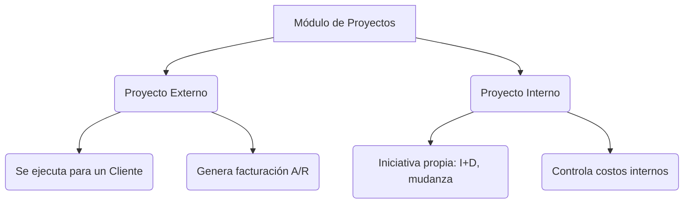
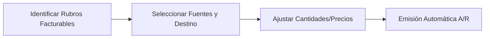

# MÓDULO 07: GESTIÓN DE PROYECTOS Y FACTURACIÓN POR HITOS (PROJECT MANAGEMENT & BILLING WIZARD)

**Tipo de Contenido:** Base de Conocimiento Operativa y Guía de Entrenamiento para Copiloto IA  
**Versión:** SAP Business One 10.0 & ERP  
**Fuentes Oficiales Analizadas:** 10_ProjectManage_11_ProjectManage.pdf y 10_ProjectManage_11_ProjectManage_Billing.pdf  
**Nivel:** Avanzado / Control de Proyectos, PMI, Finanzas Analíticas y Facturación Automatizada  
**Tiempo Estimado de Estudio:** 65 minutos (dividido en 4 lecciones integradas)

---

## Resumen Ejecutivo

El módulo de Gestión de Proyectos en SAP Business One actúa como una torre de control centralizada (Workbench) que unifica la planificación física, cronológica y operativa de un proyecto con su seguimiento presupuestario y contable en tiempo real. Este módulo elimina los silos de información, permitiendo a los gerentes de proyecto monitorear el progreso, detectar desviaciones de costos tempranamente y garantizar la resolución de incidencias. Además, gracias al Asistente de Facturación (Billing Wizard), automatiza la monetización de las etapas del proyecto, transformando horas de consultoría, gastos de proveedores y consumos de inventario en facturas hacia el cliente de manera ágil y libre de errores.

---

## ÍNDICE DEL MÓDULO

1. [Lección 7.1: Arquitectura del Módulo y Datos Maestros de Proyecto](#lección-71-arquitectura-del-módulo-y-datos-maestros-de-proyecto)
2. [Lección 7.2: Desglose de Etapas, Tareas, Dependencias y Jerarquías de Subproyectos](#lección-72-desglose-de-etapas-tareas-dependencias-y-jerarquías-de-subproyectos)
3. [Lección 7.3: Trazabilidad Transaccional, Órdenes de Trabajo e Incidencias Abiertas](#lección-73-trazabilidad-transaccional-órdenes-de-trabajo-e-incidencias-abiertas)
4. [Lección 7.4: Asistente de Facturación de Proyectos: Horas Hombre, Gastos y Entregas](#lección-74-asistente-de-facturación-de-proyectos-horas-hombre-gastos-y-entregas)
5. [Matriz de Troubleshooting y Reglas Críticas para el Copiloto IA](#matriz-de-troubleshooting-y-reglas-críticas-para-el-copiloto-ia)
6. [Banco de Evaluación Situacional](#banco-de-evaluación-situacional)
7. [Guiones Humanizados para Locución IA (ElevenLabs)](#guiones-humanizados-para-locución-ia-elevenlabs)

---

## LECCIÓN 7.1: ARQUITECTURA DEL MÓDULO Y DATOS MAESTROS DE PROYECTO

### 1. ¿Qué es el Módulo de Gestión de Proyectos en SAP Business One?
Es el núcleo donde se entrelazan la planificación y la ejecución. Su propósito fundamental es responder a la pregunta: *¿El proyecto está avanzando en tiempo y forma, y es financieramente rentable?*

> [!IMPORTANT]
> **Requisito Previo Mandatorio:** El módulo no viene activo por defecto. Su uso demanda habilitación manual en: `Gestión > Inicialización sistema > Detalles sociedad > ficha Inicialización básica > Habilitar gestión de proyectos`.

### 2. Estructura de la Cabecera del Maestro de Proyectos
El Maestro de Proyectos centraliza la metadata del proyecto y su estatus global.

* **Tipo de Proyecto:** Define el objetivo comercial. Un proyecto **Externo** exige asociarse a un Interlocutor Comercial (Cliente), mientras que un **Interno** es para control corporativo.
* **Estatus del Proyecto:**
  * **Iniciado (Started):** En plena ejecución. Permite asociar transacciones y reportar avances.
  * **En pausa (Paused):** Detenido temporalmente. Impide nuevas asignaciones hasta que el cliente o los recursos estén disponibles.
  * **Detenido (Stopped):** Cancelado prematuramente. Registra la fecha de cierre automáticamente para auditorías.
  * **Finalizado (Finished):** Culminación de todas las obligaciones contractuales.
* **Barra de Avance (% Complete):** Un termómetro visual de progreso. Se calcula automáticamente sumando el peso porcentual (ponderación) de todas las etapas completadas.
* **Enlace con el Proyecto Financiero (Financial Project Code):** 
  * Es el código contable en el plan de cuentas (`Gestión > Definiciones > Finanzas > Proyectos`).
  * **Por qué es crítico:** Actúa como un puente invisible que atrae todos los movimientos contables (compras, ventas, asientos) y los asocia a la dimensión logística y presupuestaria del proyecto.

---

## LECCIÓN 7.2: DESGLOSE DE ETAPAS, TAREAS, DEPENDENCIAS Y JERARQUÍAS DE SUBPROYECTOS

La gestión del ciclo de vida requiere dividir grandes esfuerzos en hitos medibles.

### 1. Gestión de Subproyectos Jerárquicos
Para proyectos complejos (multisede, construcción por fases), el proyecto maestro se despliega en una jerarquía de subproyectos.

| Componente | Descripción | Factor de Contribución |
| :--- | :--- | :--- |
| **Proyecto Padre** | Consolidado global de la iniciativa. | 100% (Total del Proyecto) |
| **Subproyecto 01 (Sede Norte)** | Tiene sus propias etapas, presupuestos y documentos. | 60% al Padre |
| - *Etapa 1: Obra Civil* | Ponderación dentro del Subproyecto 1. | 30% |
| - *Etapa 2: Redes* | Depende del fin de la Obra Civil. | 70% |
| **Subproyecto 02 (Sede Sur)** | Representa el resto del esfuerzo global. | 40% al Padre |

> [!TIP]
> **Plantillas de Subproyectos:** Si tu empresa abre constantemente nuevas sucursales, puedes crear plantillas preconfiguradas para no empezar desde cero en cada proyecto, estandarizando así tus operaciones.

### 2. La Ficha Etapas (Stages Tab)
Esta sección desglosa el día a día operativo del proyecto.
* **Fechas Planificadas vs. Reales:** Confrontar lo estimado contra lo ejecutado. La *Fecha de Fin* es la meta; la *Fecha de Finalización* se sella al marcar la etapa como finalizada.
* **Presupuesto (Costos Planificados):** Define la línea base financiera para comparar si los costos reales (órdenes de compra, consumos) se mantienen bajo control.

### 3. Dependencias entre Etapas (Stage Precedence)
Se pueden configurar hasta 4 dependencias por etapa.
* **¿Por qué son importantes?** Previenen errores operativos. Si el "Montaje de Servidores" depende del "Cableado Eléctrico", el sistema bloqueará el cierre del montaje si el cableado aún no está concluido. Esto garantiza una secuencia lógica e inquebrantable.

---

## LECCIÓN 7.3: TRAZABILIDAD TRANSACCIONAL, ÓRDENES DE TRABAJO E INCIDENCIAS ABIERTAS

### 1. Mecanismos de Vinculación de Documentos
¿Cómo sabe el proyecto cuánto hemos gastado o facturado? A través de la vinculación de documentos.

* **Vía 1 (Asignación Asistida):** Cuando se registra una factura de proveedor con el *Código de Proyecto Financiero*, el sistema alerta en el Maestro de Proyectos sobre "transacciones huérfanas" y asiste al usuario para asignarlas a la etapa correspondiente.
* **Vía 2 (Vinculación Directa por Línea):** El usuario asigna la *Etapa* directamente en las líneas del documento de compra/venta usando el identificador único (ej. `Con1(6-1)`). Esta es la vía más precisa y recomendada.

### 2. Integración con Órdenes de Fabricación
Para proyectos de manufactura a medida, las Órdenes de Producción se amarran a etapas específicas. Esto es vital porque permite absorber los costos de mano de obra y materia prima directamente al costo real del proyecto.

### 3. Gestión de Incidencias Abiertas (Open Issues)
El seguimiento de problemas bloqueantes es esencial.
* Las incidencias se registran dentro de cada etapa.
* Están integradas con la base de conocimiento del módulo de servicios.
* **Control de Calidad:** El sistema implementa un cerrojo estricto: es imposible marcar una etapa como Finalizada si alberga al menos una incidencia en estado "Abierto".

### 4. Pestaña Resumen Financiero (Project Summary)
Brinda el estado de resultados del proyecto:
* **Desviación de Costos:** *Costos Reales (A/P) - Presupuesto Planificado*
* **Margen Bruto Proyectado:** *Ingresos (A/R) - Costos Reales (A/P + Fabricación)*
* Permite visualizar no solo lo facturado, sino también compromisos futuros (*Importes Abiertos*).

---

## LECCIÓN 7.4: ASISTENTE DE FACTURACIÓN DE PROYECTOS: HORAS HOMBRE, GASTOS Y ENTREGAS

El *Billing Wizard* (Asistente de Facturación) automatiza el ciclo de ingresos (Quote-to-Cash) dentro de la gestión de proyectos. Evita la fuga de ingresos por olvidos de facturación.

### Fuentes Facturables
1. Compras al proyecto (Facturas de Proveedores)
2. Documentos de venta abiertos (Pedidos, Entregas)
3. Órdenes de Fabricación cerradas
4. Actividades de consultoría
5. Hojas de Registro de Horas (Time Sheets)

### Flujo Operativo del Asistente

* **El Interruptor "Facturable" (Chargeable):** El asistente es ciego a cualquier registro que no tenga este atributo. Para horas hombre y actividades, este check se configura a nivel del **Tipo de Actividad** (`Gestión > Definiciones > Gestión de proyectos > Tipos de actividad`), vinculando un artículo de inventario (ej. "Hora de Consultoría Senior") que determinará el precio de venta.
* **Emisión Consolidada:** El sistema agrupa los rubros y genera una Factura de Clientes (A/R). Al finalizar, estos ingresos se reflejan automáticamente en el balance financiero del proyecto.

---

## MATRIZ DE TROUBLESHOOTING Y REGLAS CRÍTICAS PARA EL COPILOTO IA

| Síntoma / Problema | Causa Raíz Probable | Instrucción de Asesoría (Copiloto IA) |
| :--- | :--- | :--- |
| **Menú Gestión de Proyectos invisible** | Módulo inactivo en la base de datos de la empresa. | Navegar a `Gestión > Inicialización sistema > Detalles sociedad > Inicialización básica`. Marcar "Habilitar gestión de proyectos" y reiniciar SAP. |
| **Error bloqueante al finalizar etapa** | a) Dependencia previa incompleta. b) Incidencias abiertas. | 1. Revisar `Incidencias abiertas`; cerrar las pendientes. 2. Comprobar que etapas predecesoras (pestaña Dependencias) estén marcadas como "Finalizado". |
| **Asistente de Facturación no muestra horas cargadas** | Time Sheet sin actividad facturable o código de proyecto incorrecto. | 1. Verificar en `Tipos de Actividad` que la casilla "Facturable" y el artículo de servicio estén asignados. 2. Confirmar que la hoja de horas tenga el Proyecto Financiero/Etapa correctos. |

---

## BANCO DE EVALUACIÓN SITUACIONAL

**Pregunta 1 (Control Operativo de Proyectos)**
En un proyecto de implementación de servidores para un cliente externo, la etapa 4 (Instalación de Software) tiene como dependencia la etapa 2 (Montaje de Hardware). Adicionalmente, el técnico registró una incidencia abierta porque faltaba una licencia. ¿Qué condiciones deben cumplirse obligatoriamente antes de poder marcar la etapa 4 como "Finalizada"?
* A) Solo debe emitirse la factura de clientes final.
* B) La etapa 2 debe estar marcada como finalizada y la incidencia debe estar resuelta y cerrada.
* C) Debe crearse un subproyecto nuevo para gestionar la licencia.
* D) Las dependencias son solo informativas; el usuario puede finalizar la etapa en cualquier momento.

> **Respuesta Correcta: B**
> *Explicación:* SAP Business One aplica controles de integridad estrictos y lógicos: no permite finalizar etapas si la predecesora configurada no ha concluido, o si persisten incidencias operativas en estado abierto.

**Pregunta 2 (Automatización de Facturación)**
Una empresa de consultoría IT quiere facturar a su cliente las horas que sus ingenieros registraron en sus Hojas de Horas (Time Sheets) utilizando el Asistente de Facturación. ¿Cómo determina el sistema el precio de venta y el código de artículo que se incluirá en la factura de clientes?
* A) El asistente solicita digitar el precio manualmente línea por línea durante su ejecución.
* B) A través de la configuración del Tipo de Actividad (Activity Type) asignado a la hora trabajada, el cual tiene asociado un artículo de servicio y está marcado como facturable.
* C) Tomando automáticamente el costo salarial del empleado desde el maestro de Recursos Humanos.
* D) El asistente no factura horas de empleados, está restringido únicamente a viáticos y facturas de proveedores.

> **Respuesta Correcta: B**
> *Explicación:* El puente entre la operación (hora hombre) y la finanza (facturación) es el "Tipo de Actividad". Este maestro es el que asocia la labor realizada con un artículo de inventario/servicio, proveyendo así la descripción y el precio al sistema.

**Pregunta 3 (Estructuración Financiera)**
Un gerente de proyectos nota que las facturas de proveedores por compra de materiales no están impactando los costos reales dentro de la pestaña de resumen financiero de su Proyecto Maestro, aunque los pagos sí se están realizando. ¿Cuál es el paso crítico que se está omitiendo en el flujo transaccional?
* A) Los proveedores no están definidos como empleados del proyecto.
* B) Las facturas de proveedor se están creando sin indicar el Código de Proyecto Financiero y/o la Etapa del proyecto en sus líneas.
* C) El proyecto maestro no ha sido marcado como "Proyecto Externo".
* D) No se ha ejecutado el Asistente de Facturación de gastos.

> **Respuesta Correcta: B**
> *Explicación:* Para que SAP B1 reconozca un movimiento logístico o financiero como parte de un proyecto, este movimiento debe estar etiquetado con el Código de Proyecto Financiero y/o vinculado al ID de la Etapa respectiva. Sin esta vinculación, el gasto queda "huérfano".

**Pregunta 4 (Jerarquía y Avance Ponderado)**
En un mega proyecto de construcción, el Subproyecto "Cimientos" tiene asignado un factor de contribución del 30% respecto al proyecto total. Si el subproyecto de "Cimientos" alcanza un avance interno del 50% en sus propias etapas, ¿cuánto porcentaje aportará al avance total del Proyecto Padre?
* A) 50%
* B) 30%
* C) 15%
* D) 80%

> **Respuesta Correcta: C**
> *Explicación:* El avance consolidado se calcula multiplicando el porcentaje de contribución del subproyecto por su avance interno real. En este caso: 30% (peso total) * 50% (avance) = 15% de aporte al Proyecto Padre.

**Pregunta 5 (Estatus de Proyecto)**
El cliente ha decidido suspender temporalmente el presupuesto para una implementación tecnológica debido a una reestructuración interna. Para evitar que el equipo operativo asigne nuevos costos o emita facturaciones accidentales al proyecto durante este periodo, ¿qué estatus debe seleccionar el líder del proyecto?
* A) Detenido (Stopped)
* B) Finalizado (Finished)
* C) En pausa (Paused)
* D) Iniciado (Started)

> **Respuesta Correcta: C**
> *Explicación:* El estatus "En pausa" congela temporalmente el proyecto, prohibiendo nuevas asignaciones transaccionales y de recursos, sin cerrar el proyecto de manera definitiva (lo cual ocurriría si se elige "Detenido" o "Finalizado").

---
