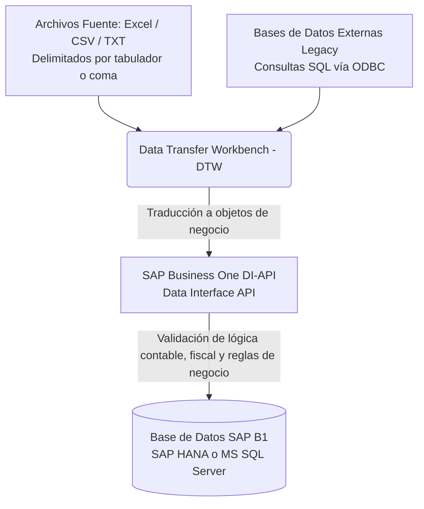
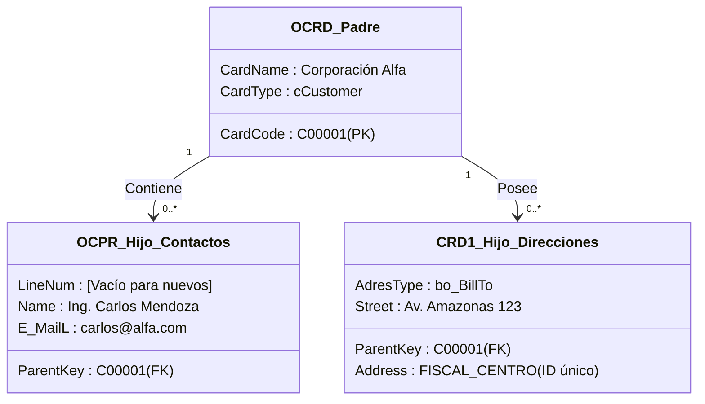
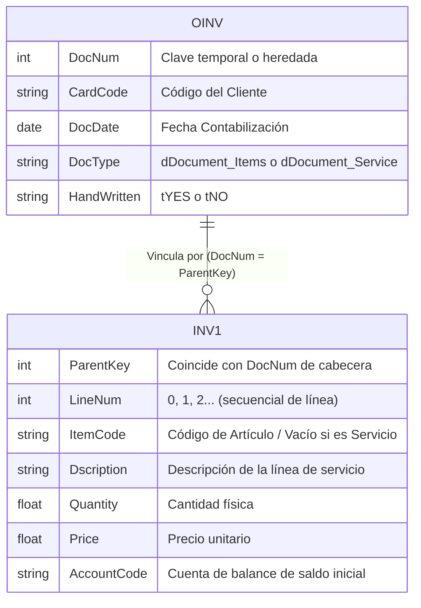
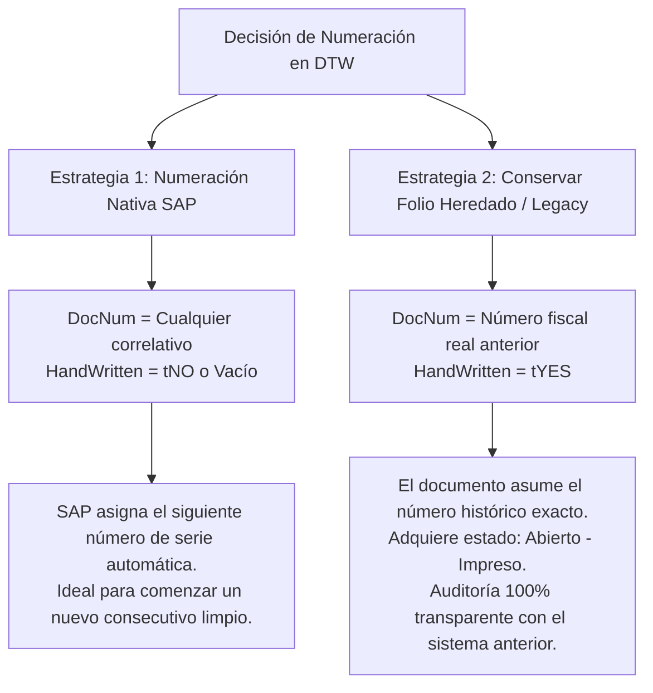
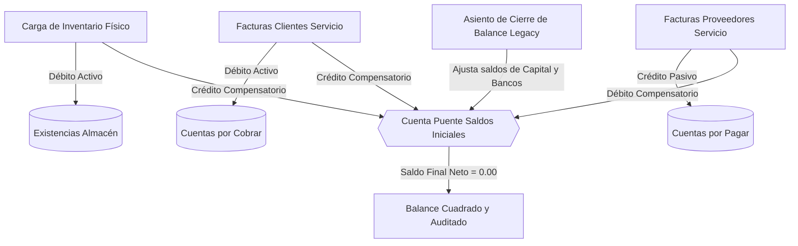
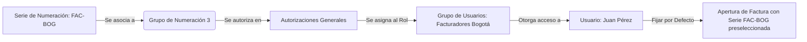
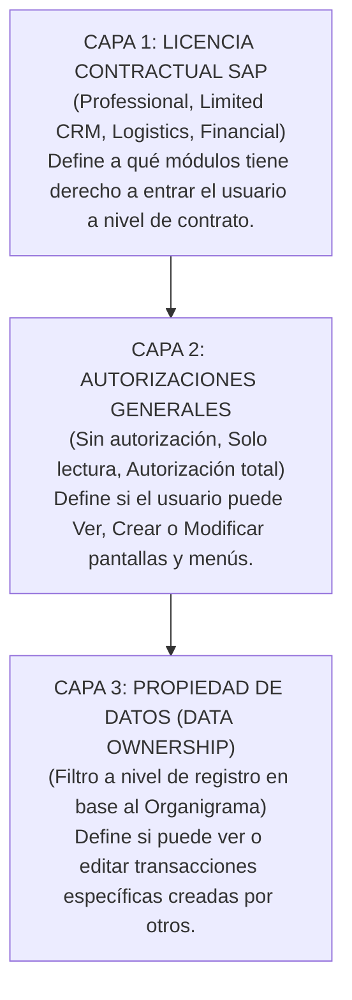
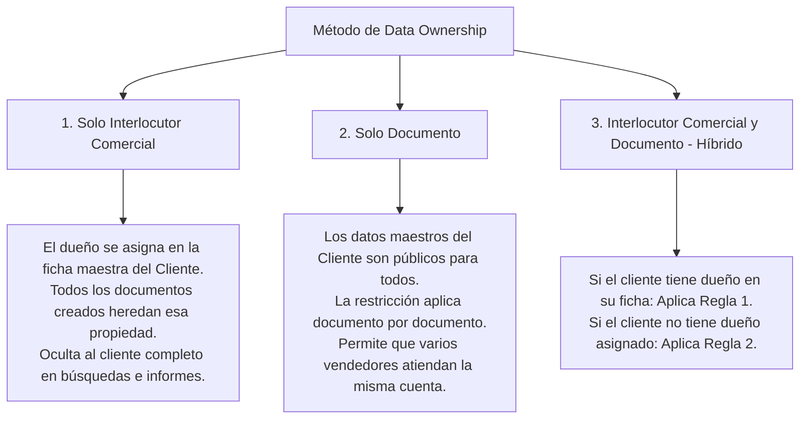

# MÓDULO 08: ADMINISTRACIÓN DEL SISTEMA, MIGRACIÓN DE DATOS (DTW) Y SEGURIDAD (SAP BUSINESS ONE 10.0 & ERP)

**Tipo de Contenido:** Base de Conocimiento Operativa y Guía de Entrenamiento para Copiloto IA  
**Versión:** SAP Business One 10.0 & ERP Cloud / On-Premise  
**Fuentes Oficiales Analizadas:** `10_Impl_32_Using_Data_Trans_Workbench.pdf`, `10_Impl_33_Importing_Docs_using_DTW.pdf`, `10_Impl_34_SystemSetup_DocumentMasterDataNumbering_ES.pdf` y `10_Impl_33_SystemSetup_DataOwnership_ES.pdf`  
**Nivel:** Avanzado / Consultoría de Implementación, Arquitectura Cutover, DBA y Administración de Seguridad  
**Tiempo Estimado de Estudio:** 75 minutos (dividido en 4 lecciones integradas)

---

## Resumen Ejecutivo

El presente módulo establece los fundamentos técnicos y estratégicos para gobernar con éxito la puesta en marcha (*Go-Live*), el mantenimiento estructural y el blindaje de seguridad en **SAP Business One 10.0**. 

A lo largo de este contenido, el consultor o administrador del sistema dominará:
1. **La Arquitectura de Migración de Datos vía Data Transfer Workbench (DTW):** Comprender el rol de la DI-API como motor de integridad transaccional frente a la tentación de inserciones directas por base de datos, dominando la estructura de plantillas padre-hijo y la aceleración multihilo en entornos SAP HANA.
2. **La Metodología de Cutover para Documentos y Saldos Iniciales:** Aplicar estrategias quirúrgicas de corte contable para evitar la letal "doble contabilización" de existencias y costos al transferir carteras abiertas de clientes y proveedores.
3. **El Gobierno de Series de Numeración e Indicadores de Período:** Diseñar estructuras de folios fiscales y logísticos que garanticen el no solapamiento numérico, la segmentación por sucursales y la transición transparente entre ejercicios anuales.
4. **El Modelo de Seguridad en Tres Capas y Propiedad de Datos (*Data Ownership*):** Modelar el organigrama empresarial vinculando usuarios a empleados de Recursos Humanos, garantizando que la visibilidad comercial responda a relaciones jerárquicas estrictas sin entorpecer la colaboración corporativa.

---

## ÍNDICE DEL MÓDULO

1. [Lección 8.1: Arquitectura de Migración de Datos con Data Transfer Workbench (DTW)](#lección-81-arquitectura-de-migración-de-datos-con-data-transfer-workbench-dtw)
2. [Lección 8.2: Migración de Documentos de Marketing y Saldos Iniciales (Cutover)](#lección-82-migración-de-documentos-de-marketing-y-saldos-iniciales-cutover)
3. [Lección 8.3: Series de Numeración y Reglas de Documentos y Datos Maestros](#lección-83-series-de-numeración-y-reglas-de-documentos-y-datos-maestros)
4. [Lección 8.4: Seguridad, Permisos y Propiedad de Datos (Data Ownership)](#lección-84-seguridad-permisos-y-propiedad-de-datos-data-ownership)
5. [Matriz de Troubleshooting y Reglas Críticas para el Copiloto IA](#matriz-de-troubleshooting-y-reglas-críticas-para-el-copiloto-ia)
6. [Banco de Evaluación Situacional](#banco-de-evaluación-situacional)
7. [Guiones Humanizados para Locución IA (ElevenLabs)](#guiones-humanizados-para-locución-ia-elevenlabs)

---

## LECCIÓN 8.1: ARQUITECTURA DE MIGRACIÓN DE DATOS CON DATA TRANSFER WORKBENCH (DTW)

### 1. ¿Qué es Data Transfer Workbench (DTW) y por qué existe?

**Data Transfer Workbench (DTW)** es la aplicación oficial cliente/servidor de SAP diseñada para realizar cargas e importaciones masivas de datos maestros y transaccionales durante la fase de puesta en marcha (*Go-Live / Cutover*) o en procesos periódicos de integración empresarial.

En proyectos de implementación de ERP, existe con frecuencia el impulso erróneo de insertar datos directamente en las tablas SQL mediante scripts (`INSERT INTO OCRD...`). SAP prohíbe tajantemente esta práctica porque corrompe la base de datos y anula la garantía de soporte técnico. DTW existe para resolver este problema actuando como una pasarela segura:



> [!IMPORTANT]
> **El Porqué de la DI-API en DTW:**
> Cuando DTW procesa un registro, no ejecuta una sentencia SQL cruda; invoca los métodos de la **DI-API** de SAP. Esto significa que:
> * Se ejecutan automáticamente las determinaciones de cuentas contables.
> * Se recalculan impuestos, listas de precios y descuentos por volumen.
> * Se validan claves foráneas (ej. que el grupo de artículos o el código fiscal realmente existan).
> * Se preserva la integridad referencial y transaccional: si una sola línea de una factura falla, el documento completo se revierte (*Rollback*).

#### Reglas de Integridad Inviolables de DTW:
* **Prohibición Absoluta de Eliminación:** DTW permite operaciones de inserción (*Add New Data*) y actualización (*Update Existing Data*), pero **NO permite eliminar registros** de la base de datos de SAP. Los datos maestros erróneos deben inactivarse manualmente o mediante actualización de estado.
* **Documentos Históricos Cerrados:** DTW no permite importar documentos que ya nacieron cerrados o cancelados en el sistema legado (ej. pedidos ya entregados hace dos años). Solo se migran saldos contables consolidados y transacciones que permanezcan legal u operativamente abiertas al momento del corte.
* **Validación Idéntica al Usuario:** El sistema rechaza cualquier registro que un usuario humano no pudiera crear manualmente desde la interfaz gráfica de SAP.

---

### 2. Estructura de las Plantillas Predefinidas de SAP

Las plantillas oficiales de DTW se localizan en el directorio del cliente DTW:  
`C:\Program Files\SAP\Data Transfer Workbench\Templates\`

Están organizadas por módulos funcionales y reproducen con exactitud la nomenclatura del diccionario de datos de SAP. Cada archivo representa una tabla relacional y posee una jerarquía estricta de encabezados:

| Fila en Archivo | Propósito Técnico | Ejemplo en Interlocutores (`OCRD`) | ¿Es Modificable? |
| :---: | :--- | :--- | :---: |
| **Fila 1** | **Propiedades DI-API:** Nombres de las propiedades en el modelo de objetos de programación de SAP. | `CardCode`, `CardName`, `CardType`, `GroupCode` | **NO (Estrictamente sagrada)** |
| **Fila 2** | **Campos de Base de Datos:** Nombres técnicos de las columnas en la tabla SQL subyacente. | `CardCode`, `CardName`, `CardType`, `GroupCode` | **NO (Estrictamente sagrada)** |
| **Fila 3+** | **Datos de Negocio:** Registros reales que serán importados a la base de datos. | `C10000`, `Corporación Industrial Andina S.A.`, `cCustomer`, `100` | **SÍ (Cuerpo de datos)** |

> [!WARNING]
> **Eliminación Accidental de Encabezados:**
> El error más frecuente en consultores júnior consiste en eliminar las filas 1 y 2 bajo la creencia de que son "títulos que estorban". Si se borra la fila 1 o 2, DTW pierde la correspondencia con los métodos COM de la DI-API y abortará la importación con errores genéricos de lectura.

#### Buenas Prácticas en el Llenado de Plantillas:
1. **Valores Enumerados (Enums de la DI-API):** Muchos campos no aceptan texto libre ni códigos numéricos visibles de la interfaz gráfica, sino identificadores tipificados de la API:
   * En `CardType`: No se escribe `C` ni `Cliente`; debe colocarse `cCustomer`. Para proveedores se usa `cSupplier`, y para prospectos comerciales `cLead`.
   * En indicadores binarios (*BoYesNoEnum*): No se usa `1/0` ni `True/False`; se escribe `tYES` o `tNO`.
   * En tipo de documento (`DocType`): Se especifica `dDocument_Items` (artículos) o `dDocument_Service` (servicios).
2. **Columnas en Blanco e Inferencia por Defecto:** Si una columna se deja vacía en la plantilla, DTW no la rellena con nulos indiscriminados; permite que SAP aplique las parametrizaciones generales configuradas en la sociedad (por ejemplo: la condición de pago predeterminada, la lista de precios base o el grupo impositivo por defecto).

---

### 3. Relación entre Plantillas Padre e Hijo (Parent & Child Templates)

En las bases de datos relacionales, una entidad de negocio rara vez se almacena en una sola tabla. Los objetos maestros y los documentos se componen de una cabecera y múltiples registros dependientes (relación uno a muchos, $1:N$).

Para cargar un Interlocutor Comercial con sus contactos y direcciones, DTW requiere procesar simultáneamente hasta tres archivos sincronizados:



#### Reglas de Sincronización Clave en Plantillas Hijo:
* **`ParentKey` (Columna A en archivos hijo):** Es el cordón umbilical que une al hijo con el padre. Debe contener el valor exacto del código primario (`CardCode` en interlocutores, o el número secuencial temporal en documentos).
* **El Campo `LineNum` en Contactos (`OCPR`):**
  * **Para insertar contactos nuevos masivamente:** La columna `LineNum` debe dejarse **completamente en blanco**. El motor de SAP asignará secuenciales correlativos internos (`0, 1, 2...`).
  * **Para actualizar un contacto preexistente:** Se debe indicar explícitamente el número de línea que ocupa en la base de datos (`0` para el primer contacto registrado, `1` para el segundo). Si se coloca `0` al intentar crear uno nuevo, DTW intentará sobreescribir el contacto existente en lugar de agregar uno adicional.
* **Identificación de Direcciones (`CRD1`):**
  * La tabla de direcciones no se indexa por `LineNum`, sino por un identificador alfanumérico en el campo `Address` (ej. `BOGOTA_NORTE`, `PLANTA_CALI`) y su tipificación en `AdresType` (`bo_BillTo` para dirección de factura o `bo_ShipTo` para entrega física).

---

### 4. Optimización de Rendimiento en SAP HANA: *Enable Faster Import*

Durante la ventana crítica del *Cutover* (generalmente entre el viernes por la noche y la madrugada del lunes previo a la apertura comercial), el tiempo disponible para migrar millones de registros es extremadamente limitado.

Para mitigar este cuello de botella en infraestructuras con motor **SAP HANA**, DTW incorpora la funcionalidad **Enable Faster Import**:

| Característica | Modo Tradicional DTW | Modo Faster Import (SAP HANA) |
| :--- | :--- | :--- |
| **Motor de Ejecución** | Monohilo secuencial vía llamadas COM simples. | **Multihilo paralelo** mediante componentes COM+ dedicados. |
| **Hilos Concurrentes** | 1 hilo de procesamiento. | **De 4 hasta 21 hilos de ejecución paralela.** |
| **Tiempo de Carga (100k ítems)** | 4 - 6 horas de procesamiento secuencial. | **35 - 50 minutos** (reducción de hasta un 80%). |
| **Modo Simulación** | Totalmente disponible para detectar errores antes de grabar. | **NO permitido.** Se asienta directamente en la base de datos. |
| **Alcance Operativo** | Todos los objetos maestros y transaccionales del sistema. | Restringido a **Datos Maestros** (Artículos, ICs) y **Documentos Abiertos**. |

> [!TIP]
> **Técnica de Consultoría para el Go-Live con Faster Import:**
> Ejecute siempre una simulación formal en una base de datos clonada de pruebas (*Sandbox/Staging*) utilizando el modo tradicional. Una vez verificado que el 100% de los datos carecen de errores de sintaxis o claves huérfanas, active *Enable Faster Import* en la base de datos productiva para maximizar la velocidad sin asumir riesgos imprevistos.

---

## LECCIÓN 8.2: MIGRACIÓN DE DOCUMENTOS DE MARKETING Y SALDOS INICIALES (CUTOVER)

### 1. Jerarquía de Plantillas en Documentos de Ventas y Compras

A diferencia de los datos maestros, los documentos de marketing tienen un impacto financiero y legal inmediato. Se estructuran mediante dos plantillas primordiales:



---

### 2. Manejo de Numeración de Documentos: ¿Folio SAP o Folio Heredado?

Una de las decisiones arquitectónicas más importantes en la preparación del archivo de corte es qué número adoptará el documento migrado dentro de SAP:



| Parámetro DTW | Numeración Automática SAP | Numeración Heredada del Sistema Anterior |
| :--- | :--- | :--- |
| **Campo `DocNum`** | Cualquier secuencial temporal para unir cabecera con líneas. | **El número exacto de la factura anterior** (ej. `804351`). |
| **Campo `HandWritten`** | Dejar vacío o asignar `tNO`. | Asignar **`tYES`** (*Manual / Escrito a mano*). |
| **Comportamiento en SAP** | SAP ignora el número de la plantilla y toma el correlativo activo de la serie predeterminada. | SAP graba la transacción con el número `804351` y marca el campo "Manual" como activo. |
| **Estado Resultante** | Documento Abierto estándar. | Documento **"Abierto - Impreso"** (no se reimprime accidentalmente). |
| **Caso de Uso Sugerido** | Nuevos pedidos que continuarán su flujo en SAP. | Facturas históricas abiertas que ya fueron emitidas físicamente al cliente. |

---

### 3. Trazabilidad entre Documentos Base y Destino (*Base Entry Linking*)

Cuando una empresa inicia operaciones en SAP, frecuentemente tiene compromisos en curso que deben conservar su trazabilidad: pedidos de venta abiertos con entregas parciales ya realizadas, o pedidos de compra aprobados que están por recibirse en almacén.

Para recrear en DTW el vínculo nativo del botón **"Copiar de / Copiar a"** y alimentar el **Mapa de Relaciones**, se deben configurar obligatoriamente tres columnas en la plantilla de detalle del documento de destino (`Document_Lines`):

```mermaid
graph LR
    Sub1["Documento Base: Pedido Cliente (ORDR/RDR1)<br/>DocEntry = 1050<br/>Línea 0: Art. A (Cant: 10)<br/>Línea 1: Art. B (Cant: 5)"] 
    -->|DTW Linking| 
    Sub2["Documento Destino: Entrega (ODLN/DLN1)<br/>BaseType = 17<br/>BaseEntry = 1050<br/>BaseLine = 0<br/>Cant Migrada: 10"]
```

#### Campos de Mapeo Obligatorios en `Document_Lines`:
1. **`BaseType` (Tipo de Documento Base):** Código numérico entero definido en la DI-API que identifica la tabla del documento predecesor:
   * `23` = Oferta de Ventas (*Sales Quotation*)
   * `17` = Pedido de Cliente (*Sales Order*)
   * `15` = Entrega de Ventas (*Delivery Note*)
   * `13` = Factura de Clientes (*A/R Invoice*)
   * `22` = Pedido de Compras (*Purchase Order*)
   * `20` = Entrada de Mercancías de Compras (*Goods Receipt PO*)
2. **`BaseEntry` (Entrada Base Interna):** Corresponde al valor **`DocEntry`** (la clave primaria autoincremental en la base de datos de SAP) del documento base ya cargado.  
   > *Nota crítica:* No se debe colocar el número visible de folio (`DocNum`), sino la clave interna de base de datos (`DocEntry`).
3. **`BaseLine` (Línea Base del Documento):** Especifica qué fila exacta del documento base está siendo consumida por la línea actual (iniciando formalmente en `0` para la primera línea).

---

### 4. Estrategia de Saldos Iniciales y Prevención de la "Doble Contabilización"

El error financiero más grave que puede cometerse durante un *Cutover* es registrar simultáneamente las existencias de bodega y la cartera por cobrar mediante facturas estándar de artículos. Analicemos el dilema contable y la arquitectura técnica de solución:

#### El Problema de la Doble Contabilización:
Si un cliente debe una factura de 10 unidades del Artículo X, y la bodega ya tiene esas 10 unidades en físico:
1. Si cargas el inventario inicial, sumas 10 unidades al activo de almacén y acreditas saldos iniciales.
2. Si luego cargas la factura abierta del cliente utilizando la plantilla de artículos (`dDocument_Items`), el motor transaccional de SAP **descontará nuevamente 10 unidades del inventario** y generará un asiento automático de costo de ventas contra existencias, descalabrando por completo la contabilidad y dejando el almacén en cero.

#### La Solución Técnica Oficial:
Dividir la carga en dos componentes independientes que se equilibran mediante una **Cuenta Transitoria de Saldos Iniciales (Cuenta Puente de Balance)**:

| Flujo de Carga | Objeto SAP / DTW | Tipo de Documento | Impacto en Stock | Impacto Contable en Mayor |
| :--- | :--- | :--- | :---: | :--- |
| **1. Inventario Físico** | Entrada de Mercancías (`OIGN` / `IGN1` en Inventario) | Logístico / Físico | **Incrementa (+) Existencias** | **Débito (+):** Cuenta de Existencias de Almacén.<br/>**Crédito (-):** Cuenta Puente de Saldos Iniciales. |
| **2. Cartera de Clientes** | Facturas de Clientes (`OINV` / `INV1` en Ventas) | **Servicio** (`DocType = dDocument_Service`) | **Neutro (0) No mueve stock** | **Débito (+):** Cuenta por Cobrar Clientes.<br/>**Crédito (-):** Cuenta Puente de Saldos Iniciales. |
| **3. Cartera de Proveedores** | Facturas de Proveedor (`OPCH` / `PCH1` en Compras) | **Servicio** (`DocType = dDocument_Service`) | **Neutro (0) No mueve stock** | **Débito (+):** Cuenta Puente de Saldos Iniciales.<br/>**Crédito (-):** Cuenta por Pagar Proveedores. |



> [!CAUTION]
> **Imputación de Cuentas en Facturas de Servicio:**
> Al confeccionar la plantilla `INV1` para saldos iniciales de clientes, en la columna `AccountCode` se debe colocar la **Cuenta Puente de Saldos Iniciales**, jamás una cuenta de ingresos/ventas del grupo 4 o 5. De lo contrario, se duplicarían artificialmente los ingresos fiscales del ejercicio en curso.

---

## LECCIÓN 8.3: SERIES DE NUMERACIÓN Y REGLAS DE DOCUMENTOS Y DATOS MAESTROS

### 1. Configuración de Series de Documentos

El control de folios en SAP Business One garantiza el cumplimiento fiscal, la segregación por puntos de venta y la trazabilidad de auditoría.

Ruta de acceso:  
`Gestión > Inicialización sistema > Numeración de documento`

* **Serie Principal (*Primary Series*):** Es la serie preconfigurada creada por SAP en toda base de datos limpia. Inicia en el número `1` y tiene un valor final infinito (`999999999`). No puede eliminarse, pero sí renombrarse o desactivarse una vez alcanzado el fin de su ciclo.
* **Series Múltiples:** Permiten segregar la facturación o la logística por criterios operativos:
  * **Por Sucursal Física:** Serie `FAC-SUR`, Serie `FAC-NORTE`.
  * **Por Canal Comercial:** Serie `POS-CAJA1`, Serie `ECOMMERCE`.
  * **Por Régimen Fiscal:** Serie `FACTURA-ELEC`, Serie `EXPORTACION`.
* **Regla Estricta de No Solapamiento Numérico:** SAP exige una barrera estricta para evitar duplicidad de folios. Si se desea crear una nueva serie para un tipo de documento que ya está operando con la serie primaria, el administrador debe **cerrar el límite superior** de la serie anterior configurando el campo `Primer nº` y `Último nº`. Dos series activas dentro de un mismo período nunca pueden compartir rangos numéricos superpuestos.
* **Prefijos y Sufijos:** Códigos alfanuméricos visuales (ej. prefijo `FE-`, sufijo `-2026`).  
  > *Nota arquitectónica:* El prefijo y sufijo son elementos puramente visuales e impresos. En la base de datos relacional, el campo `DocNum` almacena única y exclusivamente el valor entero correlativo (`1001`), lo que permite ordenar y filtrar numéricamente las consultas SQL sin problemas de ordenación alfanumérica.

---

### 2. Seguridad y Asignación de Series por Usuario

Por diseño del sistema, un usuario nuevo recién creado en SAP Business One **no tiene acceso a emitir transacciones con ninguna serie de numeración**, ni siquiera con la serie principal. Si intenta crear un documento, recibirá el error: *"No tiene autorización para la serie de numeración seleccionada"*.

Para delegar el acceso de forma estructurada, SAP emplea un sistema de **Grupos de Numeración**:



1. **Paso 1: Asignación al Grupo:** En la ventana de configuración de series, cada serie se vincula a uno de los 10 grupos predeterminados disponibles (del `Grupo 1` al `Grupo 10`).
2. **Paso 2: Autorizaciones Generales:** En `Gestión > Inicialización sistema > Autorizaciones > Autorizaciones generales`, se selecciona al usuario o grupo de usuarios, se expande la sección *Serie de numeración*, y se otorga **Autorización Total** sobre el grupo correspondiente.
3. **Paso 3: Establecer Serie por Defecto:** Para evitar errores operativos donde el usuario emite una factura en una serie ajena, se hace clic en el botón **Fijar como por defecto**, asignando la serie correspondiente a su sucursal de manera automática al abrir la ventana.

---

### 3. Indicadores de Período y Series de Cancelación

* **Indicadores de Período (*Period Indicators*):**  
  Permiten desacoplar legalmente los ejercicios fiscales. Al enlazar una serie de numeración con un indicador de período contable (ej. `2026`), la empresa puede reiniciar su numeración en el número `1` cada 1 de enero sin colisionar con la factura número `1` del año 2025. El motor de base de datos valida la unicidad del folio evaluando la tupla `(DocNum + PeriodIndicator)`.
* **Series de Cancelación:**  
  Al marcar la casilla **Cancelación** en la definición de una serie, esa serie se reserva exclusivamente para los documentos de anulación reversa que SAP genera automáticamente cuando un usuario hace clic derecho y selecciona *Cancelar* sobre una factura o entrega. Esto aísla contablemente las anulaciones de la facturación comercial regular.

---

### 4. Numeración Automática de Datos Maestros

Por defecto, SAP B1 permite escribir códigos alfanuméricos manuales en Clientes, Proveedores y Artículos. Sin embargo, en implementaciones corporativas maduras, la nomenclatura libre genera duplicados y desorden (`CLI-001`, `C001`, `CL0001`).

Para establecer una numeración automática institucional:
1. En `Numeración de documento`, se selecciona la pestaña de datos maestros correspondiente (*Interlocutores comerciales* o *Artículos*).
2. Se define una serie estructurada:
   * **Nombre de Serie:** `Clientes Nacionales`
   * **Prefijo:** `CLI-`
   * **Longitud fija de caracteres:** Por ejemplo, `5` dígitos.
3. **Comportamiento Operativo:** Al crear un nuevo cliente en el sistema, SAP generará automáticamente el código formateado rellenando con ceros a la izquierda: `CLI-00001`, `CLI-00002`, `CLI-00003`, suprimiendo la digitación manual y garantizando uniformidad absoluta.

---

## LECCIÓN 8.4: SEGURIDAD, PERMISOS Y PROPIEDAD DE DATOS (DATA OWNERSHIP)

### 1. La Jerarquía de Seguridad en Tres Capas

La seguridad de datos en SAP Business One no se limita a otorgar o denegar contraseñas; opera como un filtro concéntrico de tres capas jerárquicas:



* **Capa 1 (Licencia):** Si un usuario tiene una licencia *Limited CRM*, el sistema físicamente oculta y bloquea el módulo de Finanzas e Inventario.
* **Capa 2 (Autorizaciones Generales):** Si el usuario tiene licencia comercial pero en Autorizaciones Generales tiene *Sin Autorización* para "Facturas de Clientes", la opción no aparecerá en su menú principal.
* **Capa 3 (Propiedad de Datos):** Si el usuario tiene licencia comercial y autorización total en facturas, pero la factura fue creada por otro vendedor de otra sucursal, la capa de *Data Ownership* determina si el registro se muestra, se bloquea o queda en modo solo lectura.

---

### 2. Los 3 Métodos de Gestión de Propiedad de Datos (*Data Ownership*)

Se configuran en:  
`Gestión > Inicialización sistema > Parametrizaciones generales > ficha IC`



| Método de Propiedad | Mecanismo de Control | Escenario de Negocio Recomendado |
| :--- | :--- | :--- |
| **1. Solo Interlocutor Comercial** | El propietario (*Owner*) se estipula en la cabecera del Cliente (`OCRD.OwnerCode`). Un usuario no autorizado ni siquiera podrá encontrar al cliente en la lista desplegable de búsqueda ni ver sus saldos. | **Carteras Cerradas Exclusivas:** Banca privada, consultoría especializada o ventas corporativas donde cada cliente pertenece estrictamente a un ejecutivo de cuenta. |
| **2. Solo Documento** | Todos los empleados pueden seleccionar y facturar al mismo cliente. La restricción de visibilidad se calcula a nivel de la cabecera de la cotización, pedido o factura individual según el empleado que la registró. | **Ventas Abiertas / Mostrador:** Retail, venta telefónica o sucursales donde múltiples ejecutivos emiten cotizaciones al mismo cliente institucional. |
| **3. Híbrido (IC y Documento)** | Regla jerárquica combinada: si el cliente tiene un propietario asignado en su maestro, prevalece el blindaje total (Método 1). Si la ficha está vacía, cualquier documento nuevo generado pasa a regularse por la propiedad documental (Método 2). | **Empresas Mixtas:** Poseen grandes cuentas corporativas blindadas (*Key Accounts*) y simultáneamente atienden clientes masivos generales. |

---

### 3. Matriz de Relaciones Organizacionales Basada en Empleados

Para que la Propiedad de Datos opere, existe un **requisito técnico indispensable**: cada código de usuario de SAP (`OUSR`) debe estar enlazado con su respectiva ficha en el módulo de Recursos Humanos (**Datos Maestros de Empleado**, `OHEM`).

A través del organigrama corporativo definido en Recursos Humanos (campo *Jefe directo*, *Departamento*, *Sucursal* y *Equipo*), SAP calcula las siguientes relaciones entre el usuario que intenta acceder y el propietario del documento:

| Relación Organizacional | Definición Estructural en SAP | Caso Práctico Típico |
| :--- | :--- | :--- |
| **Compañero (*Peer*)** | El usuario y el dueño del documento tienen asignado al **mismo Jefe directo** en RH. | Dos ejecutivos de cuenta que reportan al mismo Gerente de Ventas Regional. |
| **Jefe (*Manager*)** | El dueño del documento es el superior jerárquico directo del usuario consultante. | Un asistente administrativo consultando las órdenes de trabajo de su supervisor. |
| **Subordinado (*Subordinate*)** | El usuario consultante es el jefe directo del dueño del registro. | Un Gerente de Sucursal auditando las cotizaciones emitidas por sus vendedores a cargo. |
| **Equipo (*Team*)** | Ambos empleados pertenecen al mismo equipo de trabajo funcional configurado en RH. | Miembros de un comité especial de licitaciones o proyectos transversales. |
| **Departamento / Sucursal** | Pertenecen a la misma unidad organizativa funcional o geográfica. | Todo el personal de la sede Cali o del departamento de Operaciones. |
| **Empresa (*Company*)** | Nivel supremo global corporativo. | Directores generales con potestad de visualización consolidada. |

#### Opciones de Permiso por Relación:
Para cada una de estas dimensiones, el administrador puede conceder:
* **Ninguno (*No Authorization*):** El registro es totalmente invisible; no aparece en búsquedas ni en reportes.
* **Solo lectura (*Read Only*):** Puede abrir el documento para inspección o impresión, pero no puede modificar cantidades, precios ni cerrarlo.
* **Total (*Full Authorization*):** Capacidad absoluta de consulta, modificación y anulación del registro.

> [!NOTE]
> **Reglas de Oro del Motor de Seguridad:**
> 1. **Regla de Prevalencia de la Autorización Más Generosa:** Si un usuario califica simultáneamente en dos relaciones (por ejemplo, tiene *Solo Lectura* por pertenecer al mismo Departamento, pero tiene *Total* porque el dueño es su Subordinado directo), el sistema **siempre aplica el permiso más favorable** (Autorización Total).
> 2. **Inmunidad de Superusuarios:** Los usuarios administradores marcados con el flag *Superusuario* ignoran por diseño todas las restricciones de *Data Ownership*.

---

## MATRIZ DE TROUBLESHOOTING Y REGLAS CRÍTICAS PARA EL COPILOTO IA

Esta matriz contiene los incidentes más frecuentes reportados en mesas de ayuda durante implementaciones y cortes operativos, detallando su diagnóstico y solución:

### Incidente 1: DTW arroja el error *"Unexpected end of file"* o las columnas quedan desplazadas

* **Causa Raíz:** El archivo se guardó en formato `.csv` delimitado por comas, pero dentro de los campos de texto libre (direcciones, nombres comerciales o comentarios) existen comas gramaticales (ej. `"Calle 100, Edificio Torre Central, Oficina 502"`). DTW interpreta la coma del texto como un delimitador de columna, fracturando el registro y desplazando los datos hacia campos erróneos.
* **Instrucción de Asesoría del Copiloto:**
  1. Abrir la plantilla de datos en Microsoft Excel.
  2. Guardar el archivo seleccionando el formato **Texto delimitado por tabulaciones (*.txt)** o **CSV delimitado por punto y coma**.
  3. Al iniciar el asistente de DTW en el paso de selección de fuentes, marcar explícitamente el delimitador correspondiente (**Tab Delimited**).
  4. Correr nuevamente el botón *Run Simulation* antes de proceder con la carga definitiva.

---

### Incidente 2: Al intentar crear un documento comercial, SAP muestra *"No tiene autorización para la serie de numeración"*

* **Causa Raíz:** El usuario cuenta con licencia operativa y autorización en el menú del documento, pero la serie activa está asignada a un *Grupo de Numeración* (del 1 al 10) sobre el cual el usuario tiene estatus *Sin Autorización*.
* **Instrucción de Asesoría del Copiloto:**
  1. Ingresar como superusuario a `Gestión > Inicialización sistema > Numeración de documento`.
  2. Hacer doble clic sobre el tipo de documento afectado (ej. *Facturas de Clientes*) y verificar qué valor figura en la columna **Grupo** para la serie predeterminada (ej. `Grupo 4`).
  3. Dirigirse a `Gestión > Inicialización sistema > Autorizaciones > Autorizaciones generales`.
  4. Localizar al usuario o su grupo de seguridad, desplegar el módulo *Gestión > Inicialización sistema > Serie de numeración*, y asignar **Autorización total** al `Grupo 4`.
  5. Asegurarse de fijar la serie como predeterminada para el usuario mediante el botón *Fijar como por defecto*.

---

### Incidente 3: Un ejecutivo comercial no puede visualizar las cotizaciones de su compañero de equipo

* **Causa Raíz:** La empresa tiene activa la *Propiedad de Datos (Data Ownership)* en modo Documento o Híbrido. El usuario carece de permisos sobre la relación *Compañero (Peer)* en la matriz de autorizaciones o su ficha de Recursos Humanos no está debidamente configurada.
* **Instrucción de Asesoría del Copiloto:**
  1. Verificar en `Módulo Recursos Humanos > Datos maestros de empleado` que tanto el usuario consultante como el vendedor propietario tengan seleccionado al mismo superior en el campo **Jefe**.
  2. Ir a `Gestión > Inicialización sistema > Autorizaciones > Propiedad de datos > Autorizaciones de propiedad de datos`.
  3. Seleccionar al usuario consultante, ubicar la fila del objeto *Oferta de Ventas* (o *General*), y en la columna **Compañero** modificar el valor de *Ninguno* a **Solo lectura** o **Total**, según la política comercial de la empresa.

---

### Incidente 4: Error en DTW *"Invalid value for Property [Field_Name] / Enum mismatch"*

* **Causa Raíz:** Se introdujo en la plantilla un valor en texto legible en lugar del valor enumerado exigido por la interfaz DI-API (por ejemplo: escribir `Cliente` en lugar de `cCustomer`, o `Y` en lugar de `tYES`).
* **Instrucción de Asesoría del Copiloto:**
  1. Abrir la plantilla original provista por SAP en la carpeta `Templates`.
  2. Posicionar el cursor sobre el comentario de la cabecera en la Fila 1 correspondiente al campo con fallo.
  3. Leer la lista de enumeraciones válidas soportadas por el DI-API.
  4. Reemplazar masivamente los valores en la columna de datos y reejecutar la simulación en DTW.

---

### Incidente 5: Al vincular documentos en DTW arroja *"Base document does not exist or line is closed"*

* **Causa Raíz:** Se configuró el número visible `DocNum` en el campo `BaseEntry` en lugar de utilizar el identificador único interno autoincremental `DocEntry`, o bien la cantidad especificada en la línea destino supera la cantidad pendiente del documento base.
* **Instrucción de Asesoría del Copiloto:**
  1. Ejecutar una consulta SQL simple sobre la tabla base para obtener el `DocEntry` real (ej. `SELECT DocEntry, DocNum FROM ORDR WHERE DocNum = 501`).
  2. Reemplazar en la plantilla `Document_Lines` el valor de la columna `BaseEntry` con el `DocEntry` recuperado.
  3. Validar que la columna `BaseLine` coincida con el índice de base cero (`0, 1, 2...`) de la línea base abierta.

---

## BANCO DE EVALUACIÓN SITUACIONAL

A continuación se presentan 5 casos situacionales basados en escenarios de implementación real. Cada pregunta incluye el análisis de opciones y la justificación metodológica correspondiente:

---

### Pregunta 1: Arquitectura de Saldos Iniciales en el Go-Live
Durante el corte contable (*Cutover*) de una distribuidora con inventario permanente, la gerencia financiera exige migrar 1.200 facturas de venta que quedaron pendientes de cobro en el ERP legacy. El inventario físico de las bodegas ya fue contado, auditado e ingresado al sistema mediante una Entrada de Mercancías inicial. ¿Cuál es el procedimiento técnico estricto que debe ejecutar el equipo de consultoría en DTW para registrar estas cuentas por cobrar sin alterar las cifras de balance ni las existencias?

* **A)** Importar las facturas utilizando la plantilla estándar de artículos (`DocType = dDocument_Items`) y posteriormente ejecutar una Salida de Mercancías por ajuste para anular el movimiento de inventario.
* **B)** Importar las facturas configuradas como tipo Servicio (`DocType = dDocument_Service`), asignando en las líneas la Cuenta Puente Transitoria de Saldos Iniciales de Balance como contrapartida. **[CORRECTA]**
* **C)** No migrar las facturas en el módulo de ventas; registrar únicamente un asiento contable consolidado en el libro mayor que agrupe toda la cartera por cobrar.
* **D)** Importar las facturas con la plantilla de artículos (`dDocument_Items`), pero marcando el campo `HandWritten = tYES` para que el sistema asuma que son manuales y omita el control de stock.

> **Explicación Pedagógica Detallada:**  
> La opción **B** es la única respuesta arquitectónicamente correcta. Al utilizar facturas de tipo Servicio (`dDocument_Service`), SAP Business One genera el débito comercial en la cuenta del cliente (creando la cuenta por cobrar individualizada con su fecha de vencimiento y folio histórico) y acredita la cuenta puente de saldos iniciales de balance. Esta operación elude por completo el módulo de bodegas: **no descuenta inventario físico ni genera costo de ventas**, evitando la devastadora duplicación contable. La opción A destruye la pista de auditoría e infla innecesariamente los movimientos de almacén. La opción C pierde el detalle auxiliar por cliente (imposibilitando cobranzas individuales), y la opción D es una falacia técnica: el flag `HandWritten` solo controla la numeración del documento, jamás inhibe el movimiento de inventario en facturas de artículos.

---

### Pregunta 2: Segregación Jerárquica y Propiedad de Datos
Una corporación comercializadora cuenta con 4 sucursales regionales. La dirección exige una política de visibilidad estricta:
1. Los ejecutivos de venta solo deben ver y gestionar sus propios documentos comerciales.
2. No deben ver bajo ninguna circunstancia las cotizaciones ni pedidos creados por otros vendedores, incluso si están en su misma sucursal.
3. Los Gerentes Regionales deben tener supervisión y control total sobre los documentos creados por todos los ejecutivos que les reportan.
¿Cómo debe estructurarse esta configuración en SAP Business One?

* **A)** Asignar a los vendedores una licencia *Limited CRM* y a los gerentes una licencia *Professional*, ya que las licencias controlan de forma nativa la visibilidad por usuario.
* **B)** Habilitar la Propiedad de Datos por Documento, vincular a los usuarios con sus fichas de Recursos Humanos configurando al Gerente como su *Jefe*, y en la matriz de Propiedad de Datos asignar al Gerente autorización *Total* sobre la relación "Subordinado" y a los ejecutivos autorización *Ninguno* sobre la relación "Compañero". **[CORRECTA]**
* **C)** Crear una base de datos de sociedad independiente en el servidor para cada ejecutivo de ventas y consolidar financieramente al final del mes.
* **D)** Asignar a cada ejecutivo comercial una Serie de Numeración distinta y denegar el acceso a las series de sus compañeros en Autorizaciones Generales.

> **Explicación Pedagógica Detallada:**  
> La opción **B** aplica a la perfección la Capa 3 de seguridad (*Data Ownership*). Al activar la propiedad a nivel documental y mapear el organigrama en Datos Maestros de Empleado, la relación "Subordinado" con permiso Total confiere al Gerente visibilidad omnímoda sobre su equipo. Al fijar el permiso "Compañero" (*Peer*) en Ninguno, los ejecutivos comerciales quedan completamente aislados entre sí, impidiendo el espionaje de cotizaciones y carteras. La opción A es incorrecta porque el tipo de licencia delimita módulos, no registros individuales. La opción C es un error de sobrediseño arquitectónico inviable, y la opción D solo restringe la creación de nuevos folios en una serie, pero no impide que un vendedor consulte o busque documentos creados por otros en la serie común.

---

### Pregunta 3: Optimización Masiva en Entornos SAP HANA
Durante un fin de semana de Go-Live, el equipo de migración debe cargar 450.000 registros correspondientes al catálogo maestro de artículos con sus listas de precios asociadas. En las pruebas preliminares con DTW tradicional, el proceso tardaba más de 9 horas, lo cual excede la ventana técnica acordada con el negocio. ¿Qué solución oficial proporciona SAP para reducir drásticamente este tiempo manteniendo la estabilidad del sistema?

* **A)** Ejecutar sentencias masivas `BULK INSERT` directamente en las tablas `OITM` e `ITM1` mediante HANA Studio, omitiendo la interfaz de DTW.
* **B)** Iniciar sesión en DTW y habilitar la opción "Enable Faster Import", ejecutando la carga multihilo en paralelo mediante componentes COM+ dedicados en SAP HANA. **[CORRECTA]**
* **C)** Convertir todos los archivos CSV a formato binario JSON y subirlos mediante el Service Layer de SAP HANA.
* **D)** Abrir 15 sesiones simultáneas de la aplicación cliente DTW en la misma estación de trabajo para importar lotes fraccionados de 30.000 artículos.

> **Explicación Pedagógica Detallada:**  
> La opción **B** es la funcionalidad nativa de alto rendimiento diseñada por SAP para entornos HANA. Al marcar *Enable Faster Import*, DTW desacopla el cuello de botella monohilo y despliega entre 4 y 21 hilos de procesamiento paralelo vía COM+, permitiendo reducir el tiempo de carga en hasta un 80% bajo un marco totalmente respaldado por el soporte de SAP. La opción A constituye una violación flagrante de las políticas de soporte de SAP y corrompería las tablas de índices y cálculo de costos. La opción C no es una función estándar de DTW, y la opción D colapsaría los bloqueos transaccionales a nivel de cliente provocando bloqueos mutuos (*Deadlocks*).

---

### Pregunta 4: Gobierno de Folios y Cambio de Ejercicio Fiscal
Una compañía que inició operaciones en marzo de 2025 necesita que el 1 de enero de 2026 la numeración de sus facturas de venta vuelva a comenzar desde el número `1`, cumpliendo con una disposición de la entidad tributaria local. Sin embargo, el director contable teme que al reiniciar la serie en `1`, el sistema sobreescriba o bloquee la facturación al detectar colisión con la Factura número `1` emitida en 2025. ¿Cómo resuelve SAP Business One esta exigencia sin comprometer los datos históricos?

* **A)** Creando una nueva sociedad en blanco cada 1 de enero y migrando nuevamente los saldos de clientes.
* **B)** Asociando las series de numeración a un nuevo "Indicador de Período" enlazado al ejercicio 2026, lo que permite reiniciar el correlativo en 1 garantizando unicidad mediante la combinación Folio + Período. **[CORRECTA]**
* **C)** Modificando manualmente el campo `Siguiente nº` en la serie principal sin tocar ninguna otra parametrización.
* **D)** Cancelando todas las facturas del año 2025 para liberar los correlativos en la base de datos.

> **Explicación Pedagógica Detallada:**  
> La opción **B** describe el funcionamiento estándar de los *Indicadores de Período (Period Indicators)*. En SAP Business One, las series de numeración pueden asignarse a un indicador de período contable anual específico. Al asignar la serie de 2026 a su respectivo indicador, el sistema permite que el folio inicie formalmente en `1` sin arrojar conflictos de duplicidad con el ejercicio 2025, preservando la integridad de las consultas fiscales y la trazabilidad histórica de años previos. La opción C fallará inmediatamente porque SAP valida que el número inicial no solape folios preexistentes dentro de una serie continua. Las opciones A y D son aberraciones operativas que destruyen la continuidad del negocio.

---

### Pregunta 5: Integridad Relacional en Plantillas Hijo de DTW
Al preparar la plantilla de importación para actualizar masivamente los números telefónicos y correos electrónicos de los Contactos de Clientes preexistentes mediante la tabla `OCPR`, el analista de datos asigna en la Columna A (`ParentKey`) el código del cliente (`C10001`), pero deja la Columna B (`LineNum`) totalmente en blanco en todos los registros. ¿Cuál será el resultado técnico cuando se ejecute la importación en DTW en modo "Update Existing Data"?

* **A)** DTW actualizará correctamente los contactos existentes reconociendo automáticamente a cada persona por su nombre.
* **B)** DTW fallará o agregará nuevos contactos adicionales duplicados con los teléfonos actualizados, en lugar de modificar los contactos que ya existían. **[CORRECTA]**
* **C)** El sistema borrará los contactos anteriores y dejará únicamente los nuevos.
* **D)** La importación se detendrá con el error fatal *"LineNum must always be zero for all transactions"*.

> **Explicación Pedagógica Detallada:**  
> La opción **B** refleja el comportamiento exacto del motor de la DI-API para la tabla `OCPR`. Cuando se procesa la plantilla hijo de contactos y el campo `LineNum` se omite o queda vacío, el sistema interpreta que se trata de una instrucción de inserción (*Append*) de nuevos contactos vinculados al `ParentKey`. En consecuencia, no modificará las fichas de los contactos existentes, sino que creará líneas de contacto duplicadas. Para actualizar un contacto existente con precisión, el consultor debe indicar obligatoriamente el índice numérico que dicho contacto ocupa en la tabla (`LineNum = 0` para el primer contacto, `1` para el segundo, etc.).

---

## GUIONES HUMANIZADOS PARA LOCUCIÓN IA (ELEVENLABS)

Estructura de guiones de entrenamiento corporativo diseñados para avatares de inteligencia artificial educativa. Cada guion incluye especificaciones de entonación, pausas estratégicas y tiempos de alocución:

```json
[
  {
    "scene": "01_arquitectura_y_mision_dtw",
    "voicePrompt": "Metódico, técnico, sereno y tranquilizador. Tono de arquitecto de soluciones de alto nivel.",
    "text": "La migración de datos es, sin lugar a dudas, el momento más crítico y desafiante en la vida de un ERP. No se trata simplemente de copiar y pegar registros desde una hoja de cálculo; se trata de transferir el corazón operativo de la empresa sin quebrar su armonía contable. Con Data Transfer Workbench, cada cliente, cada saldo y cada artículo histórico ingresan a SAP Business One cruzando el puente seguro de la DI-API. Esto garantiza que cada registro cumpla exactamente las mismas reglas de validación fiscal y contable que si hubiese sido creado por un auditor experto.",
    "durationEstimate": "25s"
  },
  {
    "scene": "02_el_corte_quirurgico_y_saldos_iniciales",
    "voicePrompt": "Analítico, enfático, pedagógico y preventivo. Tono de advertencia profesional constructiva.",
    "text": "Durante el fin de semana de Go-Live, la doble contabilización es un error que puede destruir la confianza financiera del proyecto. Si intentas migrar las facturas pendientes de tus clientes como si fueran productos físicos, el sistema cometerá el error fatal de descontar nuevamente el inventario y duplicar tus costos de venta. La regla de oro en el Cutover es quirúrgica y precisa: el inventario físico entra por el almacén con Entradas de Mercancías, y la deuda histórica de tus clientes se registra mediante Facturas de Servicio asociadas a una cuenta puente de balance. Precisión matemática desde el primer día.",
    "durationEstimate": "26s"
  },
  {
    "scene": "03_gobierno_de_series_y_periodos_fiscales",
    "voicePrompt": "Estructurado, directivo, normativo y claro. Ritmo constante y seguro.",
    "text": "Una empresa en expansión no puede permitirse que todas sus sucursales compartan el mismo talonario de facturación. En SAP Business One, las series de numeración te permiten aislar y ordenar los folios por puntos de venta, cajas registradoras o tipos de régimen tributario sin riesgo alguno de solapamientos. Y cuando llega el cambio de ejercicio fiscal, los indicadores de período hacen posible reiniciar tus correlativos desde el número uno con total transparencia legal, manteniendo intacta y blindada toda la historia de los años anteriores.",
    "durationEstimate": "23s"
  },
  {
    "scene": "04_la_privacidad_inteligente_y_data_ownership",
    "voicePrompt": "Estratégico, confidencial, seguro y convincente. Tono corporativo de gobernanza.",
    "text": "¿Cómo proteges la información más sensible de tus clientes sin levantar muros innecesarios entre tus colaboradores? La respuesta es la Propiedad de Datos. Al conectar tus usuarios de SAP con el organigrama real de Recursos Humanos, el sistema entiende la jerarquía de tu organización de forma natural: los gerentes auditan a sus equipos subordinados, los departamentos colaboran entre sí, pero las carteras comerciales se mantienen estrictamente blindadas. En SAP Business One, la información correcta está siempre visible, únicamente en las manos correctas.",
    "durationEstimate": "24s"
  }
]
```
