# MÓDULO 09: SOPORTE TÉCNICO, HERRAMIENTAS DE DIAGNÓSTICO Y PLATAFORMA DE SOPORTE REMOTO (RSP) (SAP BUSINESS ONE 10.0 & ERP)

**Tipo de Contenido:** Base de Conocimiento Operativa y Guía de Entrenamiento para Copiloto IA  
**Versión:** SAP Business One 10.0 & ERP Cloud / On-Premise  
**Fuentes Oficiales Analizadas:** `10_Support_11_SupportProcTool_ES.pdf` y notas técnicas de soporte de SAP (`1167635`, `1733065`, `896891`, `1989457`, `1058208`)  
**Nivel:** Avanzado / Mesa de Ayuda de Nivel 1/2/3, Administración de Infraestructura y Mantenimiento  
**Tiempo Estimado de Estudio:** 65 minutos (dividido en 4 lecciones integradas)

---

## Resumen Ejecutivo

El soporte técnico en **SAP Business One 10.0** no es un servicio de mesa de ayuda genérico ni una labor meramente reactiva de resolución de problemas cotidianos; es un **modelo de ingeniería colaborativa y gobernanza de TI** estrictamente articulado entre el cliente final, el socio de negocio certificado (*Partner VAR*) y el fabricante del software (*SAP SE*).

La continuidad operativa de una empresa depende de que sus sistemas transaccionales se mantengan íntegros, auditables y de alto rendimiento. Para lograrlo, el ecosistema de SAP establece un esquema de responsabilidades contractuales donde el Partner asume la primera línea de defensa técnica (**Nivel 1 y Nivel 2**), resolviendo incidencias de usabilidad, configuración, infraestructura y desarrollo de terceros, mientras que SAP reserva su soporte de producto (**Nivel 3**) para la investigación profunda y corrección del código fuente estándar del ERP.

A lo largo de este módulo, el consultor o líder de soporte dominará:
1. **El Modelo de Escalabilidad y la Prevención de Incident Billing:** Conocer los límites de responsabilidad contractual establecidos en la Nota SAP 1167635, evitando que la consultora incurra en penalizaciones financieras por escalar problemas no atribuibles a defectos del producto estándar.
2. **La Arquitectura Proactiva de la Remote Support Platform (RSP):** Comprender el funcionamiento del Agente RSP y el RSP Studio, monitoreando la salud de las bases de datos (SQL Server / SAP HANA) y garantizando el envío semanal del Informe de Estado del Sistema (*System Status Report - SSR*), condición indispensable para habilitar el usuario maestro de soporte y mantener activa la cobertura de garantía de SAP (Nota SAP 1733065).
3. **El Instrumental de Diagnóstico Integrado (Support Desk):** Implementar flujos de captura forense mediante la herramienta de Notificación de Problemas (*Problem Steps Recorder - PSR*) y configurar niveles quirúrgicos de trazabilidad (*Logging & Tracing*) para aislar fallos intermitentes sin colapsar el almacenamiento del servidor.
4. **La Gestión Rigurosa de Incidentes en SAP Support Launchpad / SAP for Me:** Clasificar con precisión objetiva los niveles de prioridad según los acuerdos de nivel de servicio (*SLA*), aplicando una lista de verificación de 5 pasos antes de comprometer al equipo de desarrollo de SAP.

---

## ÍNDICE DEL MÓDULO

1. [Lección 9.1: Modelo de Niveles de Soporte y Obligaciones Contractuales del Partner (N1, N2 y N3)](#lección-91-modelo-de-niveles-de-soporte-y-obligaciones-contractuales-del-partner-n1-n2-y-n3)
2. [Lección 9.2: Arquitectura y Operación de la Plataforma de Soporte Remoto (RSP)](#lección-92-arquitectura-y-operación-de-la-plataforma-de-soporte-remoto-rsp)
3. [Lección 9.3: Herramientas Integradas de Diagnóstico: Logs, Trazas y Grabador de Incidentes](#lección-93-herramientas-integradas-de-diagnóstico-logs-trazas-y-grabador-de-incidentes)
4. [Lección 9.4: Gestión de Incidentes en SAP Support Launchpad y Políticas de Mantenimiento](#lección-94-gestión-de-incidentes-en-sap-support-launchpad-y-políticas-de-mantenimiento)
5. [Matriz de Troubleshooting y Reglas Críticas para el Copiloto IA](#matriz-de-troubleshooting-y-reglas-críticas-para-el-copiloto-ia)
6. [Banco de Evaluación Situacional](#banco-de-evaluación-situacional)
7. [Guiones Humanizados para Locución IA (ElevenLabs)](#guiones-humanizados-para-locución-ia-elevenlabs)

---

## LECCIÓN 9.1: MODELO DE NIVELES DE SOPORTE Y OBLIGACIONES CONTRACTUALES DEL PARTNER (N1, N2 Y N3)

### 1. La Cadena de Responsabilidades de Soporte en el Ecosistema SAP

En el modelo de distribución de software empresarial de SAP, existe una clara separación estratégica: **SAP SE** investiga, desarrolla y empaqueta el núcleo del sistema ERP, mientras que los **Partners de Valor Agregado (VARs)** comercializan, implementan, adaptan y proporcionan soporte de primer contacto a las organizaciones clientes.

Esta división exige un modelo estructurado de niveles de servicio (*Support Tier Model*). Sin un filtro metódico, los ingenieros de desarrollo de SAP se verían inundados por consultas operativas, dudas de capacitación o conflictos ocasionados por desarrollos a medida (*add-ons*), lo que impediría la oportuna corrección de errores en el código fuente del sistema.

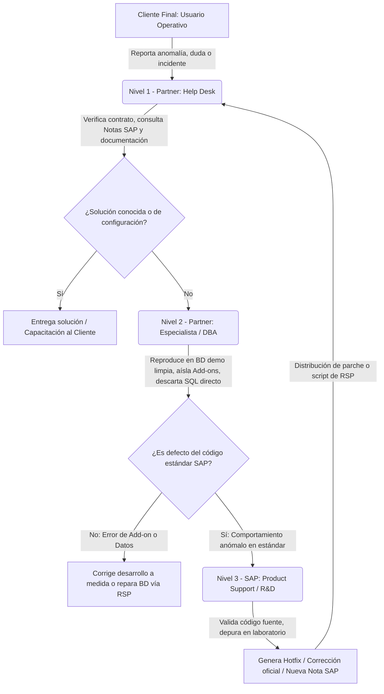

La **Nota SAP 1167635** define con precisión milimétrica las responsabilidades que cada parte asume dentro del contrato de mantenimiento de SAP Business One:

| Nivel de Soporte | Responsable Directo | Perfil del Especialista | Alcance Técnico y Obligaciones Contractuales |
| :--- | :--- | :--- | :--- |
| **Nivel 1 (N1)** | **Partner VAR** | Consultor de Mesa de Ayuda / Consultor Funcional Junior | • **Punto Único de Contacto (SPOC):** Recepción y registro formal del ticket reportado por el cliente. • **Validación Contractual:** Confirmar que la empresa cliente mantiene un contrato de mantenimiento de software vigente y al día. • **Triaje y Búsqueda Documental:** Consultar el repositorio oficial de *SAP Notes*, *Knowledge Base Articles (KBAs)* y manuales de producto. • **Documentación Inicial:** Levantar el paso a paso detallado del usuario: qué operación intentaba realizar, qué datos introdujo, cuál fue el resultado esperado y cuál el mensaje de error visualizado. |
| **Nivel 2 (N2)** | **Partner VAR** | Consultor Senior / Arquitecto de Solución / Administrador DBA | • **Aislamiento Técnico:** Desconectar y desinstalar todos los *Add-ons* de terceros y personalizaciones (SDK, Service Layer, UI API) para descartar interferencias externas. • **Reproducción en Laboratorio:** Replicar el error en una base de datos de demostración limpia (*Demo Database*) actualizada al nivel de parche (*Patch Level*) más reciente liberado por SAP. • **Auditoría de Base de Datos:** Verificar que la base de datos no contenga modificaciones directas por SQL (`UPDATE`, `INSERT`, `DELETE`) que violen la **Nota SAP 896891**. • **Propuesta de Workaround:** Diseñar e implementar soluciones de contingencia temporal que permitan al cliente continuar facturando u operando mientras se procesa la corrección de fondo. • **Expediente de Escalamiento:** Si se confirma un defecto intrínseco del software estándar, redactar el ticket formal para SAP en idioma inglés con evidencias forenses completas. |
| **Nivel 3 (N3)** | **SAP SE** | Ingeniero de Soporte de Producto / Desarrollador del Core ERP | • **Análisis de Código Fuente:** Inspección de las capas internas de la aplicación (C++, C#, Java, Stored Procedures del sistema). • **Depuración Especializada:** Solicitud de copia de base de datos o conexión remota especializada para reproducir escenarios complejos en entornos de laboratorio de SAP. • **Desarrollo de Bugfixes:** Programación de correcciones de software oficiales distribuidas a través de parches (*Patch Levels / Feature Deliveries*). • **Publicación de Conocimiento:** Creación y actualización de Notas SAP públicas que documentan la causa raíz y la solución técnica. |

> [!IMPORTANT]
> **La Regla de Oro de la Nota SAP 896891 (Modificaciones Directas en Base de Datos):**  
> SAP prohíbe de manera terminante la ejecución manual de sentencias SQL de tipo `UPDATE`, `DELETE`, `INSERT` o `ALTER TABLE` directamente sobre las tablas de SAP Business One (`OINV`, `OCRD`, `OITM`, etc.). Cualquier alteración manual no autorizada rompe la integridad referencial, el balance contable y los esquemas de auditoría. Si SAP detecta que una base de datos fue manipulada directamente por fuera de la DI-API o de la interfaz de usuario, **la base de datos pierde la garantía de soporte técnico**. En tales circunstancias, SAP se reserva el derecho de rechazar la atención o exigir un cobro extraordinario por servicios de consultoría forense para intentar reparar los datos corruptos.

---

### 2. Política de Facturación de Incidentes (Incident Billing)

El soporte de Nivel 3 de SAP es un recurso de alta especialización destinado exclusivamente al perfeccionamiento del producto. Para desalentar la práctica negligente de utilizar a los ingenieros de SAP como "mesa de ayuda extendida", SAP aplica una estricta **Política de Facturación de Incidentes (*Incident Billing*)**:

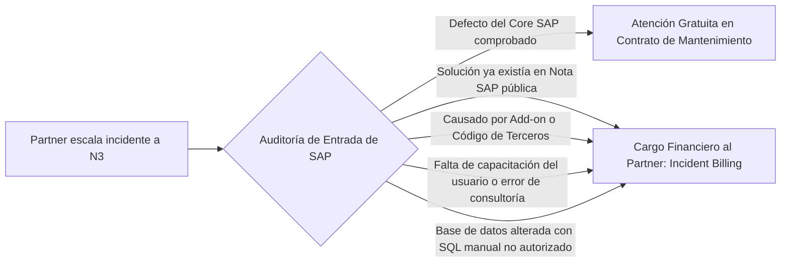

#### Reglas Operativas de la Facturación de Incidentes:
1. **Absorción de N1 y N2:** El Partner asume por contrato el compromiso de filtrar y resolver todos los incidentes de primer y segundo nivel. Escalar un caso sin haber ejecutado las comprobaciones obligatorias constituye un incumplimiento contractual.
2. **Causales de Facturación Directa:** SAP emitirá una factura por servicios profesionales de consultoría al Partner si el ticket califica en alguna de las siguientes situaciones:
   * **Incidente Previamente Resuelto:** El problema reportado ya cuenta con una solución o aclaración documentada en una Nota SAP o KBA disponible públicamente al momento del escalamiento.
   * **Problema de Capacitación o Consultoría:** La incidencia no se debe a una falla del sistema, sino a desconocimiento operativo de la funcionalidad estándar o parametrización errónea (casos tipo *"How-To"*).
   * **Desarrollos de Terceros:** La falla es provocada por un *Add-on* externo, un script no certificado, una consulta formateada (*FMS*) mal diseñada o una integración defectuosa construida mediante la DI-API o Service Layer.
   * **Datos Corruptos por Manipulación Externa:** Tablas dañadas como resultado de intervenciones manuales en la base de datos o fallos en el hardware y almacenamiento del cliente.
3. **Franquicia Trimestral de Cortesía:** Para absorber un margen razonable de error humano en la mesa de ayuda del Partner, SAP otorga una franquicia de **hasta 5 incidentes no justificados sin cobro por trimestre comercial**. Sin embargo, a partir del **sexto incidente no calificado**, SAP facturará automáticamente cada caso a la tarifa horaria corporativa estipulada en el contrato del partner.
4. **Certificación PCoE (Partner Center of Expertise):** Los partners deben someterse a una rigurosa auditoría bienal por parte de SAP. Si un partner presenta una tasa anormalmente alta de incidentes facturados o escalamientos inválidos, puede perder su certificación PCoE, lo que le inhabilita para cobrar contratos de mantenimiento a sus clientes finales.

---

## LECCIÓN 9.2: ARQUITECTURA Y OPERACIÓN DE LA PLATAFORMA DE SOPORTE REMOTO (RSP)

### 1. ¿Qué es Remote Support Platform (RSP) y cuál es su filosofía proactiva?

Históricamente, el mantenimiento de sistemas informáticos operaba bajo un modelo **reactivo**: el cliente sufría una interrupción en su facturación, llamaba al soporte, el consultor se conectaba a investigar el daño y comenzaba un proceso de recuperación que podía demorar horas o días con severas pérdidas económicas.

**Remote Support Platform (RSP)** es la arquitectura tecnológica cliente/servidor desarrollada por SAP para transformar el modelo de mantenimiento en un esquema **proactivo y predictivo**. RSP funciona como un "vigilante silencioso" que evalúa permanentemente la salud del sistema operativo, el motor de base de datos y la instancia de SAP Business One, ejecutando diagnósticos tempranos antes de que los problemas afecten a los usuarios finales.

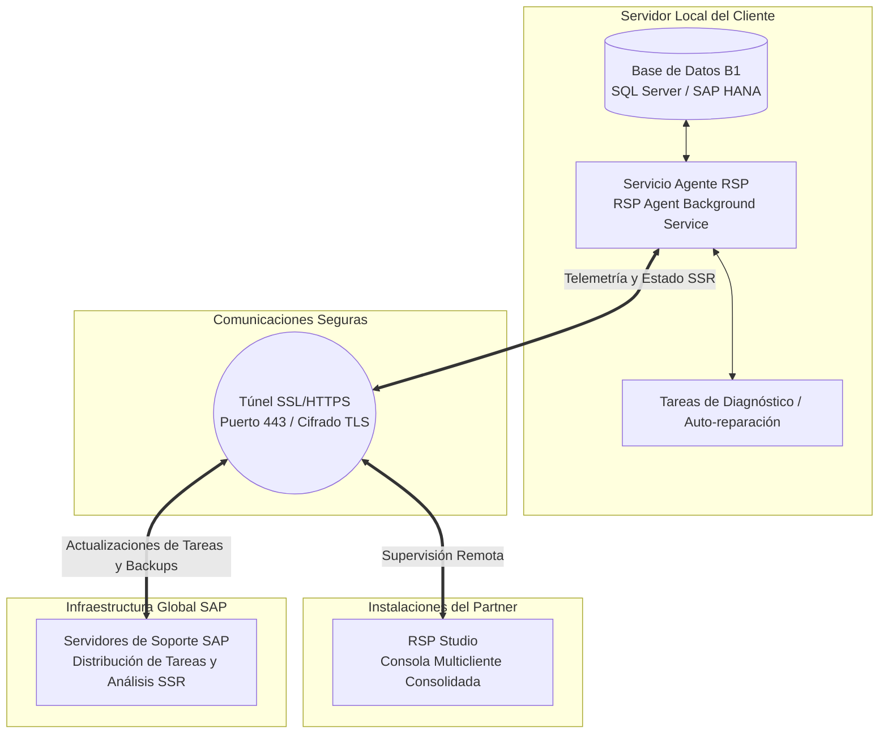

> [!CAUTION]
> **Obligación Contractual Ineludible (Nota SAP 1733065):**  
> De acuerdo con la **Nota SAP 1733065**, es estrictamente obligatorio que el Partner instale, configure y active el Agente RSP en **todos los servidores de producción de clientes nuevos y existentes**. El mantenimiento de un agente RSP activo no es una sugerencia técnica: es un requisito contractual para preservar la garantía oficial de soporte de SAP Business One. Si un cliente experimenta una catástrofe de datos y no cuenta con RSP en funcionamiento, SAP puede desestimar la cobertura de emergencia.

---

### 2. Componentes Fundamentales de RSP

La plataforma RSP se compone de tres elementos arquitectónicos interdependientes:

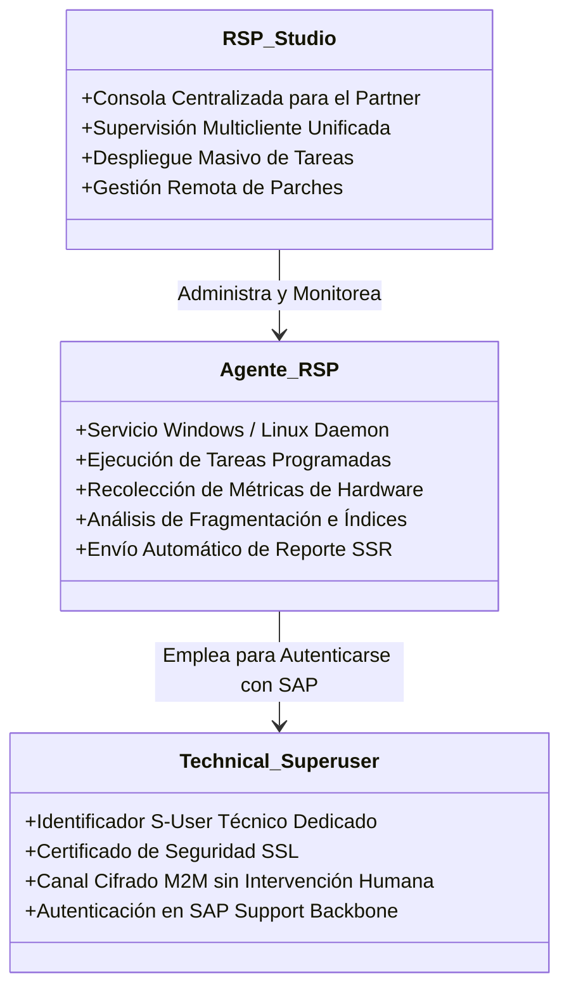

1. **Agente RSP (RSP Agent):**
   * Es un servicio que se ejecuta en segundo plano instalado en el servidor principal donde residen las bases de datos de SAP Business One.
   * Cuenta con su propio repositorio local (usualmente una base de datos ligera SQLite o SQL Express dedicada) para almacenar el historial de tareas, configuraciones y registros de eventos.
   * Funciona de manera autónoma sin requerir que un usuario inicie sesión en Windows o en SAP Business One.
2. **RSP Studio:**
   * Es una aplicación de gestión avanzada que se instala en la infraestructura de la empresa Partner.
   * Permite a los especialistas de soporte monitorear el parque tecnológico completo de todos sus clientes desde una única consola unificada.
   * Desde RSP Studio, el Partner puede programar tareas personalizadas de mantenimiento, revisar el estado de los respaldos de cada cliente y detectar oportunamente anomalías de espacio o rendimiento sin tener que ingresar individualmente por escritorio remoto a cada servidor.
3. **Usuario Técnico (Technical Superuser / Technical S-User):**
   * Es una credencial de sistema provista por SAP (solicitada por el Partner a través del portal *SAP for Me*) con identificador único de tipo `S-User`.
   * Está diseñada exclusivamente para la comunicación máquina a máquina (*Machine-to-Machine - M2M*); no consume licencias nominales humanas y permite la autenticación segura y cifrada contra los centros de datos de soporte de SAP a través del canal oficial *SAP Support Backbone*.

---

### 3. El Informe de Estado del Sistema (SSR - System Status Report)

El **Informe de Estado del Sistema (*System Status Report - SSR*)** constituye la radiografía técnica más exhaustiva que genera el agente RSP sobre la instalación de un cliente. 

#### Datos Técnicos Auditados en el SSR:
* **Infraestructura y Recursos Físicos:**
  * Capacidad total, espacio utilizado y porcentaje libre en cada uno de los discos duros (volúmenes del sistema operativo, archivos de datos `.mdf`, archivos de registro `.ldf` y rutas de copias de seguridad).
  * Consumo de memoria RAM física y uso del archivo de paginación (*Swap file* en Linux o *Pagefile* en Windows).
  * Arquitectura del procesador (núcleos, sockets y porcentaje medio de utilización de CPU).
* **Salud del Motor de Base de Datos (SQL Server o SAP HANA):**
  * Edición, versión exacta de compilación (*Build Number*) y nivel acumulativo de actualizaciones (*Cumulative Updates* o *Service Packs*).
  * Tamaño actual de las bases de datos de producción y grado de fragmentación de sus índices relacionales.
  * Modo de recuperación (*Recovery Model*) y configuración de contención de registros.
* **Gobierno y Políticas de Copias de Seguridad (Backups):**
  * Registro cronológico, fecha, hora y resultado de las últimas copias de seguridad completas y diferenciales.
  * Verificación de la consistencia física de los respaldos generados.
* **Entorno de Aplicación SAP Business One:**
  * Versión mayor de SAP, nivel de versión de parche (*Patch Level - PL*) y Hotfixes instalados.
  * Inventario completo de *Add-ons* registrados, versiones, fabricantes y estado de conexión.
  * Esquema de licencias asignadas y usuarios activos.

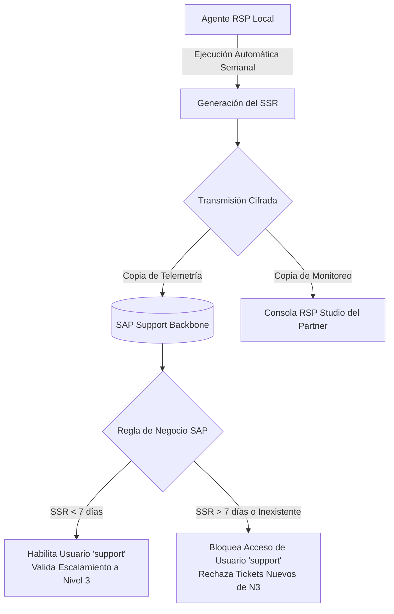

> [!WARNING]
> **Frecuencia Obligatoria y Regla de los 7 Días:**  
> El SSR debe configurarse para su ejecución y envío automático **semanal**. Si un partner escala un incidente a Nivel 3 en SAP para una instalación que no cuenta con un SSR cargado exitosamente dentro de los **últimos 7 días**, el sistema de recepción de tickets de SAP pondrá el caso automáticamente en espera (*Partner Action Required*) hasta que el reporte sea transmitido y validado, retrasando la solución de incidencias graves.

---

### 4. El Usuario Predefinido de Soporte (`support`)

Para facilitar las labores de diagnóstico e intervención técnica en bases de datos productivas, SAP Business One incluye de fábrica una cuenta de usuario interna denominada **`support`** (o **`soporte`** en localizaciones en español).

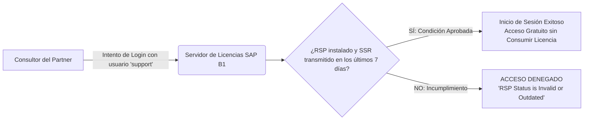

#### Características y Reglas Operativas del Usuario `support`:
1. **Acceso sin Consumo de Licencia:**  
   Permite al consultor o ingeniero de soporte iniciar sesión en la base de datos productiva de cualquier cliente sin consumir ninguna de las licencias de usuario profesional o limitado adquiridas por la empresa. Esto garantiza que las labores de diagnóstico no interrumpan el trabajo del personal operativo.
2. **Bloqueo Condicional Inteligente:**  
   SAP diseñó un candado de seguridad: el sistema **denegará rotundamente el acceso con el usuario `support`** si detecta que el Agente RSP no se encuentra instalado en el servidor o si el último SSR exitoso tiene una antigüedad superior a 7 días.
3. **Pista de Auditoría Imborrable:**  
   Todas las operaciones, modificaciones transaccionales, ejecuciones de consultas o cambios de configuración efectuados bajo la sesión del usuario `support` quedan registrados de forma inalterable en la tabla de auditoría del sistema (`AUSH`), vinculados a la dirección IP y nombre de la máquina que efectuó la conexión. Esto blinda jurídicamente al cliente contra malas prácticas de soporte.

---

### 5. Ecosistema de Tareas Automatizadas de RSP

RSP no se limita a observar; es un motor de automatización capaz de ejecutar tres categorías de tareas:

| Tipo de Tarea RSP | Propósito Operativo | Ejemplo Práctico |
| :--- | :--- | :--- |
| **Tareas de Diagnóstico Preventivo** | Escanear la base de datos en busca de posibles fallas estructurales antes de que se manifiesten en la interfaz. | • Verificación de la integridad de catálogos e inventarios. • Alerta de crecimiento desmedido del archivo de log de SQL. • Detección de incompatibilidades previas a una actualización de versión (*Pre-Upgrade Check*). |
| **Tareas de Auto-reparación (Healing Tasks)** | Corregir automáticamente inconsistencias contables o de datos maestros conocidas mediante scripts certificados por SAP. | • Corrección de descuadres en balances de comprobación de inventario documentados en Notas SAP. • Reparación de enlaces rotos entre documentos base y destino originados por cortes de energía. |
| **Tareas de Carga de Respaldos (Content Upload Tasks)** | Transferir copias de seguridad de forma cifrada y fragmentada directamente a los ingenieros de soporte de SAP Nivel 3. | • Solicitud formal de SAP para revisar una base de datos corrupta en sus laboratorios de desarrollo, cumpliendo con la normativa GDPR. |

---

## LECCIÓN 9.3: HERRAMIENTAS INTEGRADAS DE DIAGNÓSTICO: LOGS, TRAZAS Y GRABADOR DE INCIDENTES

En el cliente de SAP Business One, la ruta de diagnóstico por excelencia se ubica en el menú principal:  
**`Ayuda > Support Desk` (`Help > Support Desk`)**

Esta consola integrada elimina la ambigüedad de los reportes tradicionales ("*el usuario dice que el sistema arrojó un error extraño*") y la sustituye por evidencia forense digital irrefutable.

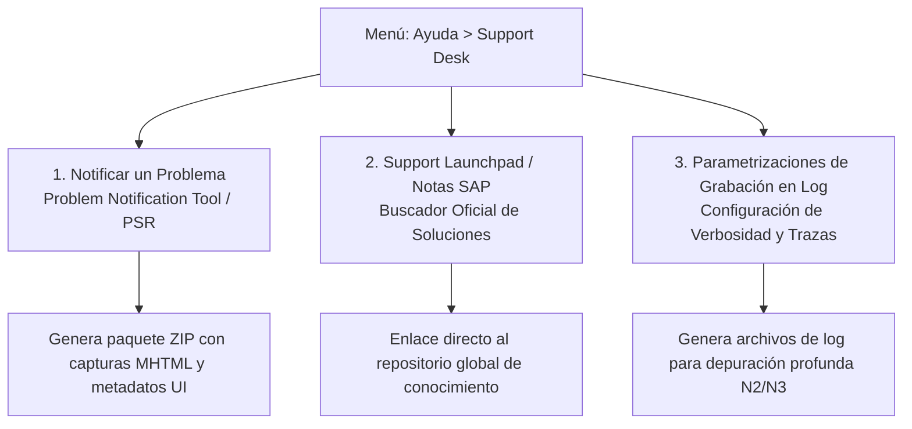

---

### 1. Herramienta de Grabación de Incidentes (Problem Notification Tool)

La herramienta **Notificar un Problema** está construida sobre la tecnología de grabación de pasos de usuario (*Problem Steps Recorder - PSR*):

#### ¿Por qué es fundamental su uso?
En una mesa de ayuda, más del 60% del tiempo de resolución se pierde intentando reproducir errores que el usuario no sabe explicar con precisión técnica. Esta utilidad resuelve la brecha de comunicación documentando automáticamente cada movimiento del operador.

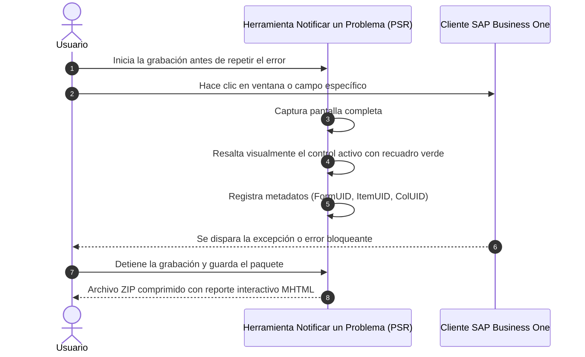

#### Ventajas Técnicas y Arquitectónicas:
* **Independencia de Proceso:** El grabador se ejecuta como un proceso de sistema operativo desacoplado de la memoria del cliente SAP Business One. Si el ERP sufre una excepción fatal no controlada (*Crash*) o se congela (*Hang*), el grabador continúa funcionando y rescata la evidencia hasta el último milisegundo previo a la caída.
* **Metadatos Técnicos:** No se limita a tomar una captura de pantalla; registra la resolución del monitor, versión del sistema operativo, nombre técnico del formulario de SAP y coordenadas exactas de cada clic.
* **Empaquetado Seguro:** Genera un archivo `.zip` que contiene un reporte en formato `.mhtml`, el cual puede adjuntarse directamente al ticket de soporte en SAP Support Launchpad o enviarse al Partner.

---

### 2. Gestión de Registros y Trazas Técnicas (Logging & Tracing)

A través de la ruta **`Ayuda > Support Desk > Parametrizaciones de grabación en log`**, el consultor puede ajustar el grado de minuciosidad con el que SAP registra sus operaciones internas en archivos de texto plano.

#### Niveles de Verbosidad de Logs:

| Nivel de Registro | Eventos Capturados | Impacto en Rendimiento (I/O) | Escenario de Aplicación |
| :--- | :--- | :---: | :--- |
| **Error / Fatal** *(Predeterminado)* | Únicamente excepciones no controladas, fallos de conexión críticos o violaciones de base de datos que impiden continuar. | **Mínimo (< 1%)** | **Entorno Productivo Continuo:** Mantiene el uso de disco bajo control y registra solo emergencias reales. |
| **Advertencia (Warning)** | Condiciones no óptimas que no detienen el sistema (ej. parámetros desaconsejados, certificados próximos a expirar). | **Bajo (1 - 3%)** | Diagnóstico rutinario preventivo durante mantenimientos de infraestructura. |
| **Información (Info)** | Hitos operacionales regulares (inicio de sesión, carga de add-ons, apertura de documentos). | **Medio (5 - 10%)** | Entornos de pruebas de integración (*Testing / QA*). |
| **Depuración (Debug / Trace)** | Detalle exhaustivo de cada llamada a métodos de la API, sentencias SQL enviadas al servidor, tráfico HTTP con Service Layer y tiempos de respuesta milimétricos. | **Muy Alto (25 - 40%)** | **Exclusivo para Diagnóstico N3:** Atrapado de errores intermitentes complejos o "caídas fantasma". |

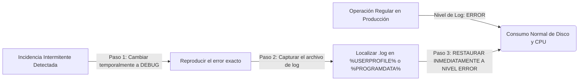

> [!CAUTION]
> **Riesgo Crítico de Saturación por Nivel Debug:**  
> El modo de depuración (*Debug / Trace*) genera cientos de miles de líneas de texto en cuestión de minutos. Si un consultor olvida desactivar este nivel y lo deja activo en un servidor de producción, el volumen del disco duro puede llenarse por completo en pocas horas, provocando la caída súbita del motor de base de datos y la detención operativa de toda la empresa. Active el modo Debug **únicamente** mientras reproduce el error específico y devuélvalo de inmediato al nivel estándar (*Error*).

---

## LECCIÓN 9.4: GESTIÓN DE INCIDENTES EN SAP SUPPORT LAUNCHPAD Y POLÍTICAS DE MANTENIMIENTO

### 1. El Portal de Soporte de SAP (SAP Support Launchpad / SAP for Me)

**SAP for Me** (sucesor del *SAP Support Launchpad*) es la ventanilla única digital donde convergen todas las interacciones de soporte, licenciamiento y mantenimiento entre clientes, partners y SAP.

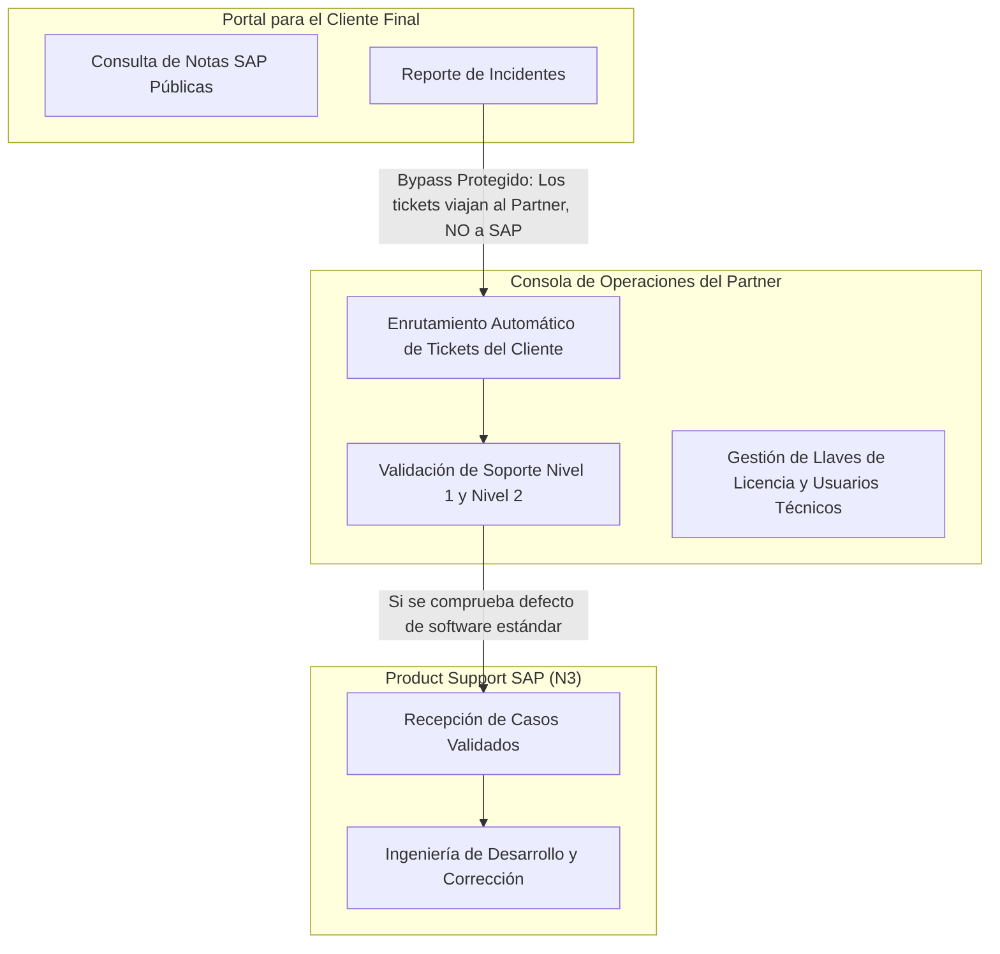

* **Enrutamiento Inteligente:** Cuando un cliente final ingresa a la plataforma y registra un ticket, el sistema no lo envía directamente a los ingenieros de SAP. La plataforma identifica al Partner VAR responsable de su contrato y deposita el caso en la cola de trabajo del Partner para su atención en Nivel 1 y Nivel 2.
* **Consola de Control del Partner:** Permite gestionar los contratos de clientes, solicitar llaves de licencia para nuevos servidores, habilitar los usuarios técnicos de RSP y, tras cumplir rigurosamente el protocolo de triaje, transferir formalmente el ticket a Nivel 3 de SAP.

---

### 2. Criterios de Clasificación de Prioridad y Niveles de Impacto (SLA)

La prioridad asignada a un ticket en el soporte de SAP no se define en función de la urgencia subjetiva o el descontento emocional del cliente; se determina de manera estricta mediante el **impacto operativo documentable** sobre la continuidad del negocio:

| Nivel de Prioridad | Criterios Operativos Reales | Requisitos Obligatorios para su Aceptación | Tiempo de Respuesta Inicial de SAP (SLA) |
| :--- | :--- | :--- | :---: |
| **MUY ALTA (Very High)** | **Parada Total del Negocio (`System Down`):** • El sistema productivo principal está completamente caído o inaccesible. • Un proceso medular del negocio (ej. facturación legal, despacho aduanero, punto de venta en caja) está paralizado sin que exista ninguna alternativa funcional (*Workaround*). • Inminente riesgo de quiebra de un Go-Live programado. | • **Disponibilidad 24/7:** El cliente y el partner deben designar un interlocutor técnico local disponible las 24 horas para interactuar con SAP. • Conexión remota activa de alta velocidad. • Descripción precisa de las pérdidas operativas inmediatas. | **< 1 Hora** *(Cobertura 24 horas al día, 7 días a la semana)* |
| **ALTA (High)** | **Impacto Severo en Operaciones Críticas:** • Una función clave de negocio está severamente afectada o bloqueada, pero el sistema general sigue operando. • No existe una solución provisional viable y el rendimiento global del ERP sufre una degradación sustancial. | • Documentación del proceso crítico interrumpido. • Evidencias de ausencia de workarounds operacionales. | **< 2 Horas** *(En horario hábil de soporte)* |
| **MEDIA (Medium)** | **Impacto Operativo Moderado o Manejable:** • Se produce una anomalía técnica en una funcionalidad estándar, pero **existe una solución alternativa (*Workaround*)** que permite a la empresa continuar trabajando mientras se emite una solución definitiva. | • Explicación de la solución temporal que se está aplicando en el cliente. | **< 4 Horas** *(En horario hábil de soporte)* |
| **BAJA (Low)** | **Inconveniente Menor o Consulta de Configuración:** • Consultas de asesoría funcional, problemas estéticos en formularios (ej. desfases milimétricos en reportes gráficos), o sugerencias de mejora de producto que no impiden transacciones. | • Pregunta o escenario funcional concreto. | **< 8 Horas** *(En horario hábil de soporte)* |

> [!WARNING]
> **Consecuencias de la Inflación Artificial de Prioridades:**  
> Si un partner clasifica un incidente como "Muy Alta" para obtener una respuesta más rápida, pero cuando los ingenieros de SAP se conectan de emergencia descubren que el sistema no estaba paralizado o que el cliente no cuenta con personal disponible para atender la sesión remota, SAP **degradará de inmediato la prioridad del ticket** y registrará una advertencia de incumplimiento en el expediente de calidad del Partner.

---

### 3. Protocolo y Lista de Chequeo de 5 Pasos para Escalar a Nivel 3

Antes de transferir formalmente un ticket al equipo de desarrollo de SAP en el portal de soporte, todo consultor senior debe auditar y verificar los siguientes 5 puntos críticos:

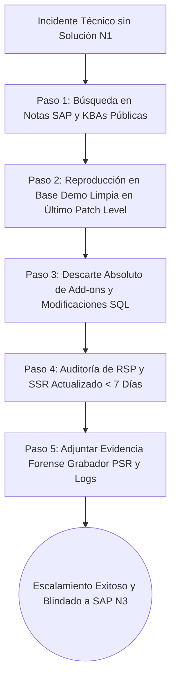

1. **[  ] Paso 1: Búsqueda Exhaustiva en el Repositorio de Notas SAP:**  
   Búsqueda por palabras clave técnicas en idioma inglés y por componente específico de SAP (ej. `SBO-SD-INV` para facturación, `SBO-MM-MDD` para maestros de inventario, `SBO-BC-RSP` para la plataforma de soporte remoto).
2. **[  ] Paso 2: Reproducción en Base de Datos Limpia (Demo Database):**  
   Replicar el mismo flujo transaccional en una base de datos demo oficial de SAP que carezca de personalizaciones y que esté instalada en el último nivel de parche (*Latest Patch Level*) disponible para la versión. Si el error no ocurre en la base demo, el problema no es del software estándar.
3. **[  ] Paso 3: Aislamiento Total de Factores Externos (Add-ons y Base de Datos):**  
   Desactivar por completo todos los add-ons de terceros. Comprobar que no existan disparadores (*Triggers*) de base de datos creados manualmente ni columnas de tablas nativas alteradas, en estricto cumplimiento de la Nota SAP 896891.
4. **[  ] Paso 4: Verificación de RSP y Reporte SSR Vigente:**  
   Confirmar en la consola del cliente que el agente RSP está en ejecución y que ha transmitido exitosamente un Informe de Estado del Sistema (*SSR*) en los últimos 7 días.
5. **[  ] Paso 5: Anexo de Evidencia Técnica Estructurada:**  
   Adjuntar el archivo `.zip` generado por la herramienta de Notificación de Problemas (*PSR*), detallando el paso a paso exacto, los códigos de artículos o clientes involucrados y, si aplica, los archivos de traza (*logs*) correspondientes.

---

## MATRIZ DE TROUBLESHOOTING Y REGLAS CRÍTICAS PARA EL COPILOTO IA

### Incidente 1: El consultor intenta ingresar a la base productiva del cliente con el usuario `support` y SAP arroja: *"Acceso denegado, RSP no actualizado"*

* **Causa Raíz:** El motor de licenciamiento de SAP Business One valida periódicamente la comunicación con el Agente RSP local. Si el servicio de RSP en el servidor está detenido, carece de conexión a Internet o lleva más de 7 días continuos sin sincronizar un reporte SSR con los servidores de SAP, la cuenta especial `support` queda automáticamente inhabilitada por seguridad.
* **Instrucción de Asesoría del Copiloto:**
  1. Iniciar sesión en el servidor del cliente mediante Escritorio Remoto (RDP) utilizando credenciales administrativas de Windows.
  2. Abrir la consola de servicios del sistema (`services.msc`) y verificar que el servicio **SAP Remote Support Platform Agent** esté en estado "En ejecución" (*Running*). Si está detenido, iniciarlo.
  3. Ejecutar la consola local del Agente RSP, dirigirse a la sección de tareas programadas, seleccionar manualmente el **Informe de estado del sistema (SSR)** y hacer clic en **Ejecutar ahora**.
  4. Monitorear el log de RSP hasta obtener la confirmación de transferencia exitosa hacia los servidores de SAP.
  5. Volver a abrir el cliente de SAP Business One e iniciar sesión con el usuario `support`. El acceso quedará inmediatamente restablecido.

---

### Incidente 2: El Partner recibe un cobro por facturación de soporte (*Incident Billing*) por parte de SAP tras cerrar un ticket

* **Causa Raíz:** El consultor del Partner escaló un ticket a Nivel 3 solicitando la intervención de los ingenieros de producto para un problema que ya estaba resuelto en una Nota SAP pública, o cuya causa raíz correspondió a una falla en un add-on de desarrollo propio/tercero o una consulta de parametrización básica.
* **Instrucción de Asesoría del Copiloto:**
  1. Descargar el informe de cierre del ticket en el portal *SAP for Me* y verificar la Nota SAP o justificación técnica adjunta por el ingeniero de soporte (usualmente amparada en la Nota SAP 1167635).
  2. Evaluar internamente si el ticket superó la franquicia trimestral de 5 incidentes de cortesía que otorga SAP.
  3. Establecer como política obligatoria interna un filtro de aprobación de Nivel 2: ningún consultor puede escalar un ticket a SAP sin la firma de revisión de un consultor senior que audite la búsqueda previa en Notas SAP y el descarte de *Add-ons*.
  4. En caso de discrepancia técnica comprobable (si se demuestra que la Nota SAP citada por el fabricante no resolvía el escenario particular), presentar una apelación formal ante el *Partner Service Advisor (PSA)* asignado por SAP antes del cierre del ciclo de facturación.

---

### Incidente 3: Soporte de SAP solicita el envío urgente de una copia de la base de datos para reparar una corrupción, pero las políticas de seguridad del cliente prohíben compartirla por canales públicos

* **Causa Raíz:** Por normativas internacionales de protección de datos personales y privacidad financiera (GDPR, ISO 27001), está estrictamente prohibido transmitir bases de datos que contengan información confidencial de clientes a través de correos electrónicos, servidores FTP comerciales o enlaces de almacenamiento en la nube no regulados.
* **Instrucción de Asesoría del Copiloto:**
  1. Solicitar formalmente al ingeniero de soporte de SAP asignado al caso que libere una **Tarea de Carga de Contenido (*Content Upload Task*)** vinculada al número de sistema del cliente y al ID específico del ticket de soporte.
  2. Ingresar al servidor del cliente, abrir la consola del Agente RSP y forzar una sincronización de tareas con el centro de datos de SAP.
  3. Localizar en la pestaña de tareas disponibles la orden de carga emitida por SAP y ejecutar el asistente guiado.
  4. Seleccionar el archivo de copia de seguridad (`.bak` en SQL Server o exportación de esquemas en SAP HANA). RSP se encargará de fragmentar, comprimir y cifrar el archivo de extremo a extremo a través de túneles SSL seguros hacia los servidores blindados de desarrollo de SAP.

---

### Incidente 4: El cliente de SAP Business One se cierra repentinamente sin emitir ningún mensaje de error al abrir una ventana específica

* **Causa Raíz:** Choque de librerías en tiempo de ejecución (*Application Crash*) ocasionado frecuentemente por corrupción de archivos temporales del cliente, incompatibilidades con versiones locales del framework .NET, componentes COM dañados o conflictos con librerías gráficas de un add-on.
* **Instrucción de Asesoría del Copiloto:**
  1. Acceder al menú `Ayuda > Support Desk > Notificar un Problema` e iniciar una sesión de grabación para capturar los pasos exactos y los metadatos del formulario involucrado.
  2. Activar temporalmente el nivel de registro en **Debug** desde `Ayuda > Support Desk > Parametrizaciones de grabación en log`.
  3. Reproducir el error hasta provocar el cierre intempestivo del sistema.
  4. Inspeccionar el archivo de registro generado en `%USERPROFILE%\Local Settings\Application Data\SAP\SAP Business One\Log` o en `%PROGRAMDATA%\SAP\SAP Business One\Log`, buscando las últimas líneas previas a la terminación anormal del proceso.
  5. Restaurar de inmediato las parametrizaciones de log al nivel estándar (**Error**) para prevenir la degradación de rendimiento.

---

### Incidente 5: El Agente RSP arroja error de comunicación persistente: *"Failed to connect to SAP Support Backbone (SSL Handshake Failed)"*

* **Causa Raíz:** Expiración de los certificados de seguridad TLS en el servidor local, bloqueo en el firewall corporativo de los puertos salientes HTTPS hacia los dominios de SAP, o desactualización del usuario técnico (*Technical S-User*) configurado en la plataforma.
* **Instrucción de Asesoría del Copiloto:**
  1. Verificar que los puertos de salida 443 (HTTPS) hacia los rangos de direcciones IP y dominios de soporte de SAP (`*.sap.com`) se encuentren abiertos y sin inspección SSL profunda que corrompa los certificados.
  2. Comprobar que la versión del Agente RSP esté actualizada a la versión más reciente compatible con los protocolos TLS 1.2/1.3 exigidos por el estándar *SAP Support Backbone*.
  3. Ingresar a las parametrizaciones de conexión en la consola de RSP y validar el estado de las credenciales del *Technical Superuser*. Si han caducado, generar un nuevo par de llaves técnicas en el portal *SAP for Me* y reasociarlas al agente.
  4. Ejecutar la prueba de conectividad integrada (*Connection Test Wizard*) de RSP para certificar el enlace exitoso.

---

## BANCO DE EVALUACIÓN SITUACIONAL

A continuación se presentan 5 casos situacionales basados en escenarios de soporte e infraestructura del mundo real. Cada pregunta incluye el análisis de opciones y la justificación pedagógica correspondiente:

---

### Pregunta 1: Gobierno Contractual y Escalamiento de Incidentes
Durante el cierre mensual de una empresa manufacturera, un usuario reporta que al intentar procesar una Reconciliación Interna masiva de cuentas de clientes, el sistema emite un mensaje de error que impide la finalización de la tarea. Con el tiempo en contra y presionado por la gerencia financiera, el consultor de la mesa de ayuda del Partner toma la captura del mensaje y, sin consultar Notas SAP previas ni probar la transacción en una base de datos demo limpia, abre un ticket con prioridad "Muy Alta" en el portal de soporte de SAP solicitando la corrección inmediata. Días después, el equipo de Nivel 3 de SAP responde demostrando que el problema ya estaba completamente resuelto en una Nota SAP pública liberada hace 6 meses. ¿Qué repercusión técnica y comercial enfrentará la empresa Partner según la política de mantenimiento de SAP Business One?

* **A)** SAP cancelará de forma inmediata la licencia de software del cliente final por considerar que operó de manera negligente durante el cierre contable.
* **B)** El Partner recibirá un cobro financiero por servicios profesionales (*Incident Billing*) imputado al tiempo invertido por los ingenieros de Nivel 3 de SAP, conforme a lo estipulado en la Nota SAP 1167635. **[CORRECTA]**
* **C)** SAP enviará a un ingeniero de campo a las instalaciones del cliente sin costo adicional para capacitar al usuario en el proceso de reconciliación.
* **D)** El sistema SAP Business One bloqueará automáticamente el módulo de Finanzas en el servidor del cliente hasta que se instale el siguiente parche oficial.

> **Explicación Pedagógica Detallada:**  
> La opción **B** es la respuesta correcta. De acuerdo con el modelo de soporte de SAP y la **Nota SAP 1167635**, el Partner VAR tiene la obligación contractual ineludible de ejecutar el triaje de Nivel 1 y Nivel 2. Esto incluye buscar proactivamente en el repositorio público de Notas SAP y reproducir el caso en laboratorio antes de acudir al fabricante. Escalar una consulta que ya cuenta con una solución pública documentada representa un desvío injustificado de los recursos de desarrollo de SAP, lo que activa el mecanismo de penalización financiera (*Incident Billing*). Las opciones A y D son medidas inexistentes en el marco de soporte que destruirían la operación del cliente, mientras que la opción C confunde el rol de desarrollo de Nivel 3 con un servicio presencial de consultoría gratuita.

---

### Pregunta 2: Condiciones Técnicas para el Acceso con Usuario `support`
Un consultor senior de soporte técnico requiere ingresar a la base de datos productiva de una distribuidora mayorista para diagnosticar un bloqueo en la liberación de órdenes de venta. Dado que todos los usuarios operativos se encuentran conectados y consumiendo la totalidad de las licencias adquiridas por la empresa, el consultor intenta iniciar sesión utilizando la cuenta maestra `support`. Sin embargo, el cliente de SAP Business One rechaza el acceso con el mensaje: *"Acceso denegado: el estado de Remote Support Platform no es válido"*. ¿Cuál es la causa técnica raíz de este bloqueo y qué procedimiento debe ejecutarse para restablecer el acceso sin obligar a desconectar a ningún usuario?

* **A)** El servidor del cliente no cuenta con suficiente memoria RAM disponible para instanciar una sesión de soporte técnico; se debe reiniciar el servidor de inmediato.
* **B)** El Agente RSP en el servidor local está detenido o no ha transmitido un Informe de Estado del Sistema (*SSR*) exitoso en los últimos 7 días; se debe reactivar el servicio y forzar el envío manual del SSR hacia SAP. **[CORRECTA]**
* **C)** El usuario `support` solo puede iniciar sesión los fines de semana o fuera del horario comercial definido en las parametrizaciones generales de la sociedad.
* **D)** La clave del usuario `manager` ha expirado, lo que inhabilita temporalmente a todas las cuentas administrativas del sistema ERP.

> **Explicación Pedagógica Detallada:**  
> La opción **B** describe con exactitud el candado de seguridad y cumplimiento de SAP. El usuario predefinido `support` es un beneficio técnico gratuito que no consume licencias comerciales, pero su activación está estrictamente condicionada a que la infraestructura cumpla con la **Nota SAP 1733065**: el Agente RSP debe estar activo y reportando la telemetría semanal del sistema mediante el SSR con una antigüedad no mayor a 7 días. Si el reporte falla o el servicio se detiene, el acceso de soporte se inhabilita de inmediato. La opción A confunde recursos de hardware con reglas de validación de licencias; la opción C es un mito urbano operativo (la cuenta puede usarse cualquier día si cumple con RSP), y la opción D es incorrecta porque el usuario `support` es autónomo respecto a la contraseña de `manager`.

---

### Pregunta 3: Transferencia Segura de Información Confidencial a Nivel 3
El equipo de desarrollo de Nivel 3 de SAP solicita acceso a una copia completa de la base de datos de un cliente del sector bancario para corregir en laboratorio un daño estructural en tablas contables históricas. El departamento de seguridad de la información del cliente prohíbe terminantemente enviar el respaldo mediante correos electrónicos, servicios comerciales de transferencia en la nube (*WeTransfer, Dropbox*) o servidores FTP tradicionales no homologados, amenazando con detener el proceso si se vulneran sus estándares de privacidad. ¿Cuál es el procedimiento oficial y seguro respaldado por SAP para llevar a cabo esta entrega cumpliendo con los marcos normativos internacionales (GDPR / ISO 27001)?

* **A)** Convertir la base de datos a un documento de texto plano delimitado por comas (CSV) y enviarlo comprimido con contraseña mediante mensajería instantánea al consultor.
* **B)** Solicitar al ingeniero de soporte de SAP que habilite una "Tarea de Carga de Contenido" (*Content Upload Task*) en RSP, ejecutándola desde el servidor local para que el backup viaje cifrado y fragmentado directamente a los servidores de SAP. **[CORRECTA]**
* **C)** Conectar el servidor del cliente mediante un cable físico directo al centro de datos de SAP más cercano para evitar el uso de redes públicas.
* **D)** Crear un usuario con perfil de superusuario en el entorno de producción para que el equipo de SAP en Alemania ingrese libremente mediante AnyDesk o TeamViewer.

> **Explicación Pedagógica Detallada:**  
> La opción **B** es la única metodología avalada por la arquitectura de soporte de SAP. La funcionalidad de *Content Upload Task* de la plataforma RSP fue concebida precisamente para resolver los desafíos de cumplimiento legal y seguridad corporativa. El agente local empaqueta, fragmenta y encripta el archivo de respaldo con algoritmos de alta seguridad, transmitiéndolo a través del canal oficial SSL/HTTPS directamente al repositorio aislado del ticket en los laboratorios de SAP, registrando una pista de auditoría imborrable. Las opciones A y D representan violaciones gravísimas a las políticas de confidencialidad y gobernanza de TI, mientras que la opción C es un disparate logístico inviable.

---

### Pregunta 4: Gestión de Prioridades y Cumplimiento de SLA en Soporte Crítico
El viernes a las 18:00 horas, durante el arranque en productivo (*Go-Live*) de un nuevo centro logístico, el sistema experimenta una caída global del servidor de licencias que impide el acceso de todos los usuarios de almacén, paralizando los despachos de mercancías de exportación. El consultor del Partner procede a registrar el incidente en el portal *SAP for Me* y selecciona la prioridad **"Muy Alta" (*Very High*)**. Para que los ingenieros de soporte de guardia de SAP mantengan activo el tratamiento de emergencia con un tiempo de respuesta menor a una hora durante el fin de semana, ¿qué compromiso operativo obligatorio debe cumplir el Partner y el Cliente?

* **A)** Comprometerse formalmente a adquirir 10 licencias profesionales adicionales durante el siguiente trimestre comercial.
* **B)** Garantizar que el Cliente y el Partner dispongan de un interlocutor técnico calificado accesible las 24 horas del día y mantengan habilitada la conexión remota al servidor. **[CORRECTA]**
* **C)** Enviar un fax firmado por el Director Ejecutivo de la compañía autorizando la intervención de SAP.
* **D)** Aceptar por escrito que el software se desinstalará por completo si la solución no se encuentra en las primeras 4 horas.

> **Explicación Pedagógica Detallada:**  
> La opción **B** establece la condición sine qua non del SLA para incidentes de prioridad "Muy Alta". SAP asigna ingenieros de guardia 24/7 de forma inmediata bajo el compromiso recíproco de que la contraparte (Partner y Cliente) mantenga personal técnico disponible en todo momento para responder preguntas, validar pruebas y habilitar accesos remotos seguros. Si los ingenieros de SAP intentan contactar al cliente o conectarse al entorno y no obtienen respuesta, el protocolo de soporte degrada de inmediato la prioridad del ticket a nivel "Alto" o "Medio", suspendiendo la atención continuada de fin de semana. Las opciones A, C y D son estipulaciones ficticias sin relación con las normas de mantenimiento de SAP.

---

### Pregunta 5: Diagnóstico y Aislamiento Forense de Anomalías Intermitentes
Varios cajeros de una cadena de tiendas retail reportan que, de manera esporádica e impredecible (aproximadamente una vez cada tres días), la pantalla de cobro de facturas de clientes se congela durante 5 segundos y cierra intempestivamente el cliente de SAP Business One sin generar ningún mensaje de error en pantalla. El equipo de consultoría ha intentado reproducir la falla en su laboratorio sin éxito. ¿Cuál es la combinación metodológica correcta de herramientas integradas en SAP Business One que debe desplegar el consultor para atrapar la causa raíz y construir un paquete de evidencia concluyente?

* **A)** Solicitar a los cajeros que tomen fotografías con sus teléfonos móviles de la pantalla congelada y subir las fotos a un ticket de soporte.
* **B)** Desactivar la base de datos de producción y solicitar al cliente que opere durante una semana en una base de datos demo para aislar el hardware.
* **C)** Utilizar la herramienta de Notificación de Problemas (*Problem Steps Recorder - PSR*) para documentar los pasos del usuario y habilitar temporalmente el nivel de log en modo Debug para registrar la excepción en memoria. **[CORRECTA]**
* **D)** Borrar todos los índices relacionales de la base de datos en SQL Server para evitar bloqueos transaccionales en las cajas.

> **Explicación Pedagógica Detallada:**  
> La opción **C** sintetiza las mejores prácticas de diagnóstico de SAP Business One. La herramienta integrada *Notificar un Problema* (PSR) opera de manera autónoma al proceso principal del ERP, lo que le permite salvar capturas de pantalla, metadatos y secuencias de eventos incluso si el programa colapsa repentinamente (*Crash*). Al complementar esto con la activación temporal del nivel **Debug / Trace** en los logs, el sistema registrará en disco la traza exacta de llamadas a las librerías o APIs justo en el milisegundo en que se produjo la falla intermitente. La opción A carece de valor técnico forense (no captura datos de memoria ni metadatos); la opción B detendría la facturación del negocio de forma absurda, y la opción D destruiría el rendimiento y la integridad de la base de datos productiva.

---
