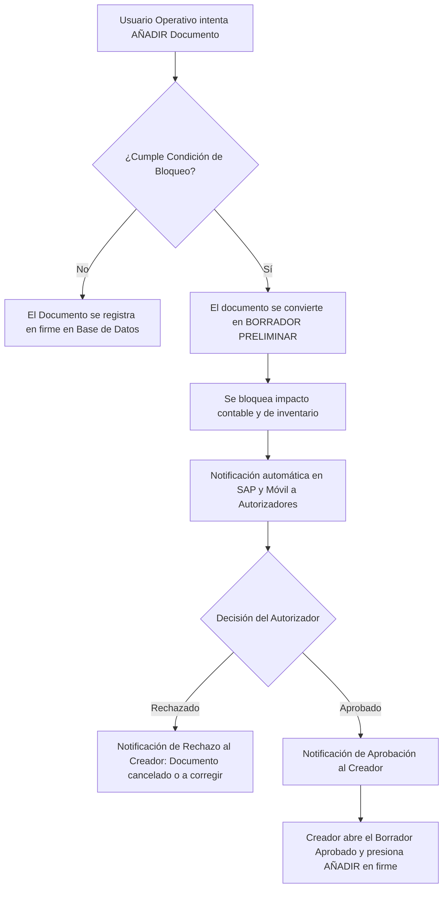

# MÓDULO 11: PERSONALIZACIÓN AVANZADA, AUTOMATIZACIONES Y ANALÍTICA EN TIEMPO REAL
**(SAP BUSINESS ONE 10.0 & ERP)**

**Tipo de Contenido:** Base de Conocimiento Operativa y Guía de Entrenamiento para Copiloto IA  
**Fuentes Oficiales Analizadas:** `10_Impl_11_CustomTools_Queries_ES.pdf`, `10_Impl_13_CustomTools_ApprovalProcesses_ES.pdf`, `10_Impl_14_CustomTools_UserDefinedFields_ES.pdf`, `10_Impl_15_CustomTools_UserDefinedValues_ES.pdf` y `10_Impl_17_CustomTools_IntroAnalytics_ES.pdf`  
**Nivel:** Avanzado / Consultoría de Desarrollo, Automatización de Procesos (FMS/BPM) y Business Intelligence  
**Tiempo Estimado de Estudio:** 70 minutos (dividido en 4 lecciones integradas)

---

## Resumen Ejecutivo

Las organizaciones dinámicas no pueden encasillarse en modelos transaccionales rígidos; requieren que su ERP se adapte con exactitud a su ventaja competitiva sin sacrificar la estabilidad del sistema ni la garantía oficial de actualización. SAP Business One 10.0 responde a esta necesidad mediante una arquitectura de extensibilidad no invasiva de tres capas: datos personalizados (*UDF, UDT, UDO*), automatizaciones interactivas de pantalla (*Búsquedas Formateadas / FMS*) y gobernanza de procesos (*Procedimientos de Autorización estándar y por consulta*). Complementariamente, en los entornos sobre tecnología SAP HANA, el paradigma analítico evoluciona de los reportes estáticos en diferido hacia la inteligencia en tiempo real: millones de registros se procesan en la memoria RAM a través de la Capa Semántica (*Semantic Layer*), exponiendo KPIs visuales y tableros interactivos embebidos (*Pervasive Analytics*). Este módulo entrega el marco metodológico y técnico para que consultores y líderes de proyecto sistematicen la personalización del sistema bajo estándares de alta eficiencia operativa y rigor corporativo.

---

## ÍNDICE DEL MÓDULO

1. [Lección 11.1: Extensiones de Datos: Campos de Usuario (UDF), Tablas (UDT) y Objetos (UDO)](#lección-111-extensiones-de-datos-campos-de-usuario-udf-tablas-udt-y-objetos-udo)
2. [Lección 11.2: Automatización de Formularios: Búsquedas Formateadas (FMS) y Valores Definidos por el Usuario](#lección-112-automatización-de-formularios-búsquedas-formateadas-fms-y-valores-definidos-por-el-usuario)
3. [Lección 11.3: Gobernanza y Workflows: Procedimientos de Autorización Estándar y por Consulta](#lección-113-gobernanza-y-workflows-procedimientos-de-autorización-estándar-y-por-consulta)
4. [Lección 11.4: Inteligencia de Negocios y Analítica HANA: Capa Semántica, KPIs y Dashboards](#lección-114-inteligencia-de-negocios-y-analítica-hana-capa-semántica-kpis-y-dashboards)
5. [Matriz de Troubleshooting y Reglas Críticas para el Copiloto IA](#matriz-de-troubleshooting-y-reglas-críticas-para-el-copiloto-ia)
6. [Banco de Evaluación Situacional](#banco-de-evaluación-situacional)
7. [Guiones Humanizados para Locución IA (ElevenLabs)](#guiones-humanizados-para-locución-ia-elevenlabs)

---

## LECCIÓN 11.1: EXTENSIONES DE DATOS: CAMPOS DE USUARIO (UDF), TABLAS (UDT) Y OBJETOS (UDO)

### 1. El Principio de Extensibilidad No Invasiva
En la ingeniería de software empresarial, modificar la estructura física de la base de datos de manera directa (por ejemplo, ejecutando sentencias `ALTER TABLE` o `CREATE TABLE` manuales por SQL) constituye una falta grave que anula el soporte oficial de SAP (Nota SAP 896891). 

¿Por qué? Porque SAP Business One gestiona un diccionario interno de metadatos que sincroniza la lógica de negocio, los esquemas de licenciamiento, la capa de acceso a datos (DI-API / Service Layer) y las rutinas de actualización de versión (*upgrades*). Para habilitar la captura de datos particulares de cada industria, SAP implementa herramientas nativas de extensión que garantizan la coexistencia de personalizaciones profundas con las actualizaciones periódicas de parches (*Feature Delivery Packages*).

```
┌────────────────────────────────────────────────────────────────────────┐
│               ARQUITECTURA DE EXTENSIBILIDAD EN SAP B1                 │
├────────────────────────────────────────────────────────────────────────┤
│ 1. UDF (Campos de Usuario): Columnas añadidas a tablas estándar (U_)   │
│ 2. UDT (Tablas de Usuario): Tablas relacionales independientes (@)     │
│ 3. UDO (Objetos de Usuario): Entidades completas con DI-API y UI propia │
└────────────────────────────────────────────────────────────────────────┘
```

---

### 2. Campos Definidos por el Usuario (UDF - User-Defined Fields)
Permiten enriquecer los formularios estándar con atributos adicionales requeridos por la operativa de la empresa.

* **Ruta de Configuración:** *Herramientas > Herramientas de customizing > Campos definidos por el usuario - Gestión*.
* **Prefijo de Base de Datos:** SAP antepone automáticamente el prefijo obligatorio `U_` al nombre del campo (por ejemplo, un campo definido con título `ZonaReparto` se registrará en el motor como `U_ZonaReparto`).
* **Nivel de Inserción Técnica:**
  * **Nivel de Cabecera (Header):** Se añaden a las tablas maestras o cabeceras de documentos (ej. `OCRD` para Socios de Negocio, `OINV` para Facturas de Venta, `OITM` para Datos Maestros de Artículo). Visualmente se ubican en el panel lateral de campos de usuario (activable con el atajo **Ctrl + Shift + U**) o se incorporan directamente en el cuerpo de la ventana mediante el *Diseñador de Interfaz de Usuario*.
  * **Nivel de Línea / Matriz (Row / Detail):** Se agregan a las tablas de líneas de documentos transaccionales (ej. `INV1` para detalle de facturas, `RDR1` para detalle de pedidos de cliente). Se visualizan como columnas adicionales dentro de la cuadrícula o matriz de artículos.
* **Tipos de Datos y Validaciones:**
  * *Alfanumérico:* Cadenas de texto con límite de longitud configurable (hasta 254 caracteres en versiones estándar o texto enriquecido según la versión).
  * *Numérico:* Números enteros para contadores o folios secundarios.
  * *Fecha / Hora:* Para marcas cronológicas independientes a las fechas contables.
  * *Unidades y Monedas:* Campos flotantes para cantidades, precios o tasas de cambio.
  * *Estructura con Valores Válidos (Dropdown):* Permite definir un catálogo restringido de pares `Valor / Descripción` (ej. `A = Activo`, `S = Suspendido`, `L = Liquidación`), erradicando errores tipográficos y facilitando la analítica estructurada.
  * *Valores por Defecto:* Relleno automático al inicializar un nuevo registro.

---

### 3. Tablas Definidas por el Usuario (UDT - User-Defined Tables)
Cuando la información a modelar no cabe en campos aislados sino que conforma una entidad multidimensional o un catálogo secundario (ej. Flota de Vehículos, Especialistas de Mantenimiento, Rutas Geográficas de Distribución), se crean tablas independientes.

* **Ruta de Configuración:** *Herramientas > Herramientas de customizing > Tablas definidas por el usuario*.
* **Prefijo de Base de Datos:** Toda tabla creada por este mecanismo recibe el prefijo reservado `@` (ej. `@LOG_RUTAS`).
* **Tipos de Tablas UDT:**
  * **Datos Maestros:** Contiene automáticamente los campos clave `Code` (código único) y `Name` (descripción). Ideal para catálogos simples.
  * **Líneas de Datos Maestros:** Diseñada como tabla hija dependiente de una tabla maestra de usuario.
  * **Documento:** Incorpora los campos predefinidos para representar transacciones (`DocEntry`, `DocNum`, `Period`, `CreateDate`, etc.).
  * **Líneas de Documento:** Representa las partidas o renglones individuales de un documento de usuario.
  * **Sin Objeto:** Tabla plana que no cuenta con interfaz gráfica automática; comúnmente utilizada para almacenar parámetros globales de integración o registros de auditoría.

---

### 4. Objetos Definidos por el Usuario (UDO - User-Defined Objects)
El UDO es el nivel más alto de extensibilidad nativa. Permite tomar una o más tablas UDT (una cabecera y una o varias tablas de líneas) y empaquetarlas bajo una entidad transaccional completa con servicios de lógica de negocio:

* **Características Clave del UDO:**
  * Genera formularios automáticos de navegación sin programar código en Visual Studio o SDK.
  * Habilita los botones de la barra de herramientas: *Crear*, *Actualizar*, *Buscar*, *Eliminar* y flechas de navegación de registros.
  * Soporta asignación de numeración de series de documentos independientes.
  * Expone automáticamente servicios de integración a través de la DI-API y el Service Layer (operaciones RESTful: GET, POST, PATCH, DELETE).
  * Se integra al árbol de autorizaciones de SAP: permite otorgar o restringir accesos a usuarios por grupos.

| Nivel de Extensión | Prefijo en BD | Tabla Ejemplo | Dónde se Diseña | Caso de Uso Empresarial |
| :--- | :--- | :--- | :--- | :--- |
| **UDF (Campo)** | `U_` | `OCRD.U_SectorIndustrial` | Herramientas de Customizing > UDF | Agregar el número de cédula jurídica extranjera o sector económico a los clientes. |
| **UDT (Tabla)** | `@` | `@VEHICULOS` | Herramientas de Customizing > UDT | Crear el catálogo de camiones de reparto (Placas, Capacidad en Toneladas, Modelo). |
| **UDO (Objeto)** | `@` (Lógica) | `@SOL_VIATICOS` / `@SOL_VIATICOS_DET` | Asistente de Registro de UDO | Sistema interno de legalización de viáticos con flujo de cabecera, líneas de gastos y autorizaciones. |

---

## LECCIÓN 11.2: AUTOMATIZACIÓN DE FORMULARIOS: BÚSQUEDAS FORMATEADAS (FMS) Y VALORES DEFINIDOS POR EL USUARIO

### 1. ¿Qué es una Búsqueda Formateada (FMS / User-Defined Values)?
En el lenguaje diario de consultoría SAP, las siglas **FMS** (*Formatted Search*) o **UDV** (*User-Defined Values*) hacen referencia a la capacidad de asociar una consulta SQL/HANA interactiva a cualquier campo de un formulario estándar o personalizado.

```
[ EVENTO DISPARADOR EN PANTALLA ] ───> Modificación del campo disparador (ej. Código del Artículo)
                │
                ▼
[ EJECUCIÓN INTERACTIVA DE FMS ]  ───> Se evalúa la consulta vinculada con parámetros en tiempo real
                │
                ▼
[ AUTOCOMPLETADO EN CAMPO DESTINO ]──> Se escribe el valor calculado (ej. Margen, Almacén sugerido)
```

**El Porqué del Uso de FMS:**
1. **Erradicación del Error Humano:** Elimina cálculos manuales (ej. recargos por flete, comisiones de venta, listas de precios cruzadas).
2. **Productividad Operativa:** Reduce el número de clics y llamadas telefónicas para consultar datos de otras tablas.
3. **Validación Preventiva:** Asigna valores predeterminados basados en reglas lógicas antes de registrar la transacción en la contabilidad.

---

### 2. Configuración Paso a Paso de una FMS
1. **Posicionamiento:** Hacer clic sobre el campo destino (donde se desea depositar el valor calculado).
2. **Invocación del Asistente:** Presionar la combinación de teclas **Alt + Shift + F2** (o navegar a través de *Herramientas > Herramientas de customizing > Valores definidos por usuario - Configuración*).
3. **Selección del Modo de Búsqueda:**
   * *Buscar en valores definidos por el usuario según consulta grabada:* Permite seleccionar una consulta guardada previamente en el *Query Manager* (Generador de Consultas).
4. **Definición del Disparador (Trigger):**
   * **Disparo Manual:** El usuario hace clic en el icono de la lupa que aparece en el campo o presiona **Shift + F2**.
   * **Disparo Automático (Recomendado):** Se marca la casilla *Visualización automática cuando se modifica el campo*. Se despliega la lista de campos del formulario y se selecciona el campo disparador (ej. *Lista de Precios*, *Código de Cliente* o *Cantidad*).
   * **Comportamiento de Actualización:** Marcar la opción *Visualizar valores guardados* si se quiere mantener el valor tras recargar, o actualización interactiva por cada cambio.

---

### 3. Sintaxis de Variables de Formulario (Tokens de Pantalla)
Para que una consulta SQL/HANA lea el dato que el usuario acaba de escribir en pantalla **antes de que el documento se guarde en la base de datos**, SAP utiliza una sintaxis especial de variables dinámicas:

```sql
-- Sintaxis General basada en ID de Objeto y Columna:
$[$Item_ID.Column_ID.Number/Date/0]

-- Sintaxis alternativa basada en Nombre de Tabla y Campo:
$[Tabla.NombreCampo]
```

#### ¿Cómo descubrir el Item ID y Column ID de un campo?
1. Activar el menú **Ver > Información del sistema** (o presionar **Ctrl + Shift + I**).
2. Posicionar el cursor sobre el campo deseado.
3. En la esquina inferior izquierda de la ventana de SAP Business One aparecerá la barra de estado con la información técnica:
   * Formulario (`Form=...`), Ítem (`Item=...`), Columna (`Col=...`) y Tabla (`Variable=...`).

#### Ejemplos de Sintaxis en Consultas de Búsqueda Formateada:
* **Lectura del Código de Cliente en Cabecera de Oferta/Pedido:**
  ```sql
  -- Lectura por token de pantalla en HANA / SQL:
  SELECT "CardName" FROM OCRD WHERE "CardCode" = $[$4.1.0]
  ```
* **Lectura de la Cantidad en la Línea Actual de una Factura:**
  ```sql
  -- Siendo Item 38 la matriz de líneas y Columna 11 la cantidad:
  SELECT $[$38.11.NUMBER] * 1.10 FROM DUMMY; -- En SAP HANA
  ```

> [!WARNING]
> **Rendimiento de FMS en Tablas de Líneas:** Si vinculas una FMS compleja (con múltiples subconsultas o tablas agregadas) a una columna de línea con disparo automático, el sistema ejecutará la consulta cada vez que el usuario agregue o modifique un renglón. En documentos con más de 100 líneas, esto puede degradar severamente la velocidad de captura. Mantén las consultas de FMS lo más atómicas y optimizadas posible.

---

## LECCIÓN 11.3: GOBERNANZA Y WORKFLOWS: PROCEDIMIENTOS DE AUTORIZACIÓN ESTÁNDAR Y POR CONSULTA

### 1. El Ciclo de Vida del Procedimiento de Autorización (Approval Process)
En las empresas medianas y corporativas, delegar la toma de decisiones comerciales o financieras sin controles automatizados genera riesgos críticos: ventas con márgenes negativos, concesión indebida de crédito a clientes morosos o compras por encima de los presupuestos aprobados.

El procedimiento de autorización de SAP Business One actúa como un **filtro de gobernanza preventivo** que intercepta el documento antes de que impacte los libros contables o los inventarios físicos:



> [!IMPORTANT]
> **El Principio del Borrador (Draft):** Un documento sujeto a aprobación **no genera asientos contables en `OACT` ni movimientos de stock en `OINM` / `OITL`**. Permanece en la tabla de borradores preliminares (`ODRF`) hasta que todos los autorizadores requeridos den su visto bueno y el usuario creador lo procese definitivamente.

---

### 2. Arquitectura de Configuración de Modelos de Autorización
La configuración se realiza desde el módulo: *Gestión > Inicialización sistema > Procedimientos de autorización*.

1. **Etapas de Autorización (*Approval Stages*):**
   * Define *quién* autoriza.
   * Se asignan uno o varios usuarios autorizadores.
   * Se define la cuota de aprobación requerida: *Número de autorizaciones requeridas* (ej. Si hay 3 gerentes asignados, ¿basta con que 1 autorice, o se requiere la firma de los 3?).
2. **Modelos de Autorización (*Approval Templates*):**
   * **Pestaña Autores:** Usuarios o departamentos cuya labor transaccional estará bajo supervisión.
   * **Pestaña Documentos:** Documentos sujetos a la regla (ej. Pedidos de Clientes, Facturas de Proveedores, Solicitudes de Compra, Pagos Efectuados).
   * **Pestaña Etapas:** Vincula las etapas de aprobación creadas en el paso 1.
   * **Pestaña Términos:** Regla que dispara la necesidad de autorización.
     * *Siempre:* Todo documento del autor pasará por autorización.
     * *Cuando se aplique lo siguiente (Estándar):* Casillas de verificación nativas (Desviación del límite de crédito, Descuento superior al X%, Margen bruto inferior al X%, Importe total del documento superior a X monto).
     * *Cuando se aplique la siguiente consulta (Avanzada):* Reglas condicionales personalizadas.

---

### 3. Condiciones de Autorización Basadas en Consultas (Approval by Query)
Cuando las reglas de negocio de la empresa sobrepasan las casillas nativas (por ejemplo: *"Bloquear la orden si el cliente pertenece al sector Gobierno, el plazo de pago es mayor a 45 días y el total excede los $10,000 USD"*), se diseñan consultas SQL/HANA especializadas.

#### Regla de Oro de las Consultas de Autorización:
* Para que el sistema bloquee el documento y exija aprobación, **la consulta debe retornar al menos un registro (típicamente el valor `'TRUE'`)**.
* Si la consulta retorna vacío (`NULL` o 0 filas), el sistema interpreta que la condición no se cumplió y permite añadir el documento directamente.

#### Sintaxis Crítica para Consultas de Autorización:
Durante la creación de un documento preliminar, la fila del documento **aún no existe en las tablas maestras de documentos (`ORDR`, `OPOR`, etc.)**. Por lo tanto, la consulta debe evaluar las variables activas del formulario en memoria:

```sql
-- Ejemplo en SAP HANA para bloquear un Pedido de Venta si el cliente tiene saldo vencido > 50,000:
SELECT DISTINCT 'TRUE' 
FROM OCRD T0 
WHERE T0."CardCode" = $[$4.1.0] 
  AND T0."Balance" > 50000;
```

```sql
-- Ejemplo SQL Server para bloquear si se intenta otorgar un descuento mayor a 10% en artículos de una línea específica:
SELECT DISTINCT 'TRUE'
FROM RDR1 T0
INNER JOIN OITM T1 ON T0.ItemCode = T1.ItemCode
WHERE T0.DocEntry = $[$8.1.0] 
  AND T1.ItmsGrpCod = 105 
  AND T0.DiscPrcnt > 10.0;
```

---

## LECCIÓN 11.4: INTELIGENCIA DE NEGOCIOS Y ANALÍTICA HANA: CAPA SEMÁNTICA, KPIS Y DASHBOARDS

### 1. La Arquitectura Analítica en Memoria (SAP HANA)
Históricamente, los sistemas ERP tradicionales sufrían una limitación estructural: ejecutar reportes analíticos complejos sobre bases de datos relacionales tradicionales (OLTP) ralentizaba o bloqueaba las transacciones de ventas y facturación diarias.

En la versión de SAP Business One para **SAP HANA**, este conflicto se resuelve mediante el procesamiento *In-Memory* y el almacenamiento columnar. La analítica operativa no requiere la creación de cubos externos de Business Intelligence ni extractores pesados hacia un Data Warehouse; los cálculos masivos de millones de registros se realizan directamente en la memoria RAM en fracciones de segundo.

```
┌────────────────────────────────────────────────────────────────────────┐
│                   CAPA DE DATOS TRANSACCIONALES (OLTP)                  │
│       Tablas Físicas Columnas en RAM: ORDR, OINV, OCRD, OITM, JDT1     │
└───────────────────────────────────┬────────────────────────────────────┘
                                    │ (Cálculo In-Memory en microsegundos)
                                    ▼
┌────────────────────────────────────────────────────────────────────────┐
│                     CAPA SEMÁNTICA (SEMANTIC LAYER)                    │
│      Vistas de Cálculo (Calculation Views) preconfiguradas por SAP     │
├───────────────────────────────────┬────────────────────────────────────┤
│ ├──> MEDIDAS (Cuantitativo):      │ └──> DIMENSIONES (Cualitativo):    │
│      • Importe de Ventas Netas    │      • Cliente / Territorio        │
│      • Utilidad Bruta Operativa   │      • Vendedor / Sucursal         │
│      • Cantidad de Unidades       │      • Año / Trimestre / Mes       │
└───────────────────────────────────┬────────────────────────────────────┘
                                    │
                                    ▼
┌────────────────────────────────────────────────────────────────────────┐
│                      PERVASIVE ANALYTICS DESIGNER                      │
│             • KPIs Numéricos con Semáforos y Metas Dinámicas           │
│             • Tableros Interactivos (Barras, Líneas, Dispersión)       │
│             • Acciones de Tablero (Click-to-Action hacia SAP B1)       │
└────────────────────────────────────────────────────────────────────────┘
```

---

### 2. Conceptos Centrales: Medidas vs. Dimensiones
Al diseñar reportes analíticos y tableros con la Capa Semántica, el consultor debe clasificar rigurosamente las variables de negocio:

* **Medidas (Measures):** Son datos numéricos continuos y cuantitativos sobre los cuales tiene sentido aplicar operaciones matemáticas de agregación (`SUM`, `AVG`, `COUNT`, `MIN`, `MAX`).
  * *Ejemplos:* Monto Total Facturado, Costo Total de Ventas, Días de Rotación de Inventario, Margen de Utilidad Porcentual.
* **Dimensiones (Dimensions):** Son atributos cualitativos, categóricos o cronológicos que sirven como ejes de corte, filtrado y segmentación de las medidas.
  * *Ejemplos:* Razón Social del Cliente, Familia de Artículos, Región Geográfica, Nombre del Vendedor, Período Fiscal (Mes/Año).

---

### 3. Pervasive Analytics Designer: De Datos a Decisiones
Integrado directamente en el cliente de SAP Business One con estilo Fiori, el diseñador de analítica pervasiva democratiza la creación de artefactos de Business Intelligence sin necesidad de programar código:

1. **Diseño de KPIs (Key Performance Indicators):**
   * Tarjetas numéricas ejecutivas de alto impacto visual (ej. *Ventas Mes Actual*, *Días Promedio de Cobro*).
   * **Metas y Límites:** Permite configurar un valor objetivo (*Target*) y rangos de tolerancia.
   * **Semáforos Dinámicos:** Asigna automáticamente colores de estado:
     * 🟢 **Verde:** Rendimiento óptimo sobre la meta.
     * 🟡 **Amarillo:** Zona de alerta preventiva.
     * 🔴 **Rojo:** Desviación crítica que requiere intervención.
2. **Tableros Interactivos (Dashboards):**
   * Gráficos visuales de diversas tipologías: Gráficos de barras comparativas, líneas de tendencia temporal, mapas de calor (*Heat maps*) y gráficos de dispersión.
3. **Acciones de Tablero (Dashboard Actions):**
   * Transforma un gráfico estático en una herramienta transaccional interactiva.
   * *Acción de Enlace a Documento:* Al hacer clic en una barra que representa al cliente "Industrial del Norte", el sistema abre automáticamente la ventana nativa de *Datos Maestros de Socio de Negocio* (`OCRD`) filtrando a dicho cliente.
4. **Analítica Embebida en Documentos (Sidebar Analytics):**
   * Mientras un agente comercial crea una *Oferta de Ventas*, el panel lateral derecho del documento despliega gráficos analíticos contextualizados en tiempo real: los artículos más comprados por ese cliente y su historial de cumplimiento de pagos durante los últimos 6 meses.

---

## MATRIZ DE TROUBLESHOOTING Y REGLAS CRÍTICAS PARA EL COPILOTO IA

Esta matriz sintetiza los incidentes más comunes en despliegues de personalizaciones y analítica, proporcionando la causa raíz y las pautas operativas exactas para el consultor o copiloto IA:

| # | Escenario de Error / Síntoma | Causa Raíz Técnica | Protocolo de Resolución y Asesoría del Copiloto |
| :-: | :--- | :--- | :--- |
| **1** | **Error en FMS:**<br>`Internal error (-1004)` o la búsqueda no actualiza el valor automáticamente en pantalla. | La sintaxis del token de formulario (`$[$Item.Col.0]`) hace referencia a un control que no existe, está deshabilitado en pantalla o retorna nulo sin tratamiento. | 1. Activar *Ver > Información del sistema* (**Ctrl + Shift + I**) y verificar con el cursor el ID exacto del ítem y la columna.<br>2. Proteger la consulta contra valores nulos usando `IFNULL(..., '')` en SAP HANA o `COALESCE(..., '')` en SQL Server.<br>3. Verificar en la parametrización de la FMS que esté marcada la casilla *Visualización automática cuando se modifica el campo* con el disparador correcto. |
| **2** | **Salto de Aprobación:**<br>El usuario crea un documento crítico y el sistema lo añade directamente sin pedir la autorización requerida. | El usuario creador no está incluido en la pestaña *Autores* del modelo, el autorizador asignado está inactivo, o la consulta de autorización retorna 0 registros (vacío). | 1. Ir a *Gestión > Inicialización sistema > Procedimientos de autorización > Modelos de autorización*.<br>2. Confirmar que el usuario o su grupo figure en la pestaña *Autores* y que el tipo de documento esté marcado.<br>3. Verificar que en *Parametrizaciones generales > pestaña Servicios* esté tildada la casilla global *Activar procedimiento de autorización*.<br>4. Si es por consulta, ejecutar la consulta con los parámetros del caso y asegurar que devuelva explícitamente `'TRUE'`. |
| **3** | **Degradación de Rendimiento:**<br>El cliente experimenta un congelamiento temporal de 3 a 5 segundos cada vez que cambia de línea en una orden de venta. | Búsqueda Formateada (FMS) configurada en una columna de la matriz con cálculo automático y disparador continuo, ejecutando joins masivos sobre tablas históricas sin índices. | 1. Aislar la columna que dispara la FMS y evaluar su necesidad interactiva.<br>2. Optimizar la consulta SQL/HANA reduciendo lecturas de tablas enteras o reemplazándola por consultas sobre vistas agregadas.<br>3. Evaluar si el cálculo puede postergarse a un disparo manual (**Shift + F2**) en lugar de automático por línea, o ejecutarse únicamente a nivel de cabecera. |
| **4** | **Dashboards Vacíos en HANA:**<br>Los tableros o KPIs en el Cockpit Fiori muestran el mensaje *"No hay datos disponibles"* o error al cargar la vista. | Los servicios de la Capa Semántica (*AppFramework / AnalyticsPlatform*) no están inicializados en el Servidor HANA, o las Vistas de Cálculo no se han desplegado/autorizado. | 1. Ingresar a la consola de administración de SAP HANA y validar el estado de los servicios `B1A` (*Business One Analytics*).<br>2. En el cliente de SAP B1, navegar a *Gestión > Inicialización sistema > Inicialización de la analítica* y ejecutar la sincronización de modelos.<br>3. Asegurarse de que el usuario de SAP tenga asignada la licencia adecuada y permisos de visualización sobre la Capa Semántica. |

---

## BANCO DE EVALUACIÓN SITUACIONAL

A continuación se presentan 5 casos prácticos situacionales diseñados bajo estándares de certificación de consultoría SAP Business One 10.0:

### Pregunta 1 (Automatización de Formularios / FMS)
Una distribuidora farmacéutica requiere que, al registrar una Factura de Clientes, el asesor de ventas visualice de inmediato en un campo libre el porcentaje de margen bruto proyectado de la línea antes de grabar la transacción. La empresa no cuenta con desarrolladores de software externos ni desea incurrir en costos de licenciamiento de Add-ons. ¿Cuál es el mecanismo técnico nativo más eficiente y mantenible en SAP Business One?

* A) Desarrollar una aplicación externa en C# conectada por la DI-API que monitoree la base de datos cada 2 segundos.
* B) Crear un Campo Definido por el Usuario (UDF) a nivel de líneas y vincularle una Búsqueda Formateada (FMS) disparada automáticamente al modificarse el campo de precio o cantidad, utilizando una consulta con variables activas de formulario. **[CORRECTA]**
* C) Crear un Trigger `AFTER INSERT` directamente en la tabla física `INV1` en SQL Server / HANA para forzar el cálculo en la base de datos.
* D) Solicitar al asesor de ventas que exporte la cuadrícula a Microsoft Excel, aplique una fórmula manual y digite el porcentaje resultante.
* **Explicación de la IA:** La respuesta correcta es la **B**. La arquitectura de extensibilidad nativa de SAP permite crear Campos de Usuario (UDF) tanto a nivel de cabecera como de línea, y complementarlos con Búsquedas Formateadas (FMS) que leen la memoria del formulario mediante tokens (`$[$Item.Col.0]`). La opción A introduce complejidad y costos innecesarios; la opción C viola las directrices oficiales de soporte (Nota SAP 896891) y no refresca la interfaz gráfica en tiempo real; la opción D genera ineficiencia operativa y riesgo de error humano.

---

### Pregunta 2 (Analítica y Business Intelligence en SAP HANA)
Durante la implementación del Cockpit Fiori en una cadena de tiendas retail sobre SAP HANA, el Director Financiero solicita un panel interactivo que muestre el monto total de ventas agrupado por región geográfica y familia de productos durante el último año móvil. Al configurar el modelo en el *Pervasive Analytics Designer*, ¿cómo debe catalogar el consultor los componentes del modelo de datos?

* A) El monto total de ventas y la familia de artículos deben definirse como Dimensiones, mientras que la región geográfica es una Medida.
* B) Todos los campos deben configurarse exclusivamente como Medidas, ya que provienen de documentos fiscales auditados.
* C) El monto total de ventas es una Medida cuantitativa agregable, mientras que la región geográfica y la familia de artículos son Dimensiones cualitativas de agrupación. **[CORRECTA]**
* D) En SAP HANA no existe distinción conceptual entre medidas y dimensiones; el motor OLAP las procesa de manera idéntica.
* **Explicación de la IA:** La respuesta correcta es la **C**. En los modelos multidimensionales OLAP de la Capa Semántica de SAP HANA, las **Medidas** (*Measures*) representan los hechos cuantificables continuos sobre los cuales se ejecutan sumas o promedios (el importe monetario vendido), mientras que las **Dimensiones** (*Dimensions*) constituyen los atributos categóricos o cronológicos que definen los niveles de agregación y corte analítico (región, categoría de artículo, fecha).

---

### Pregunta 3 (Gobernanza y Procedimientos de Autorización)
El departamento de auditoría interna de una corporación exige que ningún Pedido de Cliente (`ORDR`) sea procesado si el Socio de Negocio presenta facturas con una morosidad superior a 60 días en el libro mayor. Dado que esta condición específica no existe como casilla predefinida en los modelos de autorización estándar, el consultor decide implementarla mediante una consulta de usuario (*Approval by Query*). ¿Cuál de las siguientes consideraciones técnicas es obligatoria para que el workflow funcione con éxito?

* A) La consulta debe realizar un `SELECT * FROM ORDR` verificando el estado del pedido actual ya registrado en la base de datos.
* B) La consulta debe retornar al menos un registro (por ejemplo, el texto `'TRUE'`) cuando se cumpla la condición de riesgo, leyendo el código del cliente desde la variable activa de pantalla `$[$4.1.0]`. **[CORRECTA]**
* C) La consulta debe configurarse para devolver siempre `FALSE` cuando se detecte un cliente moroso.
* D) El procedimiento solo funcionará si el usuario autorizador tiene una licencia de tipo Profesional y está conectado en la misma estación de trabajo del autor.
* **Explicación de la IA:** La respuesta correcta es la **B**. En SAP Business One, las consultas de modelos de autorización exigen dos premisas fundamentales: 1) Como el documento aún no existe físicamente en la tabla transaccional (está en memoria antes de crearse), debe capturar el cliente desde el token de pantalla (`$[$4.1.0]`); 2) El motor de autorizaciones se activa únicamente si la consulta arroja al menos una fila de resultado (convención estándar: `SELECT DISTINCT 'TRUE' ...`). Si la consulta retorna vacío, SAP asume que no hay impedimento y autoriza la creación directa.

---

### Pregunta 4 (Arquitectura de Datos: UDF vs. UDT vs. UDO)
Una empresa de logística y transporte necesita registrar en SAP Business One su flota de 120 tractocamiones. Para cada unidad se requiere registrar: Placas, Marca, Año, Kilometraje actual y una lista histórica de servicios de mantenimiento preventivo (Fecha de servicio, Taller, Costo de repuestos y Observaciones). Además, los operadores deben tener una pantalla dedicada con permisos de acceso, botones de navegación y capacidad de consultar información por API. ¿Cuál es la arquitectura de extensibilidad correcta recomendada por un consultor certificado?

* A) Crear 120 Campos de Usuario (UDF) en los Datos Maestros de Socio de Negocio.
* B) Crear una sola Tabla de Usuario (UDT) plana de tipo "Sin Objeto" y llenar los mantenimientos en un campo de texto largo separado por comas.
* C) Diseñar una Tabla de Usuario (UDT) de cabecera de tipo Datos Maestros para los vehículos, una UDT de líneas para el detalle de mantenimientos, y encapsularlas en un Objeto Definido por el Usuario (UDO) con interfaz y servicios de DI-API. **[CORRECTA]**
* D) Modificar la tabla física estándar de activos fijos `OFIX` añadiendo columnas directamente con scripts SQL desde el motor de base de datos.
* **Explicación de la IA:** La respuesta correcta es la **C**. El requerimiento describe una relación maestro-detalle (un camión tiene muchos servicios de mantenimiento) con necesidad de interfaz gráfica estructurada, control de permisos y exposición a APIs. El Objeto Definido por el Usuario (UDO) es la herramienta nativa diseñada precisamente para este propósito. La opción A desnaturaliza el maestro de socios; la opción B viola las formas normales de bases de datos relacionales; la opción D viola la política de soporte de SAP y corrompe la integridad del ERP.

---

### Pregunta 5 (Troubleshooting de Procedimientos de Autorización)
Un usuario con rol de Vendedor genera un Pedido de Cliente con un descuento del 25%. Según las políticas de la empresa, todo descuento superior al 15% debe ser aprobado por la Gerencia Comercial. Sin embargo, el documento se añade de forma definitiva e inmediata en el sistema, afectando el inventario comprometido y sin generar ningún borrador preliminar de autorización. Al auditar el sistema, ¿cuál de las siguientes opciones describe la causa más probable del incidente?

* A) El cliente al que se le vendió tiene habilitada la opción de pago al contado, lo cual anula automáticamente todos los procesos de autorización en SAP B1.
* B) El usuario creador no está vinculado en la pestaña *Autores* del Modelo de Autorización, o la opción global *Activar procedimiento de autorización* está desmarcada en las Parametrizaciones Generales de la empresa. **[CORRECTA]**
* C) La estación de trabajo del usuario vendedor no tiene instalado el cliente de SAP Crystal Reports.
* D) El servidor de licencias no cuenta con licencias analíticas de SAP HANA activas para ese usuario.
* **Explicación de la IA:** La respuesta correcta es la **B**. Para que un procedimiento de autorización se ejecute, se requiere una cadena de tres elementos activos: 1) La casilla global *Activar procedimiento de autorización* debe estar encendida en *Gestión > Inicialización sistema > Parametrizaciones generales > pestaña Servicios*; 2) El usuario que emite el documento debe figurar en la pestaña *Autores* del modelo; 3) El documento debe coincidir con la lista de transacciones supervisadas. Si falla cualquiera de estos eslabones, el documento se añade sin pasar por el flujo de aprobación.

---
