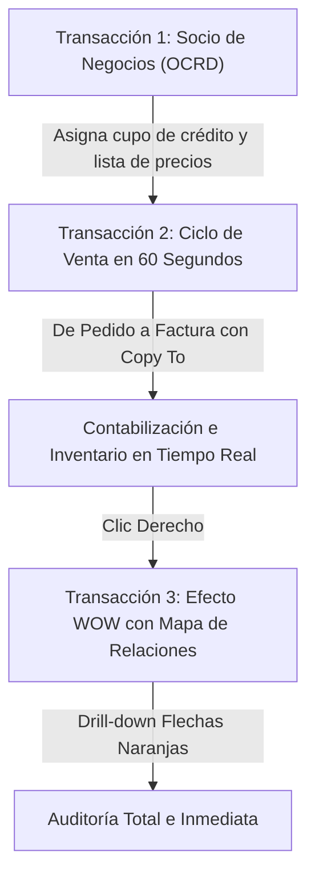
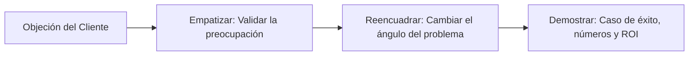

# Fuente técnica: Consultoría Comercial y Ventas de Soluciones SAP Business One

## 1. El Rol Estratégico del Consultor Comercial de SAP Business One

En el ecosistema de canales de SAP (VARs - Value Added Resellers y Gold Partners), el Consultor Comercial (Account Executive / Pre-Sales Consultant) no es un vendedor tradicional de licencias; es un **asesor de transformación empresarial**. 

Vender SAP Business One no consiste en recitar especificaciones técnicas ni enumerar menús de configuración. Consiste en **Value-Based Selling (Venta Basada en Valor)**: identificar las fugas de rentabilidad, la falta de control y los cuellos de botella de una empresa en crecimiento, y demostrar de forma irrefutable cómo SAP Business One resuelve esos dolores, protege el patrimonio de los accionistas y multiplica el retorno de inversión.

### 1.1. El Comité de Decisión Corporativo y sus Motivaciones Clave
Para cerrar una venta corporativa, el consultor comercial debe adaptar su discurso a los cuatro interlocutores del comité de compra:

| Rol Directivo | Mayor Preocupación / Dolor | Mensaje de Valor de SAP Business One |
| :--- | :--- | :--- |
| **Gerente General (CEO / Propietario)** | Falta de control, estancamiento del crecimiento, información no confiable para toma de decisiones, riesgo de fraude interno. | *Control total y visión 360° en tiempo real.* Escalabilidad para duplicar operaciones sin duplicar personal administrativo. Respaldo de la marca líder mundial. |
| **Director Financiero (CFO / Contralor)** | Cierres contables tardíos (15 a 20 días de retraso), flujo de caja impredecible, cartera vencida, discrepancias entre inventario físico y contable. | *Contabilidad en línea automática.* Estados financieros y flujo de caja proyectado al segundo con cada venta o compra. Reducción drástica del ciclo de cobro (DSO). |
| **Gerente de Operaciones / Logística (COO)** | Quiebres de stock, sobreinventario que inmoviliza capital, demoras en despachos, errores humanos en facturación y pedidos manuales. | *Planificación inteligente de materiales (MRP).* Trazabilidad total por lotes/series, inventarios valorados en tiempo real y cumplimiento de entregas a tiempo (OTD). |
| **Gerente de TI / Sistemas (CIO)** | Múltiples bases de datos desintegradas, hojas de Excel paralelas, vulnerabilidades de seguridad, servidores colapsados, dependencia de desarrolladores externos. | *Arquitectura sólida con base de datos in-memory SAP HANA.* API estándar (Service Layer) para integraciones limpias, seguridad corporativa y opción Cloud administrada. |

---

## 2. Propuesta de Valor Estratégica: ¿Por qué una Empresa en Crecimiento Compra SAP Business One?

### 2.1. El Punto de Inflexión: "El Techo de Cristal del Software Contable"
La mayoría de prospectos de SAP Business One se encuentran en el mismo dilema: comenzaron usando un software contable básico o un sistema administrativo local. Al crecer a 20, 50 o 100 empleados:
- El software colapsa ante el volumen de transacciones concurrentes.
- Cada departamento crea sus propios archivos de Excel para "complementar" lo que el sistema no hace.
- Se crean **islas de información** desconectadas: Ventas promete existencias que Bodega ya no tiene, y Contabilidad se entera semanas después de lo que se vendió.
- El Director General descubre que tiene 5 versiones distintas del margen de ganancia según quién presente el informe.

**El argumento comercial maestro:** *"Su empresa ya superó la etapa de registrar el pasado con un sistema contable. Hoy necesita un ERP que controle la operación en tiempo real, garantice que los procesos se cumplan y le permita proyectar el futuro con certeza."*

### 2.2. Los Cuatro Pilares Diferenciadores de SAP Business One

#### A. Única Fuente de la Verdad y Trazabilidad Integral (Single Source of Truth)
- **Eliminación del reproceso:** Un dato se ingresa una sola vez. Cuando se genera una Orden de Venta, esa información viaja limpiamente a Almacén, Facturación, Cartera y Contabilidad sin digitación intermedia.
- **Contabilización nativa en tiempo real:** No existen procesos nocturnos de "mayorización" o "interfaz contable". Cada remisión o factura genera su asiento contable en el milisegundo en que se crea.
- **Cero divergencias:** El saldo de inventario de Logística coincide matemáticamente con la cuenta 1.1.05 del Balance de Contabilidad en todo momento.

#### B. Control Antifraude y Gobierno Corporativo Inquebrantable
- **Inmutabilidad documental:** En SAP Business One, ningún documento contabilizado puede ser borrado ni alterado en montos o cuentas por ningún usuario, ni siquiera por el Administrador del Sistema. Las correcciones se realizan formalmente mediante notas de crédito o cancelaciones auditables.
- **Pistas de Auditoría (Audit Trail) y Log de Modificaciones:** El sistema registra quién modificó qué dato, qué día, a qué hora y cuál era el valor anterior.
- **Segregación de Funciones (SoD) y Flujos de Autorización Automáticos:** Si un vendedor intenta otorgar un descuento superior al 10%, o si se intenta vender a un cliente que superó su límite de crédito, el documento queda bloqueado inmediatamente hasta recibir la aprobación electrónica del Gerente correspondiente en su computador o teléfono móvil.

#### C. Retorno de Inversión (ROI) y Payback Tangible
El consultor comercial debe demostrar que SAP Business One no es un gasto, sino una inversión con retorno medible en 12 a 18 meses:
1. **Reducción de capital inmovilizado en inventario (15% a 25%):** Mediante el asistente de MRP que calcula compras just-in-time considerando pedidos comprometidos, tiempos de reposición (Lead Time) y stock de seguridad.
2. **Aceleración del cobro y reducción de cartera vencida (DSO):** Alertas automáticas de vencimiento, bloqueo de despacho a clientes morosos y extractos de cuenta automatizados.
3. **Cierre contable mensual en 24-48 horas:** En lugar de tardar 15 días reuniendo comprobantes y cuadrando hojas de cálculo, el Balance y el P&L están listos el primer día hábil del mes siguiente.
4. **Ahorro de horas extras y productividad administrativa:** Eliminación de horas dedicadas a transcripción manual de datos, cruce de planillas y rectificación de errores humanos.

#### D. Escalabilidad Multiempresa, Multisede e Internacional
- **Multiempresa nativa:** Permite gestionar múltiples razones sociales en la misma plataforma, consolidando estados financieros o manejando transacciones intercompañía con la solución *Intercompany Integration*.
- **Multimoneda:** Manejo simultáneo de moneda local y moneda del sistema (ej. USD, EUR) con revalorización automática de diferencias cambiarias.
- **50 Localizaciones Legales Oficiales:** Si la empresa abre operaciones en Colombia, México, Perú, España o Estados Unidos, el sistema ya cuenta con el paquete tributario oficial certificado por SAP.
- **Estrategia Two-Tier ERP:** Si la empresa aspira a ser adquirida por una multinacional o asociarse con un conglomerado que use SAP S/4HANA, SAP Business One se integra de forma estándar con la casa matriz.

---

## 3. Demostración de Impacto en Vivo (The Golden Demo)

### 3.1. Metodología de la Demostración Comercial Efectiva
El 80% de los negocios se ganan o se pierden durante la demostración en vivo. Las reglas de oro para el consultor comercial son:
- **Prohibido el "recorrido turístico por los menús":** No abra menús desplegables para mostrar cuántas opciones tiene el sistema. Eso abruma y confunde al cliente.
- **Regla de los 5 minutos:** Los beneficios principales y el impacto visual deben presentarse en los primeros minutos de la reunión.
- **Enfoque en Procesos de Negocio, no en Pantallas Técnicas:** Cuente una historia realista centrada en la empresa del prospecto (utilice el nombre de su industria, sus productos típicos y sus problemas reales).

### 3.2. Las 3 Transacciones Clave de Alto Impacto

#### Transacción 1: Creación Ágil de Cliente / Socio de Negocios (OCRD)
- **Objetivo comercial:** Demostrar que dar de alta un cliente toma 15 segundos y que el control financiero queda activado desde el origen.
- **Paso a paso en vivo:**
  1. Abrir `Socios de negocios > Datos maestros socio de negocios` (Modo Crear).
  2. Ingresar: Código de cliente, Razón Social y Número de Identificación Tributaria (RUC / CIF / NIT).
  3. Seleccionar el Grupo de Clientes (ej. Mayoristas).
  4. Ir a la pestaña **Condiciones de pago**: mostrar cómo el sistema asigna de inmediato la lista de precios mayorista correspondiente y definir un **Límite de Crédito** de $10,000 USD con plazo a 30 días.
  5. Clic en "Crear".
- **Mensaje de venta al CFO:** *"Desde este segundo, ningún vendedor podrá facturarle a este cliente por encima de su límite de crédito sin autorización formal, y las listas de precios se aplicarán solas sin margen de error humano."*

#### Transacción 2: Ciclo de Venta y Facturación en 60 Segundos (Order-to-Cash)
- **Objetivo comercial:** Mostrar la agilidad del ciclo de ventas y la automatización total de almacén y contabilidad mediante la funcionalidad `Copiar a... (Copy To)`.
- **Paso a paso en vivo:**
  1. Abrir `Ventas - Clientes > Pedido de cliente`.
  2. Seleccionar el cliente recién creado.
  3. En la línea de artículos, seleccionar un producto de alta rotación (ej. A00001). Mostrar la columna **ATP (Available to Promise)**: existencias físicas en bodega vs cantidades ya comprometidas en otros pedidos.
  4. Ingresar cantidad: 10 unidades. El precio unitario y los impuestos se calculan automáticamente según las reglas predefinidas. Clic en "Crear".
  5. En la esquina inferior derecha del pedido creado, presionar el botón **Copiar a > Entrega** (albarán de despacho de bodega). Mostrar cómo todos los datos viajan sin tener que reescribir un solo número. Clic en "Crear".
  6. En la Entrega, presionar **Copiar a > Factura de clientes**. Clic en "Crear".
- **El momento clave de la demostración:** 
  Abrir el asiento contable originado (`Finanzas > Asiento` o flecha naranja en "Nº de operación"). Mostrar cómo el sistema acreditó los Ingresos por Ventas, calculó el IVA por pagar y debitó la Cuenta por Cobrar del cliente.
  Simultáneamente, mostrar cómo la Entrega generó el costo de ventas (Costo de Mercadería Vendida al Debe vs Inventario al Haber) rebajando exactamente el stock físico de la bodega.
- **Mensaje de venta al CEO y CFO:** *"En menos de un minuto, el pedido fue registrado, el almacén rebajó el stock real, la factura electrónica se timbró y los estados financieros se actualizaron. Cero papel, cero digitadores intermedios, cero discrepancias."*

#### Transacción 3: El Efecto WOW — El Mapa de Relaciones (Relationship Map)
- **Objetivo comercial:** El momento culminante que convence a la gerencia general y a los auditores externos.
- **Paso a paso en vivo:**
  1. Con la Factura de Clientes abierta en pantalla, hacer **clic derecho en cualquier parte del formulario**.
  2. Seleccionar del menú contextual la opción **Mapa de relaciones**.
  3. Aparece en pantalla el árbol gráfico interactivo que muestra:
     `Pedido de Cliente #104 → Entrega de Mercancía #82 → Factura de Clientes #215 → Asiento Contable #1042`.
  4. Si se realiza un pago mediante `Gestión de bancos > Pagos recibidos`, el cobro bancario se añade automáticamente al árbol gráfico.
  5. Demostrar el uso de la **Flecha Naranja (Drill-down nativo)**: hacer clic sobre cualquier nodo del árbol para abrir instantáneamente el documento original.
- **Mensaje de venta:** *"Imaginen cuánto tiempo pierde hoy su equipo cuando un cliente llama a consultar un despacho de hace tres meses o cuando un auditor pide el sustento de una factura. Con SAP, cualquier persona autorizada tiene la radiografía completa del negocio en dos clics."*

---

## 4. Informes Gerenciales y Analítica en Tiempo Real

Para el Gerente General y el Director Financiero, la verdadera justificación económica de SAP Business One radica en la **inteligencia de negocios incorporada (Analytics powered by SAP HANA)** sin necesidad de adquirir costosas herramientas externas de BI.

### 4.1. El Cockpit Interactivo de Fiori y Web Client
- Al iniciar sesión, la primera vista del directivo no es un menú aburrido, sino un panel de mando personalizado con:
  - **KPIs en tiempo real (Tarjetas numéricas):** Ventas totales acumuladas del mes, margen bruto promedio, facturación del día, órdenes pendientes de entrega.
  - **Gráficos dinámicos interactivos:** Tendencia de ingresos de los últimos 12 meses, comparativa Ventas Reales vs Presupuesto.
  - **Listas de control instantáneas:** Los 5 clientes más rentables del año, los 5 artículos de mayor y menor rotación, facturas vencidas prioritarias.

### 4.2. El Santo Grial Financiero: Previsión Dinámica de Flujo de Caja (Cash Flow Forecast)
- **Ruta en SAP:** `Finanzas > Informes financieros > Financiero > Previsión de flujo de caja`.
- **Por qué enamora al Director Financiero:**
  - Los sistemas tradicionales solo muestran el saldo que hay hoy en el banco.
  - El Cash Flow Forecast de SAP Business One analiza **el futuro financiero** integrando en una sola línea de tiempo:
    1. Saldo actual disponible en todas las cuentas bancarias.
    2. Cobros proyectados (cuentas por cobrar y pedidos de clientes confirmados).
    3. Pagos comprometidos (cuentas por pagar a proveedores y órdenes de compra autorizadas).
    4. Cheques diferidos emitidos y recibidos.
  - **Simulación por niveles de certidumbre:** Permite al CFO filtrar por niveles de seguridad (ej. Nivel 1: solo facturas en firme; Nivel 2: incluir órdenes de compra y pedidos en proceso).
  - **Mensaje de venta:** *"Usted podrá saber con semanas de anticipación si el día 28 habrá un déficit de liquidez para pagar la nómina o los impuestos, dándole tiempo para negociar con el banco en lugar de enterarse el mismo día de la crisis."*

### 4.3. Búsqueda Empresarial Estilo Google (SAP HANA Enterprise Search)
- En la barra superior, el consultor comercial debe tipear cualquier término en vivo: el nombre de una persona, un número de serie de motor, una dirección o un número de teléfono.
- En milisegundos, SAP HANA busca en toda la base de datos indexada y despliega todos los registros asociados clasificados por tipo de objeto (Clientes, Facturas, Cotizaciones, Órdenes de Servicio), con acceso directo a cada uno.

---

## 5. Manejo de Objeciones Corporativas Comunes (The Sales Battlecards)

Durante el ciclo de venta, el consultor comercial enfrentará objeciones previsibles. El éxito comercial depende de no ponerse a la defensiva y aplicar la técnica de **Empatizar, Reencuadrar y Demostrar**:

### Objeción 1: "SAP es demasiado caro, es un sistema para multinacionales gigantes."
- **El Error del Vendedor Novato:** Comenzar a hacer descuentos apresurados en el precio de la licencia.
- **Respuesta Consultiva Profesional:**
  - *Reencuadre:* *"Es una confusión muy frecuente porque la marca SAP patrocina a las empresas más grandes del planeta. Pero existe una distinción crucial: SAP tiene dos soluciones principales. Para gigantes como Nestlé o Coca-Cola existe SAP S/4HANA. Para empresas en crecimiento y medianas existe **SAP Business One**, diseñado exclusivamente para compañías como la suya, con más de 75.000 clientes en el mundo."*
  - *Optimización del TCO (Total Cost of Ownership):* Explicar la matriz de licenciamiento flexible: no todos los empleados necesitan una licencia **Profesional**. Los usuarios de almacén, cobradores o vendedores de campo utilizan licencias **Limitadas (Logística, Financiera, CRM)** significativamente más económicas.
  - *El Costo de la Inacción (Cost of Inaction - COI):* *"Permítame hacerle una pregunta financiera: ¿cuánto dinero pierde su empresa al año por mermas en bodega que nadie detecta, clientes que dejan de pagar porque la factura llegó tarde o ventas perdidas por no saber qué hay en stock? Cuando sumamos esas fugas, SAP Business One se paga solo con lo que usted deja de perder."*

### Objeción 2: "Los proyectos de SAP toman años, son traumáticos y nunca terminan."
- **El Error del Vendedor Novato:** Decir "no se preocupe, esto se instala en dos semanas".
- **Respuesta Consultiva Profesional:**
  - *Reencuadre:* *"Esa reputación proviene de los megaproyectos corporativos de los años noventa en grandes industrias. En SAP Business One trabajamos con metodologías ágiles certificadas: **SAP Activate** y **AIP (Accelerated Implementation Program)**."*
  - *Alcance Cerrado y Predecible (Fixed Scope, Fixed Price):* *"No venimos a programar un sistema desde cero. SAP Business One ya viene con las mejores prácticas mundiales de su industria preconfiguradas: el plan de cuentas, los flujos de compras y la facturación electrónica ya están listos. Por eso, nuestros proyectos duran entre **8 y 16 semanas**, con un cronograma semanal riguroso y entregables garantizados por contrato."*

### Objeción 3: "Nuestra gente tiene resistencia al cambio y está acostumbrada a su Excel."
- **El Error del Vendedor Novato:** Decir que se prohibirá el uso de Excel por orden de la gerencia.
- **Respuesta Consultiva Profesional:**
  - *Reencuadre:* *"La resistencia no es hacia el sistema; la resistencia es al miedo de perder el control o sentirse incapaz frente a una pantalla complicada. Por eso, SAP Business One cuenta con dos ventajas clave:"*
  - *Integración Nativa con Microsoft Excel:* SAP B1 permite copiar y pegar filas completas directamente desde Excel hacia las tablas de pedidos o compras, y exportar cualquier reporte a Excel manteniendo el formato original en un clic.
  - *Nueva Interfaz Web Client / Fiori:* Es tan intuitiva como navegar en una red social o una tienda online, operable desde tablets o smartphones.
  - *Estrategia Train the Trainer:* *"No capacitamos a 50 personas de golpe en un aula fría. Entrenamos a sus líderes de área (Key Users) para que ellos mismos acompañen a sus colaboradores. Al cabo del primer mes, los propios empleados agradecen el cambio porque eliminan las horas extras dedicadas a digitar comprobantes manuales."*

### Objeción 4: "¿Nube (Cloud/SaaS) o Servidor Propio (On-Premise)? ¿Dónde están mis datos?"
- **El Análisis Estratégico para el Decisor:**
  Muchos proveedores obligan al cliente a una sola modalidad. SAP Business One ofrece **libertad total de despliegue**:

| Criterio | Modelo Cloud (SaaS / Hosting Administrado) | Modelo On-Premise (Servidor Local) |
| :--- | :--- | :--- |
| **Estructura Financiera** | **OpEx (Gasto Operativo):** Suscripción mensual o anual predecible. Cero inversión inicial en infraestructura. | **CapEx (Inversión de Capital):** Compra de licencias perpetuas y servidores físicos propios. |
| **Infraestructura y Mantenimiento** | Cero servidores en la oficina. Mantenimiento, respaldos y parches administrados por ingenieros certificados. | Requiere servidor dedicado, SAI/UPS, aire acondicionado, licencias Windows Server y personal de TI interno. |
| **Seguridad y Respaldos** | Copias de seguridad automáticas diarias en centros de datos con certificación Tier III/IV y blindaje contra Ransomware. | El cliente es 100% responsable de sus políticas de copias de seguridad y de la seguridad física de su servidor. |
| **Escenario Ideal** | Empresas con personal remoto, múltiples sucursales y enfoque en su core business (sin departamento de TI pesado). | Industrias o plantas ubicadas en zonas remotas con conexión a internet inestable o políticas estrictas de soberanía de datos. |

- **Argumento de Cierre:** *"La mayor ventaja de SAP es que su inversión nunca caduca: si hoy inician en On-Premise y en dos años deciden migrar a la Nube, o viceversa, la base de datos es 100% portátil. Usted tiene soberanía total sobre sus datos."*

---

## 6. Proceso Comercial Consultivo: Discovery y Calificación de Oportunidades

Antes de agendar una demostración o emitir una cotización, el consultor comercial debe ejecutar una **Sesión de Descubrimiento (Discovery Call)**. Cotizar a ciegas es la causa número uno de propuestas rechazadas por precio.

### 6.1. Preguntas de Diagnóstico de Alto Impacto (Metodología MEDDPICC adaptada a SAP B1)
1. **Métricas de Dolor (Metrics):** *"Si hoy tuviera que decirme cuánto tiempo tarda su equipo de contabilidad en cerrar el mes y entregarle los estados financieros para la junta de socios, ¿cuántos días son exactamente?"*
2. **Impacto Económico (Economic Impact):** *"¿Alguna vez han tenido que pagar horas extras a fin de mes o contratar personal temporal para hacer conteos físicos de inventario porque los números no cuadraban?"*
3. **Criterios de Decisión (Decision Criteria):** *"Cuando la junta directiva evalúe las alternativas de ERP, ¿cuáles serán los tres factores determinantes: tiempo de arranque, confiabilidad del socio implementador o retorno de inversión?"*
4. **Proceso de Aprobación (Decision Process):** *"Además de usted, ¿quién más participará en la evaluación final y qué fechas tienen previstas para iniciar la operación con el nuevo sistema?"*
5. **Costo de la Inacción (Implication Question):** *"Si deciden no implementar un ERP este año y siguen con el sistema actual, ¿qué va a pasar con su operación cuando sus ventas crezcan un 30% como tienen proyectado?"*

### 6.2. Checklist de Preparación de la "Golden Demo"
- [ ] Conocer con exactitud la lista de los 3 dolores principales expresados por el cliente durante el Discovery.
- [ ] Configurar la base de datos de demostración con nombres de clientes, proveedores y productos similares a los de la industria del prospecto (ej. si venden repuestos automotrices, no hacer la demo con camisetas o frutas).
- [ ] Validar que la licencia de pruebas y los add-ons de facturación electrónica estén activos para no tener mensajes de error durante la presentación.
- [ ] Tener preparado y abierto el Cockpit de analítica con datos atractivos de ventas y rentabilidad.
- [ ] Preparar el Mapa de Relaciones con un flujo completo precontabilizado para abrirlo en 2 segundos.
- [ ] Terminar la reunión siempre con un acuerdo de siguiente paso concreto (ej. Taller de alcance de implementación o revisión de propuesta económica), nunca con un "quedamos en contacto".
